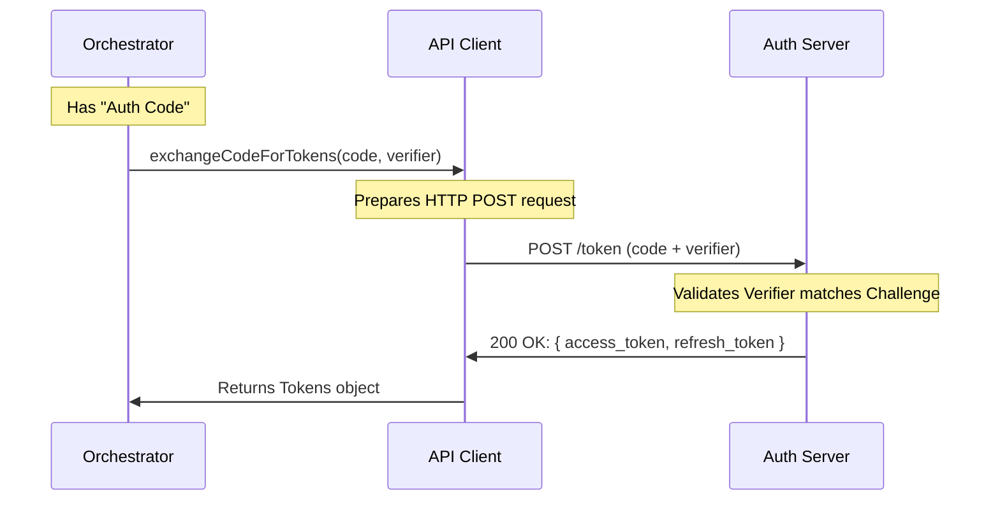

# Chapter 3: API Client & Token Management

Welcome to the third chapter of our OAuth tutorial!

In the previous chapter, we built the [Local Callback Listener](02_local_callback_listener.md). It successfully "caught" the user returning from the web browser with a temporary **Authorization Code**.

However, having that code is like having a "claim check" for a coat check room. You can't wear the claim check. You need to exchange it for the actual coat (the **Access Token**).

In this chapter, we will build the **API Client**.

## The Problem: Speaking the Language

The Authorization Server (the entity that issues logins) is strict. It requires requests to be formatted perfectly.
- You must send data as `POST` requests.
- You must include specific headers like `application/x-www-form-urlencoded` or `json`.
- You must include the correct "grant type."

If you get one character wrong, the server rejects you. We don't want to write raw HTTP requests every time we need to log in.

## The Solution: The Specialist Lawyer

Think of the **API Client** as a specialized lawyer or travel agent.
1.  **Forms:** It knows exactly how to fill out the forms to request a login URL.
2.  **Exchange:** It takes your "claim check" (Auth Code) and runs to the office to swap it for the "Passport" (Access Token).
3.  **Renewal:** If your passport expires, it knows exactly how to file for a renewal without bothering you.

## Use Case: The Trade

The Orchestrator (from Chapter 1) has the code. It needs to call a function to get the tokens.

**Our Goal:**
We want a simple function that looks like this:

```typescript
// We have the code from the Listener
const code = "captured-auth-code-123";

// We simply ask the client to do the heavy lifting
const tokens = await exchangeCodeForTokens(
    code,
    state,
    verifier,
    port
);

console.log(tokens.accessToken); // "ey..." (The real key!)
```

## Key Concepts

To manage this, our Client handles three distinct operations.

### 1. Constructing the Login URL
Before the user even leaves the terminal, we need to generate the link they will click. This isn't just `google.com`. It is a long URL containing the permissions we want (Scopes), our ID (Client ID), and security codes.

### 2. The Token Exchange
This is the core purpose of this chapter. We send the **Authorization Code** + **PKCE Verifier** to the server. The server checks them. If they match, it sends back the **Access Token**.

### 3. Token Refreshing
Access Tokens are short-lived (often 1 hour) for security. **Refresh Tokens** are long-lived (days or months). When the Access Token expires, the Client automatically uses the Refresh Token to get a new one.

## How It Works: Step-by-Step

Let's visualize the "Trade" process.



## Internal Implementation

Let's look at `src/oauth/client.ts`. We use a library called `axios` to make the actual HTTP network requests.

### 1. Building the Auth URL
Instead of pasting strings together (which is error-prone), we use the JavaScript `URL` object. This ensures special characters are handled correctly.

```typescript
export function buildAuthUrl({ codeChallenge, state, port }): string {
  // Start with the base Authorization URL
  const authUrl = new URL(getOauthConfig().CONSOLE_AUTHORIZE_URL)

  // Append necessary parameters safely
  authUrl.searchParams.append('client_id', getOauthConfig().CLIENT_ID)
  authUrl.searchParams.append('response_type', 'code')
  
  // Tell the server where to send the user back (Our Local Listener!)
  authUrl.searchParams.append('redirect_uri', `http://localhost:${port}/callback`)
  
  // Attach security parameters (See Chapter 5)
  authUrl.searchParams.append('code_challenge', codeChallenge)
  authUrl.searchParams.append('state', state)

  return authUrl.toString()
}
```

### 2. Exchanging the Code
This is the "Trade." We perform a `POST` request. Notice we include the `code_verifier`. This is the proof that we are the same person who started the flow.

*Note: We will explain `code_verifier` in depth in [PKCE Security (Crypto)](05_pkce_security__crypto_.md).*

```typescript
export async function exchangeCodeForTokens(
  authorizationCode: string,
  state: string,
  codeVerifier: string,
  port: number,
): Promise<OAuthTokenExchangeResponse> {
  // 1. Prepare the form data
  const requestBody = {
    grant_type: 'authorization_code', // The type of trade we are doing
    code: authorizationCode,          // The claim check
    code_verifier: codeVerifier,      // The security proof
    redirect_uri: `http://localhost:${port}/callback`,
    client_id: getOauthConfig().CLIENT_ID,
  }

  // 2. Send the request
  const response = await axios.post(getOauthConfig().TOKEN_URL, requestBody)

  // 3. Return the data (contains access_token and refresh_token)
  return response.data
}
```

### 3. Refreshing the Token
When the application has been running for a while, the token might expire. The Client handles this renewal.

This looks very similar to the exchange above, but the `grant_type` changes.

```typescript
export async function refreshOAuthToken(refreshToken: string): Promise<OAuthTokens> {
  const requestBody = {
    grant_type: 'refresh_token', // Different trade type!
    refresh_token: refreshToken, // The long-lived renewal card
    client_id: getOauthConfig().CLIENT_ID,
  }

  // Send request to the same URL
  const response = await axios.post(getOauthConfig().TOKEN_URL, requestBody)

  // Extract new tokens
  const data = response.data
  
  return {
      accessToken: data.access_token,
      // If server didn't send a new refresh token, keep the old one
      refreshToken: data.refresh_token || refreshToken, 
      expiresAt: Date.now() + (data.expires_in * 1000)
  }
}
```

### 4. Fetching User Profile (Optional)
Once we have the `accessToken`, we can use it to fetch information about the user (like their email or billing status). The token acts as our key to the API.

```typescript
// Helper to get user info
export async function fetchProfileInfo(accessToken: string) {
    // We attach the token in the "Authorization" header
    // It looks like: "Bearer eyJhbGci..."
    const response = await axios.get(getOauthConfig().PROFILE_URL, {
        headers: { Authorization: `Bearer ${accessToken}` },
    })
    
    return response.data;
}
```

## Summary

The **API Client** abstracts away the messy details of HTTP.

1.  It constructs the confusing URLs so we don't have to.
2.  It performs the secure swap of **Code** for **Token**.
3.  It handles **Refreshing** tokens so the user stays logged in.

At this point in the tutorial, we have:
1.  Managed the flow ([Orchestrator](01_oauth_flow_orchestrator.md)).
2.  Caught the user ([Listener](02_local_callback_listener.md)).
3.  Obtained the keys ([Client](03_api_client___token_management.md)).

Now we have a raw Access Token. But who does this token belong to? Is it a free user or a paid user? What is their email?

In the next chapter, we will learn how to resolve the identity of the user.

[Next Chapter: Profile & Identity Resolution](04_profile___identity_resolution.md)

---

Generated by [Code IQ](https://github.com/adityasoni99/Code-IQ)