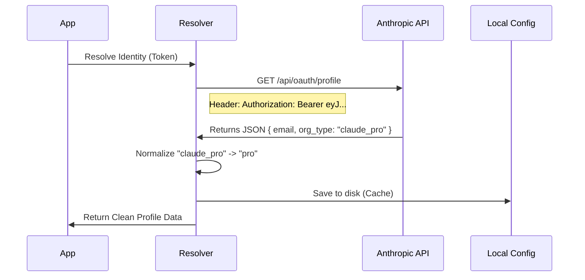

# Chapter 4: Profile & Identity Resolution

Welcome to the fourth chapter of our OAuth tutorial!

In the previous chapter, [API Client & Token Management](03_api_client___token_management.md), we successfully exchanged a temporary code for a permanent **Access Token**.

At this stage, you are holding a key. But a key is just a piece of metal (or in our case, a long string of gibberish characters like `eyJhbGci...`). Looking at the key doesn't tell you:
*   Who owns this key?
*   Is this a VIP key (Pro tier) or a standard key (Free tier)?
*   What is the owner's email address?

In this chapter, we will build the **Profile & Identity Resolution** layer.

## The ID Card Scanner

Think of an office building with high security.
1.  **Chapter 3** gave you the ID badge (The Token).
2.  **Chapter 4** is the scanner at the turnstile.

When you tap your badge, the system looks up your record in the database. It flashes your photo on the guard's screen and says, "Welcome, Alice! Access Level: Level 5."

Without this step, our application knows you are *someone*, but it doesn't know *who* you are.

## Use Case: "Hello, User!"

We want our command-line tool to greet the user and understand their limits.

**Our Goal:**
We want to take the opaque token and convert it into usable information.

```typescript
// Input: The mysterious string
const token = "eyJhbGciOiJIUz...";

// Action: The Resolution Step
const profile = await fetchProfileInfo(token);

// Output: Usable Data
console.log(`Hello, ${profile.displayName}`); // "Hello, Alice"
console.log(`Tier: ${profile.subscriptionType}`); // "Tier: pro"
```

## Key Concepts

To implement this, we need to handle two different ways users might identify themselves, and then normalize that data.

### 1. Two Paths to Identity
Our system supports two types of keys. We need to handle both:
*   **OAuth Token:** A user logging in via the browser (e.g., "Log in with Google"). This is the modern flow.
*   **Legacy API Key:** A developer manually pasting a key starting with `sk-ant-...`.

### 2. Normalization
The server might send back complex technical names like `claude_pro_v1_monthly`. Our application doesn't want to deal with that mess. We need to **normalize** this into simple categories: `free`, `pro`, or `team`.

### 3. Caching (Memory)
We don't want to ask the server "Who is this?" every time the user types a command. Once we fetch the profile, we should save it to a local configuration file.

## How It Works: Step-by-Step

Let's look at the flow of data when we resolve an identity.



## Internal Implementation

Let's look at how we implement this in `src/oauth/getOauthProfile.ts` and `src/oauth/client.ts`.

### 1. The OAuth Fetcher
If we have an OAuth token, we use it as a "Bearer" token. This is the standard way to prove identity on the web.

```typescript
// src/oauth/getOauthProfile.ts

export async function getOauthProfileFromOauthToken(token: string) {
  const endpoint = `https://api.anthropic.com/api/oauth/profile`
  
  // We attach the token to the request headers
  const response = await axios.get(endpoint, {
    headers: {
      Authorization: `Bearer ${token}`, // The Key
      'Content-Type': 'application/json',
    },
  })
  
  return response.data
}
```

### 2. The Legacy Key Fetcher
If the user provided an API Key instead, the request looks slightly different. We use a custom header `x-api-key`.

```typescript
// src/oauth/getOauthProfile.ts

export async function getOauthProfileFromApiKey() {
  const apiKey = getAnthropicApiKey() // Load from environment
  
  // We need both the Key and the Account UUID
  const endpoint = `https://api.anthropic.com/api/claude_cli_profile`
  
  const response = await axios.get(endpoint, {
    headers: {
      'x-api-key': apiKey, // Different header for legacy keys!
    },
    // ... params
  })
  
  return response.data
}
```

### 3. Logic: Translating the Data
The raw data from the server is often too specific. In `src/oauth/client.ts`, we have a function called `fetchProfileInfo` that acts as a translator.

It uses a `switch` statement to categorize the user.

```typescript
// src/oauth/client.ts

// Map the server's internal name to our app's simple types
let subscriptionType = null;

switch (profile.organization.organization_type) {
  case 'claude_max':
    subscriptionType = 'max'
    break
  case 'claude_pro':
    subscriptionType = 'pro'
    break
  case 'claude_team':
    subscriptionType = 'team'
    break
  // ... handle others
}
```

### 4. Saving the Result
Finally, once we have translated the data, we save it. This ensures that the next time the application starts, it remembers who you are without making a network request.

```typescript
// src/oauth/client.ts

// Update the global configuration object
saveGlobalConfig(current => ({
  ...current,
  oauthAccount: {
    ...current.oauthAccount,
    displayName: profile.displayName,
    billingType: profile.billingType,
    // We now know exactly who this is!
  }
}))
```

## Putting It Together

In the previous chapters, we focused on **getting access**. In this chapter, we focused on **understanding the user**.

When you run the command `claude login`:
1.  **Orchestrator** manages the flow.
2.  **Listener** catches the code.
3.  **Client** swaps code for Token.
4.  **Identity Resolution** (this chapter) takes that Token, asks the API "Who is this?", translates "claude_pro" to "Pro Tier", and saves it to your settings.

There is one final piece of the puzzle. Throughout this tutorial, we have mentioned "Codes", "Challenges", and "Verifiers." We treated them like magic passwords. But how do they actually work? How do they prevent hackers from stealing the login flow?

In the final chapter, we will explain the cryptography behind the security.

[Next Chapter: PKCE Security (Crypto)](05_pkce_security__crypto_.md)

---

Generated by [Code IQ](https://github.com/adityasoni99/Code-IQ)