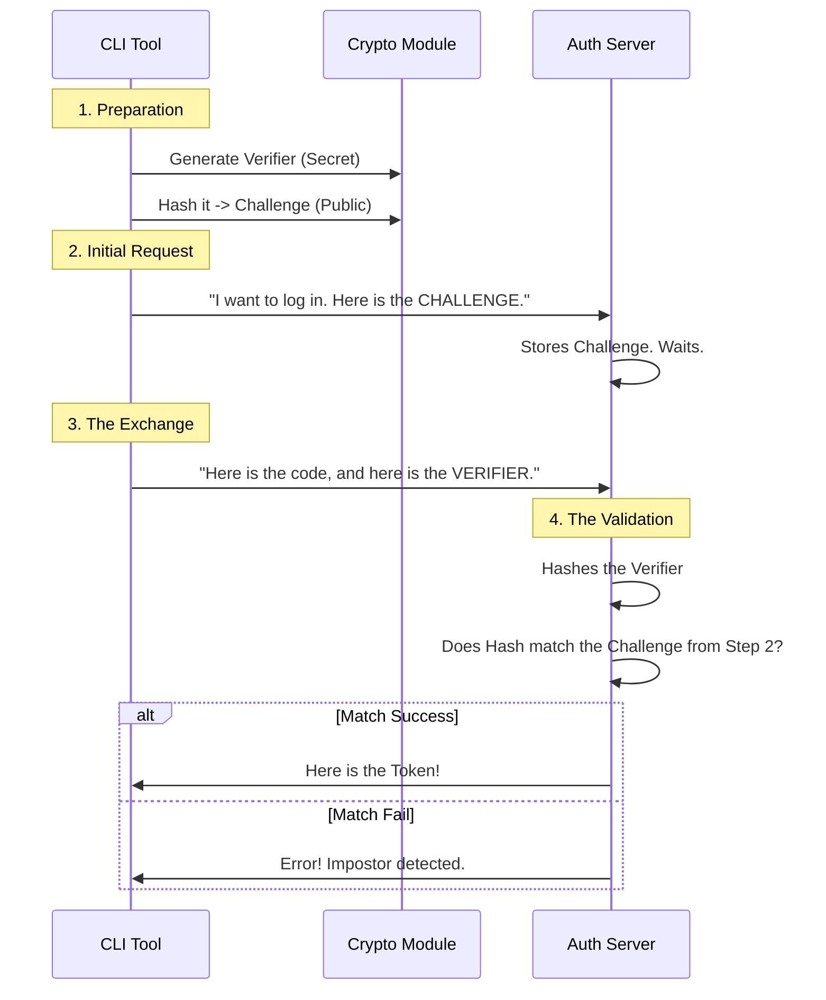

# Chapter 5: PKCE Security (Crypto)

Welcome to the final chapter of our OAuth tutorial!

In the previous chapter, [Profile & Identity Resolution](04_profile___identity_resolution.md), we learned how to turn a cryptic access token into meaningful user information, like a name or email address.

We now have a fully functional login system. However, we have glossed over one critical detail mentioned all the way back in [OAuth Flow Orchestrator](01_oauth_flow_orchestrator.md): **Security**.

Because our application runs on your computer (and not on a secure server in a data center), we cannot hide a "Client Secret" inside the code. Anyone could read the source code and steal it.

So, how do we prove to the server that we are who we say we are, without a permanent password?

In this chapter, we will build the **PKCE Security** module (Proof Key for Code Exchange).

## The Baggage Claim Analogy

To understand PKCE (pronounced "Pixy"), imagine checking your luggage at a hotel.

1.  **The Drop-off:** You hand over your bag. The bellhop gives you a **Ticket Stub**.
2.  **The Secret:** You put the ticket in your pocket. Only you have it.
3.  **The Claim:** Later, you return. You don't just say, "I'm the guy who dropped off a bag." You must **produce the physical Ticket Stub**.

If a thief overheard you checking your bag, they might know your name, but they don't have the ticket stub in your pocket. They cannot claim your bag.

## Use Case: Creating the Temporary Secret

We need to generate a "Ticket Stub" (Secret) and a public description of it every time a user tries to log in.

**Our Goal:**
We want a utility that provides these cryptographic values:

```typescript
// 1. Create the secret ticket (The Verifier)
const verifier = generateCodeVerifier();
// Output: "43_byte_random_string_secret..."

// 2. Create the public description (The Challenge)
const challenge = generateCodeChallenge(verifier);
// Output: "Scrambled_Hash_Of_Verifier..."

// 3. Create a random ID for the session (State)
const state = generateState();
// Output: "Another_Random_String..."
```

These values are passed to the [OAuth Flow Orchestrator](01_oauth_flow_orchestrator.md) to start the journey.

## Key Concepts

There are three main terms you will see in the implementation.

### 1. The Code Verifier (The Secret)
This is a cryptographically random string. It is created **before** the login starts.
*   *Analogy:* The Ticket Stub in your pocket.

### 2. The Code Challenge (The Public Proof)
This is a "hashed" version of the Verifier. We send this to the Authorization Server immediately.
*   *Analogy:* A picture of the Ticket Stub. You can show the picture to everyone; they can see what it looks like, but they can't turn the picture back into the physical piece of paper.

### 3. The State (The Anti-Forgery Token)
This is another random string used to prevent "CSRF" attacks. It ensures that the response coming back from the browser is actually for the request *you* sent, not a fake request injected by a hacker.

## How It Works: Step-by-Step

Here is the security dance that happens behind the scenes.



## Internal Implementation

Let's implement this in `src/oauth/crypto.ts`. We rely on the built-in Node.js `crypto` library.

### 1. URL-Safe Formatting
Standard encryption produces weird characters like `+`, `/`, and `=`. These break web URLs. We need a helper function to make our random strings "URL Safe."

```typescript
import { createHash, randomBytes } from 'crypto'

function base64URLEncode(buffer: Buffer): string {
  return buffer
    .toString('base64')      // Convert binary to text
    .replace(/\+/g, '-')     // Swap + for -
    .replace(/\//g, '_')     // Swap / for _
    .replace(/=/g, '')       // Remove padding =
}
```

### 2. Generating the Verifier
The Verifier is just a random string. We use `randomBytes(32)` to get 32 bytes of pure noise, then convert it to text.

```typescript
export function generateCodeVerifier(): string {
  // Generate 32 bytes of random data
  const randomData = randomBytes(32)
  
  // Make it safe for URLs
  return base64URLEncode(randomData)
}
```
*Explanation:* If you ran this twice, the odds of getting the same string are astronomically low. This makes it impossible for a hacker to guess.

### 3. Generating the Challenge
This is the "One-Way Street." We use **SHA-256**, a mathematical algorithm that scrambles data.
*   You can turn the Verifier into the Challenge easily.
*   It is mathematically impossible to turn the Challenge back into the Verifier.

```typescript
export function generateCodeChallenge(verifier: string): string {
  // Create a SHA-256 hasher
  const hash = createHash('sha256')
  
  // Feed it our secret verifier
  hash.update(verifier)
  
  // Return the scrambled result (encoded safely)
  return base64URLEncode(hash.digest())
}
```

### 4. Generating the State
The `state` parameter is essentially the same as a verifier—just a random ID tag for this specific login attempt.

```typescript
export function generateState(): string {
  // Just another random string!
  return base64URLEncode(randomBytes(32))
}
```

## Integrating with Previous Chapters

Now you can see how this connects to the rest of the application:

1.  **Orchestrator** ([Chapter 1](01_oauth_flow_orchestrator.md)) calls `generateCodeVerifier` and saves it in memory.
2.  It calls `generateCodeChallenge` and sends it to the URL Builder in the **Client** ([Chapter 3](03_api_client___token_management.md)).
3.  The User logs in.
4.  When the user returns, the **Orchestrator** sends the saved `verifier` to the **Client**.
5.  The **Client** sends the `verifier` to the API to prove ownership.

## Tutorial Conclusion

Congratulations! You have completed the **OAuth** project tutorial.

By breaking down this complex security protocol into small, manageable pieces, we have built a robust login system:

1.  **[OAuth Flow Orchestrator](01_oauth_flow_orchestrator.md)**: The conductor managing the show.
2.  **[Local Callback Listener](02_local_callback_listener.md)**: The local server catching the browser's return.
3.  **[API Client & Token Management](03_api_client___token_management.md)**: The lawyer handling the official exchange.
4.  **[Profile & Identity Resolution](04_profile___identity_resolution.md)**: The system that figures out who the user actually is.
5.  **PKCE Security (Crypto)**: The math that keeps the whole process safe from hackers.

You now have a production-ready authentication flow suitable for CLI tools and desktop applications!

---

Generated by [Code IQ](https://github.com/adityasoni99/Code-IQ)