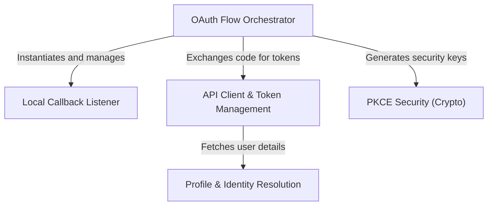

# Tutorial: oauth

This project implements a secure **OAuth 2.0 authentication flow** specifically designed for a Command Line Interface (CLI). It acts as a concierge that manages the entire login journey: generating **PKCE security keys**, spinning up a *local web server* to catch browser redirects, exchanging authorization codes for access tokens, and finally fetching the user's **profile and subscription details** to verify their identity.

## Chapters

1. [OAuth Flow Orchestrator](01_oauth_flow_orchestrator.md)
2. [Local Callback Listener](02_local_callback_listener.md)
3. [API Client & Token Management](03_api_client___token_management.md)
4. [Profile & Identity Resolution](04_profile___identity_resolution.md)
5. [PKCE Security (Crypto)](05_pkce_security__crypto_.md)

---

Generated by [Code IQ](https://github.com/adityasoni99/Code-IQ)