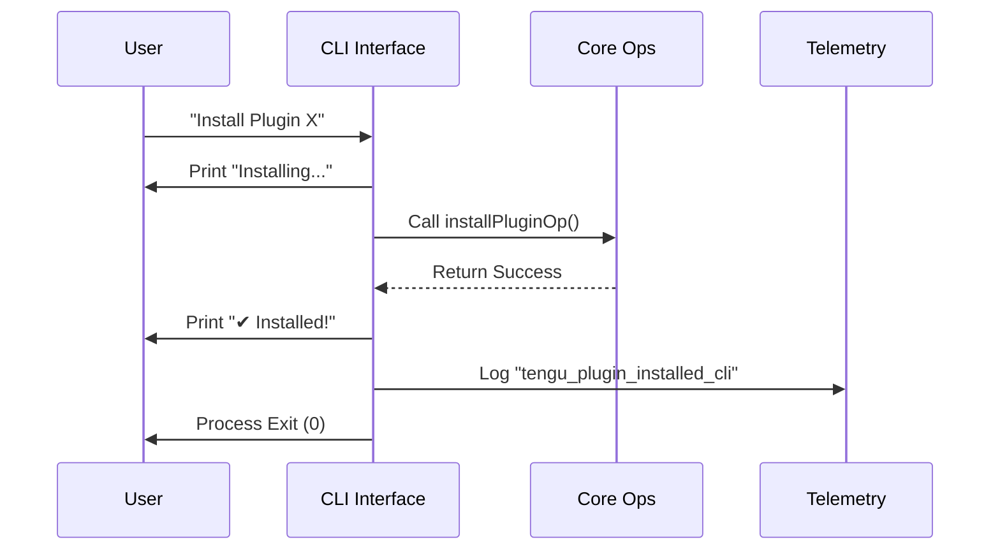

# Chapter 1: CLI Command Interface

Welcome to the first chapter of our journey into the Plugin system! 

Before we dive into how plugins are discovered, verified, or installed deep in the system, we need to understand how the user actually talks to the tool.

## The Motivation: The "Car Dashboard"

Imagine you are building a car. You have a powerful engine (the logic) that can drive wheels, switch gears, and burn fuel. However, you can't ask the driver to reach into the hood and pull wires to accelerate. You need a **steering wheel and a dashboard**.

In our project, the **CLI Command Interface** is that dashboard.

**The Central Use Case:**
A user types the following command in their terminal:
```bash
tengu plugin install my-cool-plugin
```

We need a specific layer of code to:
1.  Acknowledge the user ("Installing...").
2.  Tell the "engine" to do the work.
3.  Report success or failure nicely (`✔ Success` or `✖ Error`).
4.  Tell our analytics system what happened (Telemetry).
5.  Cleanly exit the program.

## Key Concepts

To solve this, we split our code into two parts. This chapter covers the **Presentation Layer**.

1.  **The Wrapper:** This functions as a "guard" or "wrapper." It doesn't know *how* to install a file, but it knows how to *ask* the core logic to do it.
2.  **Process Lifecycle:** This layer is responsible for the life and death of the command. It decides if the process exits with a `0` (success) or `1` (error).
3.  **Telemetry:** This layer quietly takes notes on what features users are using.

## Solving the Use Case

Let's look at how we implement the `install` command. We use a function called `installPlugin`.

Here is how you would use it (conceptually):

```typescript
import { installPlugin } from './pluginCliCommands.js'

// The user wants to install 'my-plugin' globally ('user' scope)
await installPlugin('my-plugin', 'user')

// Note: You don't need to handle what happens next. 
// This function will exit the process automatically!
```

This function is designed to be the "end of the line" for the CLI execution.

### Under the Hood: The Flow

When `installPlugin` is called, it orchestrates a conversation between the user, the core logic, and the analytics system.

Here is the flow of a successful operation:



## Implementation Deep Dive

Let's look at the actual code in `pluginCliCommands.ts`. We will break the `installPlugin` function down into small, manageable pieces.

### 1. The Setup and Core Call
First, we tell the user what we are doing, and then we ask the "Core" to do the heavy lifting.

```typescript
export async function installPlugin(
  plugin: string,
  scope: InstallableScope = 'user',
): Promise<void> {
  try {
    console.log(`Installing plugin "${plugin}"...`)

    // We delegate the hard work to the Core Operations layer
    const result = await installPluginOp(plugin, scope)

    if (!result.success) {
      throw new Error(result.message)
    }
```
*Explanation:* 
*   We use `console.log` to give immediate feedback.
*   `installPluginOp` is the "engine." You will learn about how that works in [Core Plugin Operations](04_core_plugin_operations.md).
*   If the result isn't successful, we throw an error to jump straight to our error handler.

### 2. Success and Telemetry
If the engine did its job, we celebrate and take notes.

```typescript
    // Print a nice checkmark figure
    console.log(`${figures.tick} ${result.message}`)

    // Log the event for analytics
    logEvent('tengu_plugin_installed_cli', {
      _PROTO_plugin_name: parsePluginIdentifier(result.pluginId || plugin).name,
      scope: result.scope || scope,
      install_source: 'cli-explicit',
      // ... other metadata fields
    })

    // Exit the program successfully
    process.exit(0)
```
*Explanation:*
*   `figures.tick` prints a green checkmark (✔).
*   `logEvent` sends data to our dashboard so we know which plugins are popular.
*   `process.exit(0)` stops the Node.js program. `0` tells the terminal "Everything went okay."

### 3. Error Handling
But what if something goes wrong? The `catch` block handles it politely.

```typescript
  } catch (error) {
    // This helper function handles logging the error and exiting with code 1
    handlePluginCommandError(error, 'install', plugin)
  }
}
```
*Explanation:*
*   We don't just crash. We catch the error.
*   We pass it to `handlePluginCommandError`, a shared utility that prints a nice "✖ Failed to install..." message and exits with code `1` (failure).

## Summary

The **CLI Command Interface** acts as the polite front desk of our plugin system. 
1.  It wraps the raw logic.
2.  It handles the inputs (`console.log`) and outputs (`process.exit`).
3.  It ensures consistent error formatting and telemetry.

Now that we know *how* to call the commands, we need to understand *what* exactly we are installing. How does the system know the difference between a plugin name like `my-plugin` and a complex ID?

Find out in the next chapter:
[Plugin Identification & Discovery](02_plugin_identification___discovery.md)

---

Generated by [Code IQ](https://github.com/adityasoni99/Code-IQ)