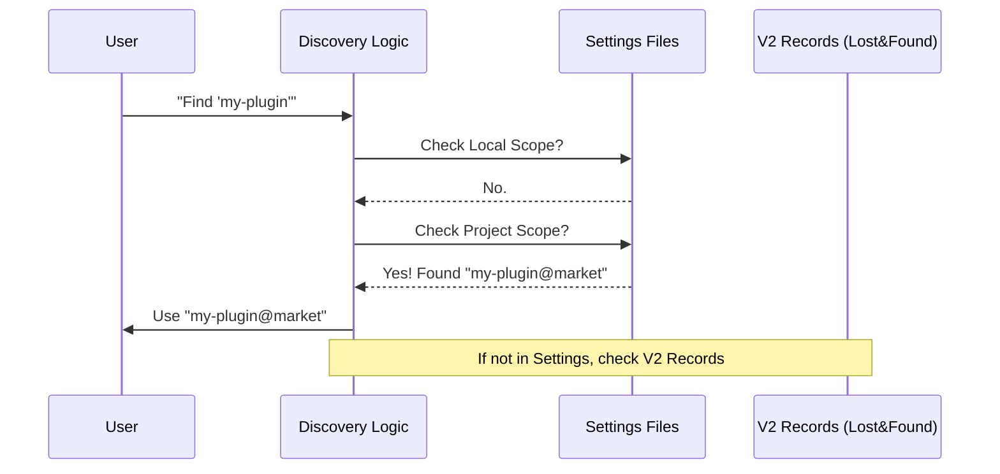

# Chapter 2: Plugin Identification & Discovery

Welcome back! In the previous chapter, [CLI Command Interface](01_cli_command_interface.md), we learned how the "dashboard" of our application accepts commands like `install` or `disable`.

But there is a catch. When a user types:
`tengu plugin disable my-plugin`

...how does the system know *which* "my-plugin" they are talking about? Is it the one installed globally for the user? Or the one specific to the current project? Is it from the official marketplace or a private one?

This chapter explains how we translate a simple string into a concrete plugin identity.

## The Motivation: The "Smart Contact List"

Think of your phone's contact list.
*   If you type **"Mom"**, your phone knows to dial `+1-555-0199`.
*   If you type **"555-0199"**, it also works.
*   If you have two friends named "John," your phone might ask, "Which one?"

**The Central Use Case:**
A user wants to **uninstall** a plugin. They type:
```bash
tengu plugin uninstall super-logger
```

Our system needs to:
1.  **Parse:** Understand if `super-logger` is a nickname (name) or a full ID.
2.  **Search:** Look through the user's settings (Local, Project, User) to see if `super-logger` is already defined there.
3.  **Resolve:** Return the exact ID, like `super-logger@official-marketplace`.

## Key Concepts

### 1. The Identifier
There are two ways to refer to a plugin:
*   **The Bare Name:** `super-logger`. This is ambiguous. It's like saying "John".
*   **The Full ID:** `super-logger@marketplace`. This is specific. It's like saying "john.doe@email.com".

### 2. The Scope Hierarchy
We store settings in three places (Scopes). When looking for a plugin, we search in a specific order:
1.  **Local** (`.claude/claude.json` - just for you)
2.  **Project** (`.claude/settings.json` - shared with the team)
3.  **User** (`~/.config/claude/config.json` - global)

**Most Specific Wins:** If "super-logger" is defined in your *Local* settings, we stop looking there. We assume that's the one you mean, even if another exists globally.

### 3. The "Lost & Found" (V2 Data)
Sometimes, a plugin might be removed (delisted) from the marketplace. It no longer exists online, but you still have it installed. We keep a permanent record in a file called `installed_plugins_v2.json`. If we can't find a plugin in the marketplace, we check here.

## Solving the Use Case

Let's see how we handle `uninstallPluginOp`. We don't just blindly delete files; we first figure out exactly who we are dealing with.

Here is the high-level logic (Conceptual):

```typescript
// Input: "super-logger"
const found = findPluginInSettings("super-logger");

if (found) {
  // We found it in the settings! 
  // It resolves to "super-logger@official"
  return uninstall("super-logger@official");
} else {
  // Not in settings? Check the "Lost & Found" record.
  const record = resolveDelistedPluginId("super-logger");
  return uninstall(record.fullId);
}
```

## Implementation Deep Dive

Let's look at how this works under the hood.

### 1. The Discovery Flow

Before looking at the code, let's visualize the decision process.



### 2. Hunting through Settings

In `pluginOperations.ts`, we use a helper function called `findPluginInSettings`. It implements the "Most Specific Wins" search strategy.

```typescript
function findPluginInSettings(plugin: string): { pluginId: string, scope: InstallableScope } | null {
  const searchOrder: InstallableScope[] = ['local', 'project', 'user']

  // 1. Loop through scopes from most specific to least specific
  for (const scope of searchOrder) {
    const enabledPlugins = getSettingsForSource(scopeToSettingSource(scope))?.enabledPlugins
    if (!enabledPlugins) continue

    // 2. Check every key in this setting file
    for (const key of Object.keys(enabledPlugins)) {
      // Does "my-plugin" match "my-plugin@marketplace"?
      if (key === plugin || key.startsWith(`${plugin}@`)) {
        return { pluginId: key, scope } // Found it!
      }
    }
  }
  return null // Not found in any settings
}
```
*Explanation:*
*   We iterate through `local`, then `project`, then `user`.
*   We check if the key in the settings file matches the user's input.
*   If found, we return the *full* ID (`pluginId`) and where we found it (`scope`).

### 3. Handling the "Lost" Plugins

If a plugin is delisted, it won't appear in the marketplace API anymore. However, the user still has it installed. We need `resolveDelistedPluginId` to find these "ghost" plugins.

```typescript
function resolveDelistedPluginId(plugin: string) {
  const { name } = parsePluginIdentifier(plugin)
  const installedData = loadInstalledPluginsV2()

  // 1. Try exact match (e.g., input was "my-plugin@old-market")
  if (installedData.plugins[plugin]?.length) {
    return { pluginId: plugin, pluginName: name }
  }

  // 2. Try searching by name (e.g., input was "my-plugin")
  const matchingKey = Object.keys(installedData.plugins).find(key => {
    const { name: keyName } = parsePluginIdentifier(key)
    // Return true if names match and it's actually installed
    return keyName === name && (installedData.plugins[key]?.length ?? 0) > 0
  })

  return matchingKey ? { pluginId: matchingKey, pluginName: name } : null
}
```
*Explanation:*
*   `loadInstalledPluginsV2()` loads our permanent record of what is physically on the disk.
*   We try to find an entry that matches the name the user typed.
*   This ensures you can still uninstall a plugin even if the internet (marketplace) "forgets" it exists.

### 4. Putting it together: The Uninstall Operation

Finally, let's see how `uninstallPluginOp` uses these tools.

```typescript
export async function uninstallPluginOp(plugin: string, scope: InstallableScope = 'user') {
  // 1. Try to find the plugin in our loaded list/settings
  const foundPlugin = findPluginByIdentifier(plugin, allPlugins)

  let pluginId: string
  
  if (foundPlugin) {
    // We found it! Resolve the full ID from settings.
    pluginId = foundPlugin.name // (Simplified for tutorial)
  } else {
    // 2. Not found? It might be delisted. Check the V2 records.
    const resolved = resolveDelistedPluginId(plugin)
    if (!resolved) {
      return { success: false, message: `Plugin "${plugin}" not found` }
    }
    pluginId = resolved.pluginId
  }
  
  // ... proceed to remove files ...
}
```
*Explanation:*
*   This function acts as the coordinator.
*   It prefers "live" plugins (those we know about).
*   It falls back to "delisted" plugins (using `resolveDelistedPluginId`).
*   Only after identifying the plugin does it proceed to delete files.

## Summary

In this chapter, we learned that a plugin name is just a starting point. To safely operate on plugins, the system must:
1.  **Parse** the name.
2.  **Hunt** through settings scopes (Local > Project > User).
3.  **Recover** IDs for delisted plugins using V2 records.

Now that we know *which* plugin we are talking about and *where* it lives in the settings, we need to decide exactly which configuration file takes precedence when the code actually runs.

Next, we will explore the rules of the hierarchy in detail:
[Scope Resolution Strategy](03_scope_resolution_strategy.md)

---

Generated by [Code IQ](https://github.com/adityasoni99/Code-IQ)