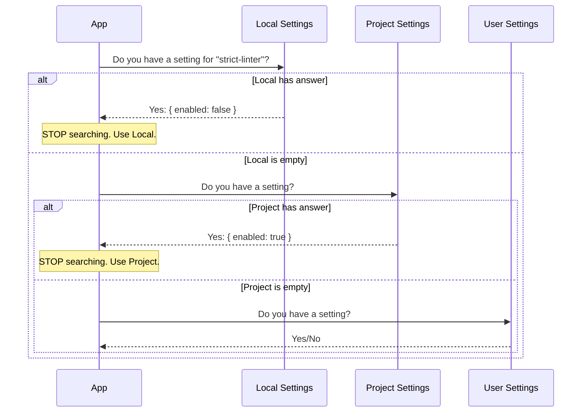

# Chapter 3: Scope Resolution Strategy

Welcome back! In [Plugin Identification & Discovery](02_plugin_identification___discovery.md), we learned how the system figures out *who* a plugin is (identifying `my-plugin` as `my-plugin@marketplace`).

Now we face a new problem: **Disagreement.**

What if you want a plugin enabled globally, but disabled for one specific project? Or what if your team mandates a "linter" plugin for the project, but you want to turn it off temporarily on your machine to debug something?

This chapter explains the **Scope Resolution Strategy**—the rules the system uses to decide which configuration wins when there are conflicting settings.

## The Motivation: The "Office Radio" Analogy

Imagine an open-plan office.

1.  **The Building Rule (User Scope):** The building management plays soft jazz in the lobby. Everyone hears it by default.
2.  **The Team Rule (Project Scope):** Your specific marketing team decides to play pop music in your corner. This overrides the lobby jazz.
3.  **The Headphones (Local Scope):** You put on noise-canceling headphones to focus. This overrides both the team music and the lobby jazz.

**The Central Use Case:**
You are working on a team project. The team has a `strict-linter` plugin enabled in the shared project settings (`.claude/settings.json`). This file is committed to Git, so everyone has it.

You want to disable it **only on your computer** without breaking it for your teammates.

You run:
```bash
tengu plugin disable strict-linter --scope local
```

The system needs a strategy to ensure your "local" preference takes priority over the "project" rule.

## Key Concepts

We organize configuration into three layers, called **Scopes**.

### 1. User Scope (Global)
*   **Location:** `~/.config/claude/config.json`
*   **Purpose:** Your personal defaults. These apply to every project you open, unless told otherwise.
*   **Analogy:** The "Factory Settings" or "Building Rules."

### 2. Project Scope (Shared)
*   **Location:** `.claude/settings.json` (inside your project folder)
*   **Purpose:** Team-wide settings. This file is usually shared via Git.
*   **Analogy:** The "Team Rules."

### 3. Local Scope (Private)
*   **Location:** `.claude/claude.json` (inside your project folder)
*   **Purpose:** Your personal overrides for this specific project. This file is **ignored by Git**.
*   **Analogy:** Your "Headphones."

### The "CSS Specificity" Rule
Just like in CSS, where an ID selector (`#header`) overrides a class selector (`.header`), our scopes have a strict precedence order.

**The Golden Rule:** `Local` > `Project` > `User`.
*   If `Local` says "Disabled", the plugin is disabled (even if Project says "Enabled").
*   If `Local` says nothing, we check `Project`.

## Solving the Use Case

When you run the disable command with `--scope local`, the system writes `enabled: false` into your private `local` settings file.

When the system later asks, "Is the `strict-linter` enabled?", it runs a resolution check:

1.  **Check Local:** Found `enabled: false`. **STOP.** Result: **Disabled.**
2.  (The system never even looks at Project or User because Local gave a definitive answer).

If you hadn't set a local override:

1.  **Check Local:** Nothing found.
2.  **Check Project:** Found `enabled: true`. **STOP.** Result: **Enabled.**

## Implementation Deep Dive

Let's look at how this logic is implemented in the code.

### The Resolution Flow

When the application starts or a command runs, it doesn't just read one file. It hunts for the plugin configuration.



### The Code: Searching the Hierarchy

In `pluginOperations.ts`, the function `findPluginInSettings` implements this hierarchy.

We define the search order explicitly:

```typescript
// From pluginOperations.ts
function findPluginInSettings(plugin: string) {
  // 1. Define the priority: Local first, then Project, then User
  const searchOrder: InstallableScope[] = ['local', 'project', 'user']

  // 2. Loop through them in order
  for (const scope of searchOrder) {
    // ... logic to check the file ...
```
*Explanation:*
We create an array `['local', 'project', 'user']`. This simple array defines the entire philosophy of our specificity. If we wanted `user` settings to override everything, we would just change the order of this array.

### Checking the Files

Inside the loop, we check if the plugin exists in that specific scope.

```typescript
    // Inside the loop...
    const settings = getSettingsForSource(scopeToSettingSource(scope))
    
    // If the file exists and has plugins enabled...
    if (settings && settings.enabledPlugins) {
        // Check if our plugin is mentioned here
        if (checkIfPluginIsHere(settings.enabledPlugins, plugin)) {
             // Found it! Return immediately. The loop stops.
             return { pluginId: key, scope }
        }
    }
  } // End loop
  return null // Not found anywhere
}
```
*Explanation:*
*   `scopeToSettingSource(scope)`: This helper translates the string `'user'` into the actual file handler for `userSettings`.
*   The `return` statement is crucial. As soon as we find a match in a high-priority scope (like `local`), we exit the function. This prevents lower-priority scopes from interfering.

### Handling Overrides During "Write"

When **writing** settings (e.g., enabling a plugin), the system is smart. It knows about the hierarchy.

If you try to disable a plugin that is enabled in the Project scope, the system warns you if you are targeting the wrong scope.

```typescript
// From setPluginEnabledOp in pluginOperations.ts

// Imagine we found the plugin enabled in 'project' scope
const foundScope = 'project' 

// But the user requested to change it in 'user' scope (which is lower priority)
const requestedScope = 'user'

// We check precedence (Local=2, Project=1, User=0)
const isOverride = precedence[requestedScope] > precedence[foundScope]

// If you aren't overriding, and you are editing the wrong scope, we warn you.
if (!isOverride && foundScope !== requestedScope) {
    return { success: false, message: "Plugin is managed in Project scope..." }
}
```
*Explanation:*
This logic prevents confusion.
*   If a plugin is set in **Project**, and you try to change it in **User** (Global), it won't work because Project wins. The system blocks this action to save you frustration.
*   However, if you try to change it in **Local**, `isOverride` becomes true. The system allows this because Local is *allowed* to override Project.

## Summary

The **Scope Resolution Strategy** ensures that your plugin system is flexible enough for team collaboration but personal enough for individual preferences.

1.  **Local** (`.claude/claude.json`) is for you.
2.  **Project** (`.claude/settings.json`) is for the team.
3.  **User** (`Config`) is for defaults.
4.  The system always listens to the most specific scope available.

Now that we know *which* plugin we want (Chapter 2) and *which* settings apply (Chapter 3), we are ready to perform the actual work: installing files, moving data, and validating versions.

Next, we dive into the engine room:
[Core Plugin Operations](04_core_plugin_operations.md)

---

Generated by [Code IQ](https://github.com/adityasoni99/Code-IQ)