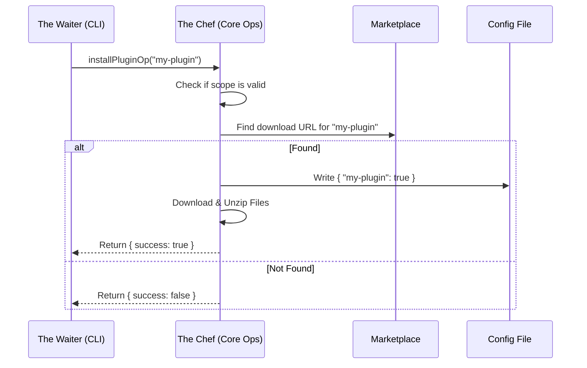

# Chapter 4: Core Plugin Operations

Welcome back! 

In the previous chapters, we built the foundation for our plugin system:
1.  We built the "Dashboard" in [CLI Command Interface](01_cli_command_interface.md).
2.  We learned how to find plugins in [Plugin Identification & Discovery](02_plugin_identification___discovery.md).
3.  We decided which configuration rules apply in [Scope Resolution Strategy](03_scope_resolution_strategy.md).

Now, we have arrived at the **Engine Room**. 

In this chapter, we will explore **Core Plugin Operations**. This is the code that actually *does* the work—downloading files, writing to configuration files, and deleting data.

## The Motivation: The "Chef and The Waiter"

To understand why this layer exists, imagine a restaurant.

*   **The CLI (Chapter 1)** is the **Waiter**. They talk to the customer, take the order, and deliver the food. They are polite and handle the "user interface."
*   **The Core Operations (This Chapter)** is the **Chef**. The Chef cooks the food inside the kitchen.

**The Important Rule:** The Chef never goes out to the dining room to scream at the customers. 

If the Chef runs out of steak, they don't yell "ERROR!" to the customer. They simply tell the Waiter, *"I cannot cook this,"* and the Waiter decides how to tell the customer politely.

In our code:
*   **CLI:** Uses `console.log` and `process.exit`.
*   **Core Ops:** **Never** uses `console.log` or `process.exit`. It simply returns a `Result Object` saying if it succeeded or failed.

**The Central Use Case:**
We want to install a plugin. This logic needs to be shared. The CLI needs it, but maybe in the future, a Graphical User Interface (GUI) will need it too. By keeping the "Chef" separate from the "Waiter," we can use the same cooking logic for any interface.

## Key Concepts

### 1. Pure Functions
The functions in this layer (like `installPluginOp` or `disablePluginOp`) are designed to be "pure" in terms of user interaction. They perform file system operations, but they remain silent.

### 2. The Result Object
Instead of printing text, every operation returns a standardized object. This acts as the "report card" passed from the Chef to the Waiter.

```typescript
type PluginOperationResult = {
  success: boolean      // Did it work?
  message: string       // A description (for the UI to print)
  pluginId?: string     // The ID we operated on
  scope?: PluginScope   // Where did we do it?
}
```

### 3. Settings-First Approach
When we install a plugin, we don't just dump files on the disk. We first declare our **intent** in the settings file (like `.claude/settings.json`). 
1.  **Write Setting:** "I want `super-logger` enabled."
2.  **Materialize:** Download and cache the files.

## Solving the Use Case

Let's look at how we use `installPluginOp`. Remember, this code runs *inside* the system, usually called by the CLI.

**Input:**
```typescript
import { installPluginOp } from './pluginOperations'

// The CLI calls the Core Op
const result = await installPluginOp('super-logger', 'user')
```

**Output (The Result Object):**
The `result` variable will look like this:
```json
{
  "success": true,
  "message": "Successfully installed plugin: super-logger@marketplace (scope: user)",
  "pluginId": "super-logger@marketplace",
  "scope": "user"
}
```

If it fails (e.g., the internet is down), it won't crash the app. It returns:
```json
{
  "success": false,
  "message": "Plugin 'super-logger' not found in marketplace"
}
```

## Implementation Deep Dive

Let's look at the flow of the `install` operation. It involves checking valid inputs, finding the plugin, and then handing off the heavy lifting to a helper.

### The Installation Flow



### 1. Validating the Request
The first thing the "Chef" does is check if the order makes sense. We can't install a plugin into a scope that doesn't accept installations.

```typescript
export async function installPluginOp(
  plugin: string,
  scope: InstallableScope = 'user',
): Promise<PluginOperationResult> {
  // 1. Guard: Ensure the scope is valid ('user', 'project', or 'local')
  assertInstallableScope(scope)

  const { name } = parsePluginIdentifier(plugin)
  
  // ... continue logic ...
```
*Explanation:*
*   `assertInstallableScope`: Throws an error immediately if a developer tries to install into an invalid scope (like 'system').

### 2. Finding the Plugin
Next, we need to find where the plugin lives. Is it in the official marketplace?

```typescript
  // 2. Search configured marketplaces
  // (Simplified for tutorial)
  const pluginInfo = await getPluginById(plugin)

  if (!pluginInfo) {
    // Return a failure result object - DO NOT exit process!
    return {
      success: false,
      message: `Plugin "${name}" not found in marketplace`,
    }
  }
```
*Explanation:*
*   We look up the plugin.
*   If we can't find it, we return `success: false`. The CLI will read this message and show a red "X" to the user later.

### 3. The Installation Helper
If we find it, we call a helper function `installResolvedPlugin` to handle the physical file copying and settings updates.

```typescript
  // 3. Perform the actual install
  const result = await installResolvedPlugin({
    pluginId: pluginInfo.id,
    entry: pluginInfo.entry,
    scope,
  })

  // 4. Transform the result for the caller
  if (!result.ok) {
    return { success: false, message: result.message }
  }

  return {
    success: true,
    message: `Successfully installed plugin: ${pluginInfo.id}`,
    pluginId: pluginInfo.id,
    scope,
  }
}
```
*Explanation:*
*   `installResolvedPlugin`: This is a helper that downloads the zip file and updates `claude.json`.
*   We wrap the result in our standard `PluginOperationResult` format and return it.

### 4. Uninstalling: Cleaning Up
Uninstalling is trickier than installing. We have to make sure we remove the settings *and* the internal records.

```typescript
export async function uninstallPluginOp(
  plugin: string,
  scope: InstallableScope = 'user',
): Promise<PluginOperationResult> {
  
  // 1. Find the full ID (e.g., resolve 'my-plugin' to 'my-plugin@market')
  // We learned this in Chapter 2!
  const foundPlugin = findPluginByIdentifier(plugin, allPlugins)

  // 2. Remove from Settings file (e.g., set to undefined)
  updateSettingsForSource(scopeToSettingSource(scope), {
    enabledPlugins: { [pluginId]: undefined },
  })
  
  // 3. Clear internal caches so the system forgets the code
  clearAllCaches()
  
  return { success: true, message: "Uninstalled successfully" }
}
```
*Explanation:*
*   Note how we use `updateSettingsForSource`. This writes to the JSON file associated with the scope.
*   `clearAllCaches`: Ensures that if the user immediately tries to run the plugin again, the system doesn't accidentally use an old version loaded in memory.

## Analogy Recap: The Hierarchy

Think of the Core Operations as the **Internal API** of our tool.

1.  **CLI (Chapter 1):** The user interface. It asks nicely.
2.  **Resolution (Chapter 3):** The logic that decides *which* setting file to touch.
3.  **Core Ops (Chapter 4):** The hands that actually touch the files.

## Summary

In this chapter, we built the functional core of our plugin manager. 
*   We created "pure" functions that don't output to the console.
*   We used `PluginOperationResult` objects to communicate success or failure.
*   We implemented `install` and `uninstall` logic that respects the scopes we learned about previously.

But wait—what happens if you manually delete a plugin folder from your hard drive, but the settings file still says `enabled: true`? The system would be out of sync!

We need a process that runs in the background to ensure reality matches our settings.

Next, we will learn about the:
[Background Reconciliation Manager](05_background_reconciliation_manager.md)

---

Generated by [Code IQ](https://github.com/adityasoni99/Code-IQ)