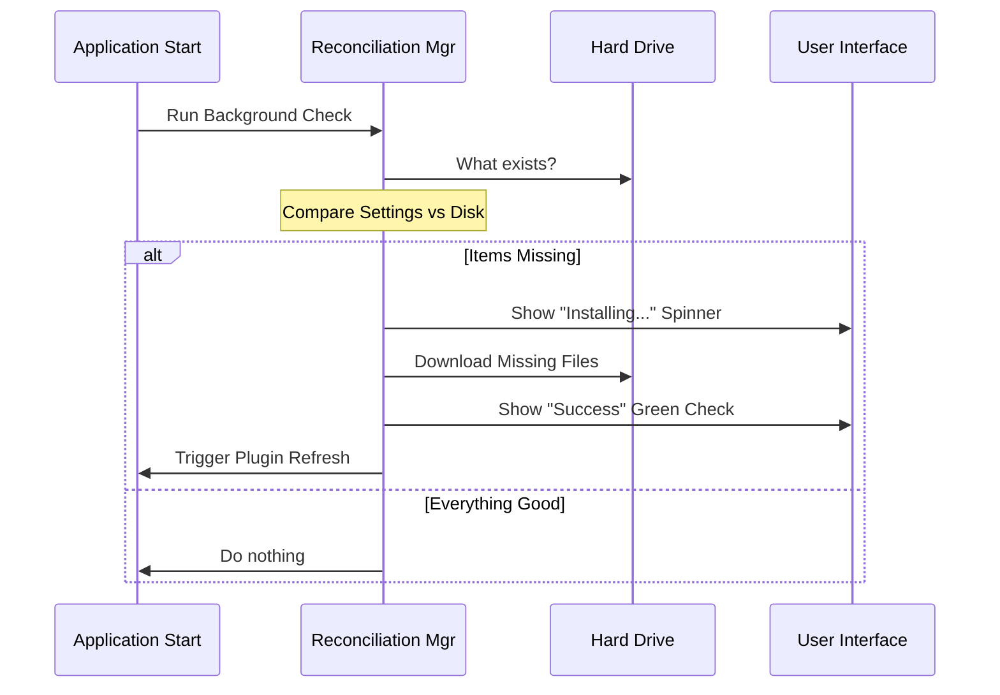

# Chapter 5: Background Reconciliation Manager

Welcome to the final chapter of our beginner's guide to the Plugin system!

In the previous chapter, [Core Plugin Operations](04_core_plugin_operations.md), we built the "Engine" (Core Ops). We learned how to write code that physically downloads files, writes settings, and deletes data when asked.

However, an engine doesn't drive itself. In Chapter 1, the **User** drove the engine using the CLI. But what happens when you want the system to fix itself automatically?

This chapter introduces the **Background Reconciliation Manager**. This is the autopilot. It ensures that what you *want* (your configuration) matches what you *have* (your hard drive), without you having to type a single command.

## The Motivation: The "New Laptop" Scenario

Imagine you just joined a new team. You clone their code repository to your brand-new laptop. Inside the project, there is a settings file that says:
*"This project requires the 'Corporate-Tools' marketplace."*

**Without a Reconciliation Manager:**
You start the app. It crashes or complains: "Error: Marketplace not found." You have to manually type:
`tengu marketplace add corporate-tools url://...`

**With a Reconciliation Manager:**
You start the app. You see a small spinner icon that says "Setting up environment..."
A few seconds later, it turns green. The marketplace is installed, the plugins are loaded, and you are ready to work.

**The Central Use Case:**
The system wakes up, reads the `settings.json` "Shopping List," checks the "Pantry" (Hard Drive), and automatically buys (downloads) whatever is missing.

## Key Concepts

### 1. Declared State vs. Actual State
*   **Declared State:** What is written in your config files (e.g., "I want Marketplace X").
*   **Actual State:** What actually exists in your file system.
*   **Reconciliation:** The process of calculating the difference (`Declared - Actual`) and performing actions to make them match.

### 2. Non-Blocking UI
Because downloading files takes time, we cannot freeze the entire application while this happens. We must run in the "background" but keep the user informed via the **App State** (UI spinners).

### 3. Auto-Refresh
Downloading a file isn't enough. Once the files land on the disk, we must tell the running application to "re-read" its memory so the new plugins become available instantly.

## Solving the Use Case

We solve this using a function called `performBackgroundPluginInstallations`. It runs every time the application starts.

Here is the high-level logic:

1.  **Diff:** Compare settings vs. disk.
2.  **Notify:** Tell the UI "I am working on X, Y, Z."
3.  **Action:** Download the missing items.
4.  **Refresh:** Reload the plugin system.

## Implementation Deep Dive

Let's look at how this works step-by-step.

### The Reconciliation Flow



### The Code: Step-by-Step

We will break down `PluginInstallationManager.ts` into small pieces to understand the logic.

#### 1. Calculating the "Diff"
First, we figure out what is missing. We don't want to download things we already have.

```typescript
// Inside performBackgroundPluginInstallations...

// 1. Get the list of what the settings file WANTS
const declared = getDeclaredMarketplaces()

// 2. Get the list of what the disk HAS
const materialized = await loadKnownMarketplacesConfig()

// 3. Calculate the difference
const diff = diffMarketplaces(declared, materialized)
```
*Explanation:*
*   `diff` contains a list of missing marketplaces.
*   If `diff` is empty, the function stops here. Efficiency first!

#### 2. Updating the UI (The Spinner)
Before we start downloading, we need to tell the user what is happening so they don't think the app is broken.

```typescript
// Define who is pending
const pendingNames = diff.missing

// Update the global AppState 
setAppState(prev => ({
  ...prev,
  plugins: {
    ...prev.plugins,
    installationStatus: {
      // Set status to 'pending' for these items
      marketplaces: pendingNames.map(name => ({
        name,
        status: 'pending', 
      })),
    },
  },
}))
```
*Explanation:*
*   `setAppState` is how we talk to the UI (React/Frontend).
*   We set the status to `'pending'`. On the user's screen, a loading spinner appears next to the marketplace name.

#### 3. Doing the Work (The Reconciler)
Now we call the heavy lifter. `reconcileMarketplaces` is a utility that iterates through the missing list and performs the actual downloads.

```typescript
// Run the reconciliation
const result = await reconcileMarketplaces({
  // This callback runs every time a download starts or finishes
  onProgress: event => {
    if (event.type === 'installing') {
        updateMarketplaceStatus(setAppState, event.name, 'installing')
    } else if (event.type === 'installed') {
        updateMarketplaceStatus(setAppState, event.name, 'installed')
    }
  },
})
```
*Explanation:*
*   We pass an `onProgress` function.
*   This allows the UI to update in real-time. The user watches the spinner turn into a "Downloading..." bar, and then a "Checkmark."

#### 4. The "Hot Swap" (Auto-Refresh)
This is the most critical step. The files are now on the disk, but the application loaded the *old* state when it started 5 seconds ago. We must force it to look again.

```typescript
if (result.installed.length > 0) {
  // 1. Clear the old memory
  clearMarketplacesCache()
  
  try {
    // 2. Force the system to reload plugins from the new files
    await refreshActivePlugins(setAppState)
    
  } catch (error) {
    // If auto-reload fails, ask the user to restart
    logError(error)
  }
}
```
*Explanation:*
*   `clearMarketplacesCache()`: Throws away the old list.
*   `refreshActivePlugins`: Re-runs the discovery logic we learned in [Chapter 2](02_plugin_identification___discovery.md).
*   This makes the new plugins available *immediately* without restarting the app.

## Summary

Congratulations! You have completed the **Plugin System Architecture** tutorial series.

In this final chapter, we learned how the **Background Reconciliation Manager** acts as the glue between your configuration and the runtime environment.

1.  It runs silently on startup.
2.  It identifies the gap between "Want" and "Have."
3.  It bridges that gap by installing missing items.
4.  It updates the UI so the user feels in control.

### Series Recap
Let's look back at our journey:
1.  **[CLI Command Interface](01_cli_command_interface.md):** We learned how users talk to the system.
2.  **[Plugin Identification](02_plugin_identification___discovery.md):** We learned how to find the right plugin.
3.  **[Scope Resolution](03_scope_resolution_strategy.md):** We learned how to handle conflicting settings.
4.  **[Core Operations](04_core_plugin_operations.md):** We learned how to touch the file system safely.
5.  **Reconciliation Manager (This Chapter):** We learned how to automate everything.

You now possess a complete mental model of how a modern, scalable plugin architecture works! You can confidently navigate the codebase, knowing exactly where to look if you need to add a new CLI command, change how settings are inherited, or debug a startup issue.

Happy Coding! 🚀

---

Generated by [Code IQ](https://github.com/adityasoni99/Code-IQ)