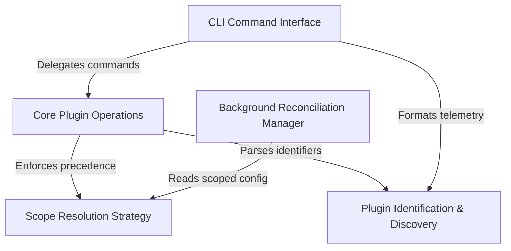

# Tutorial: plugins

The **plugins** project serves as a modular extension system, separating logic into a functional **Core** library and a user-facing **CLI** interface. It features an autonomous **Background Manager** to synchronize the runtime environment with declared configurations and employs a hierarchical **Scope Strategy** (User, Project, Local) to manage setting precedence. The system relies on a robust **Identification** mechanism to discover and resolve plugin identities across these contexts.

## Chapters

1. [CLI Command Interface](01_cli_command_interface.md)
2. [Plugin Identification & Discovery](02_plugin_identification___discovery.md)
3. [Scope Resolution Strategy](03_scope_resolution_strategy.md)
4. [Core Plugin Operations](04_core_plugin_operations.md)
5. [Background Reconciliation Manager](05_background_reconciliation_manager.md)

---

Generated by [Code IQ](https://github.com/adityasoni99/Code-IQ)