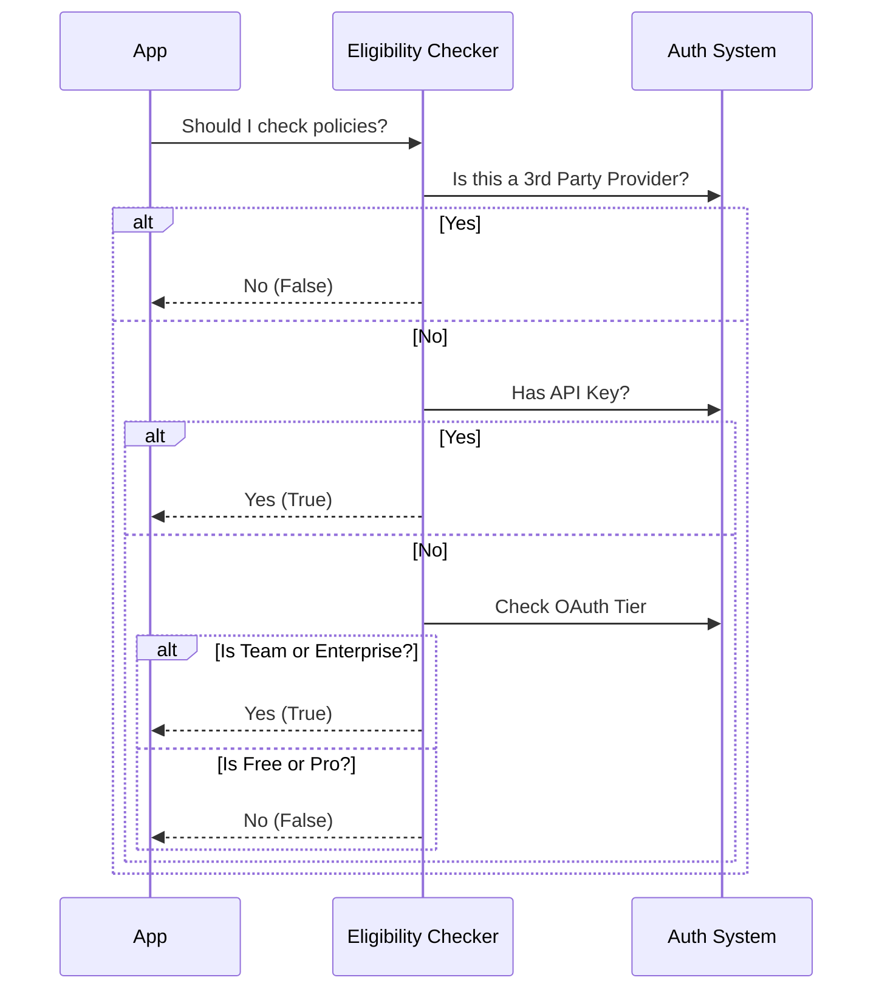

# Chapter 1: Policy Eligibility Checker

Welcome to the **Policy Limits** project! In this tutorial series, we will build a robust system to enforce organization-wide rules (like disabling remote desktop access or restricting usage) without getting in the user's way.

We start with the most fundamental question: **"Does this user even need to be checked?"**

## The Motivation: The "Corporate Gatekeeper"

Imagine you are building a CLI tool used by thousands of developers.
- **Alice** is a hobbyist using the tool for a personal project. She wants full freedom.
- **Bob** is an employee at a large bank. The bank's security team wants to ensure Bob doesn't accidentally upload sensitive code to the cloud.

If we force Alice to download and check complex corporate policies every time she runs a command, we waste her time and bandwidth. She doesn't have a "security team," so her policy list is empty.

The **Policy Eligibility Checker** acts as a smart filter. It looks at *who* is logged in and decides immediately:
1.  **Skip Check:** You are a personal user. Go ahead and have fun!
2.  **Perform Check:** You belong to an Enterprise organization. We need to fetch your rules.

## Key Concepts

To make this decision, the checker looks at three specific attributes of the current session:

1.  **API Provider:** Is the user connecting directly to our service (First Party) or using a different host (Third Party)? We only enforce rules on our own platform.
2.  **Authentication Method:** Is the user logging in with an **API Key** (developer mode) or **OAuth** (web login)?
3.  **Subscription Tier:** For web users, are they on a **Free/Pro** plan (personal) or a **Team/Enterprise** plan (corporate)?

## How It Works

The core of this logic lives in a function called `isPolicyLimitsEligible()`. It returns `true` if we should download policies, and `false` if we should ignore them.

### Usage Example

Here is how the rest of the application uses this checker. It's a simple boolean gate.

```typescript
import { isPolicyLimitsEligible } from './policyLimits';

function initializeApp() {
  // Simple check: Do we need to load policies?
  if (isPolicyLimitsEligible()) {
    console.log("Corporate user detected. Loading rules...");
    // Logic to fetch policies goes here
  } else {
    console.log("Personal user. Skipping policy checks.");
  }
}
```

## Internal Implementation

Let's look under the hood. When `isPolicyLimitsEligible()` is called, it runs through a series of "fail-fast" checks. If any check fails, the user is deemed ineligible, and we stop immediately.

### The Decision Flow



### Code Walkthrough

We will break the implementation down into small, digestible checks.

#### 1. The Provider Check
First, we ignore users who aren't using our official API. If they are using a proxy or a third-party integration, we can't enforce our policies anyway.

```typescript
// inside isPolicyLimitsEligible()

// 1. If using a 3rd party provider, ignore policy limits
if (getAPIProvider() !== 'firstParty') {
  return false
}

// 2. If using a custom proxy URL, ignore policy limits
if (!isFirstPartyAnthropicBaseUrl()) {
  return false
}
```
*Explanation:* We check `getAPIProvider()`. If it returns anything other than `'firstParty'`, we immediately return `false`.

#### 2. The API Key Check
Developers often use raw API Keys (strings starting with `sk-ant...`). These users are considered "Console Users" and are generally eligible for policy checks.

```typescript
// Check if the user has a valid API Key
try {
  const { key: apiKey } = getAnthropicApiKeyWithSource({
    skipRetrievingKeyFromApiKeyHelper: true,
  })
  
  // If an API key exists, they are eligible
  if (apiKey) {
    return true
  }
} catch {
  // If error occurs, ignore and move to next check
}
```
*Explanation:* We try to retrieve the API key. If one exists, we return `true` immediately. API Key users are always checked.

#### 3. The OAuth Tier Check
If the user doesn't have an API Key, they might be logged in via the Web (OAuth). Here, we distinguish between personal users (Pro) and corporate users (Enterprise).

```typescript
// Get the OAuth token details
const tokens = getClaudeAIOAuthTokens()

// No token means no session, so not eligible
if (!tokens?.accessToken) {
  return false
}

// Only Team and Enterprise subscribers are eligible
if (
  tokens.subscriptionType !== 'enterprise' &&
  tokens.subscriptionType !== 'team'
) {
  return false // Free/Pro users skip this
}

return true
```
*Explanation:* This is the final gate. We look at `subscriptionType`. If it is 'free' or 'pro', we return `false`. Only 'team' and 'enterprise' return `true`.

## Why This Matters

By implementing this **Eligibility Checker**, we solve two problems:
1.  **Performance:** We avoid network requests for 90% of our users (hobbyists/personal accounts).
2.  **Privacy:** We don't track or fetch configurations for users who haven't explicitly joined a managed organization.

## Summary

In this chapter, we learned how to build a **Policy Eligibility Checker**. It acts as a bouncer, deciding which user sessions require corporate rule enforcement and which do not.

Now that we know *who* needs policies, we need to figure out how to fetch and apply them without breaking the app if the network goes down.

[Next Chapter: Fail-Open Policy Enforcer](02_fail_open_policy_enforcer.md)

---

Generated by [Code IQ](https://github.com/adityasoni99/Code-IQ)