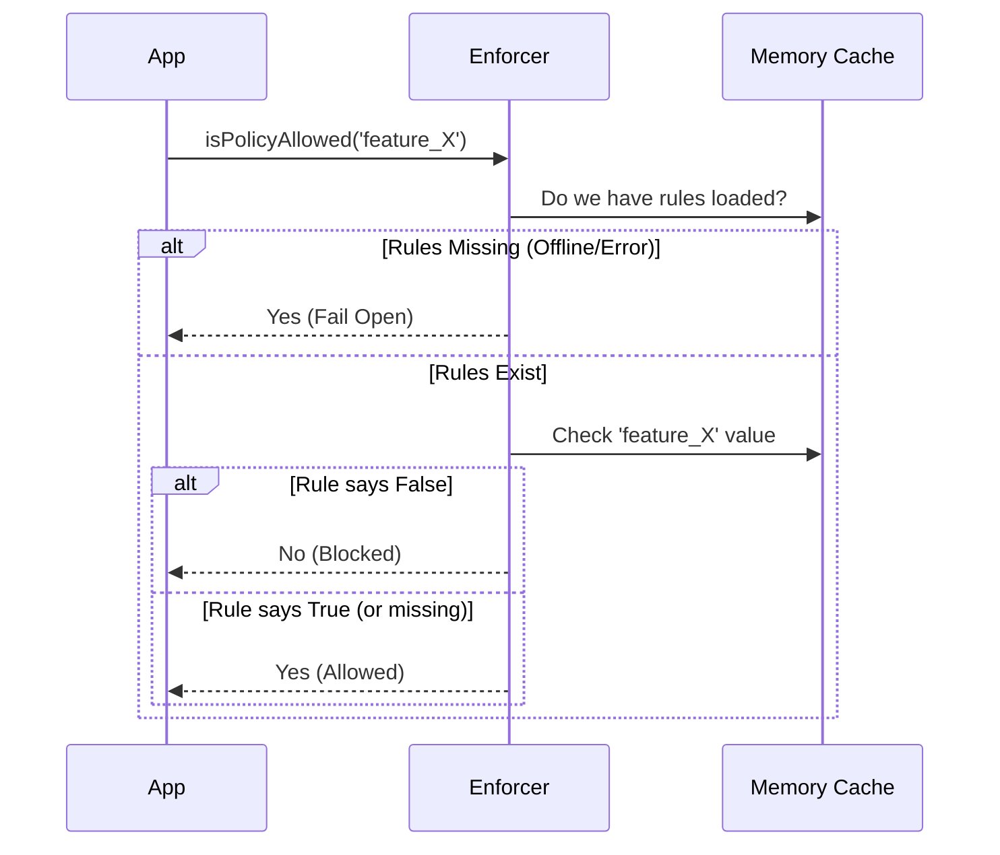

# Chapter 2: Fail-Open Policy Enforcer

Welcome back! In the previous chapter, the [Policy Eligibility Checker](01_policy_eligibility_checker.md), we determined *who* needs to be checked for corporate policies.

Now, we face a critical engineering decision: **What happens if we can't find the rules?**

Maybe the user is offline, our policy server is down, or the Wi-Fi is spotty. In this chapter, we will build the **Fail-Open Policy Enforcer**. This is the logic that decides whether a specific feature (like "remote desktop" or "telemetry") is allowed to run.

## The Motivation: Don't Break the Workflow

Imagine an electronic keycard lock on an office door.
1.  **Fail-Closed:** If the power goes out, the door locks. No one enters. This is great for a bank vault.
2.  **Fail-Open:** If the power goes out, the door unlocks. People can still get to safety.

For a developer tool, we adopt a **Fail-Open** philosophy.
*   **Scenario:** Alice is coding on a train with no Wi-Fi. She tries to use a feature.
*   **Our Stance:** We cannot fetch her company's policies. Instead of blocking her work ("Computer says no"), we assume everything is permitted until told otherwise.

**Rule of Thumb:** It is better to accidentally allow a restricted feature than to block a developer from doing their job because of a network error.

## The Interface

The entire policy system exposes one primary function to the rest of the application: `isPolicyAllowed`.

This function asks a simple question: *"Is this specific feature allowed right now?"*

### Usage Example

```typescript
import { isPolicyAllowed } from './policyLimits';

function launchRemoteDesktop() {
  // Check the policy before acting
  if (isPolicyAllowed('remote_desktop_access')) {
    console.log("Starting remote session...");
    // ... start the feature
  } else {
    console.error("Blocked by organization policy.");
  }
}
```

This boolean check acts as the gatekeeper for sensitive features.

## Internal Implementation

The implementation of `isPolicyAllowed` is designed to be fast and synchronous. It doesn't make network calls itself; it relies on data already loaded into memory (which we will cover in [Chapter 3: Caching & Persistence Layer](03_caching___persistence_layer.md)).

### The Logic Flow

When the app asks, "Is `feature_X` allowed?", the Enforcer follows this logic:



### Code Walkthrough

Let's look at the implementation steps.

#### 1. The Cache Check (Fail-Open)
First, we try to get the current list of rules. If we can't find them (maybe we haven't fetched them yet, or the user is offline), we default to **Allow**.

```typescript
// inside isPolicyAllowed(policyName)

const restrictions = getRestrictionsFromCache();

// 1. If we have no data, default to TRUE (Allowed)
if (!restrictions) {
  return true; 
}
```
*Explanation:* If `restrictions` is null, we stop checking and let the user proceed. This is the definition of "Fail-Open."

#### 2. The Unknown Policy Check
What if we have a list of rules, but the specific feature asked for isn't in the list? This happens if the CLI tool is newer than the policy server.

```typescript
// 2. Look up the specific policy
const restriction = restrictions[policyName];

// If the policy is not defined in the list, allow it
if (!restriction) {
  return true;
}
```
*Explanation:* We only enforce rules we explicitly know about. If the server doesn't say "No", the answer is "Yes".

#### 3. The Actual Enforcement
Finally, if the rule exists, we return its value.

```typescript
// 3. Return the explicit rule
return restriction.allowed;
```

## The Exception: Essential Traffic Only

There is one major exception to the "Fail-Open" rule.

Some organizations work in highly regulated environments (like healthcare handling HIPAA data). They might turn on a "Strict Privacy" or "Essential Traffic Only" mode. In this mode, sending data (like product feedback) is strictly forbidden unless explicitly authorized.

In this specific case, if we can't fetch the policy, we must **Fail-Closed** to prevent accidental data leaks.

### How We Handle the Exception

We maintain a small list of policies that must fail-closed during strict privacy modes.

```typescript
// Policies that deny on cache miss IF in strict mode
const ESSENTIAL_TRAFFIC_DENY_ON_MISS = new Set([
  'allow_product_feedback'
]);
```

We modify the logic in step 1:

```typescript
// Modified Step 1: Handling Cache Misses
if (!restrictions) {
  // Exception: If in strict privacy mode, block specific features
  if (isEssentialTrafficOnly() && 
      ESSENTIAL_TRAFFIC_DENY_ON_MISS.has(policyName)) {
    return false; // Fail Closed
  }
  
  return true; // Fail Open (Default)
}
```

*Explanation:* If the cache is missing (`!restrictions`), we check if the user is in strict mode (`isEssentialTrafficOnly`). If they are, and they are trying to do something risky (like sending feedback), we block it just to be safe.

## Summary

In this chapter, we built the **Fail-Open Policy Enforcer**.

1.  **Philosophy:** We prioritize user workflow. If the network fails, the feature works.
2.  **Implementation:** We check an in-memory cache. If the cache is empty, we return `true`.
3.  **Safety:** We added a special check for "Essential Traffic" to ensure privacy compliance even when offline.

But wait—where does this "Cache" come from? How do we populate `restrictions` without slowing down the application startup?

In the next chapter, we will build the storage system that ensures these rules are available instantly.

[Next Chapter: Caching & Persistence Layer](03_caching___persistence_layer.md)

---

Generated by [Code IQ](https://github.com/adityasoni99/Code-IQ)