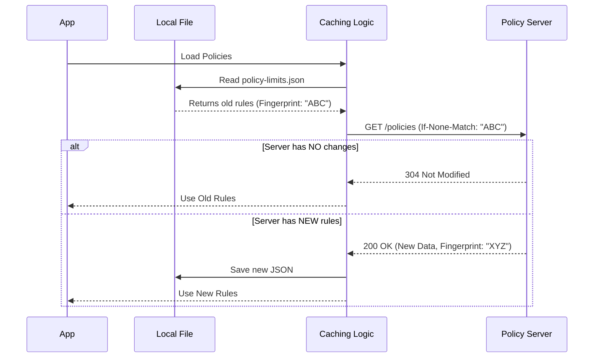

# Chapter 3: Caching & Persistence Layer

Welcome back! In [Chapter 2: Fail-Open Policy Enforcer](02_fail_open_policy_enforcer.md), we built the logic to check rules (like "Is remote desktop allowed?").

However, we left a big question unanswered: **Where does that data come from?**

If we fetch the rules from the server every time you type a command, the tool will feel sluggish. Worse, if you lose your internet connection, the tool might forget the rules entirely.

In this chapter, we will build a **Smart Caching & Persistence Layer**. We will learn how to save policies to your hard drive and how to ask the server for updates efficiently without wasting data.

## The Motivation: Speed and Efficiency

Imagine you are reading a favorite book.
1.  **No Cache:** You have to drive to the library, read one page, and drive back home every time you want to read. (Slow, wasteful).
2.  **With Cache:** You check the book out and keep it on your nightstand. You can read it instantly, even if the library is closed.

Our goal is to keep the "Policy Book" on the user's computer (the "Nightstand"). We only want to talk to the server (the "Library") to ask: *"Hey, is there a new edition of this book?"*

## Key Concepts

To achieve this, we rely on three main concepts:

1.  **JSON Persistence:** We store the rules in a simple text file (`policy-limits.json`) on the user's computer.
2.  **In-Memory Cache:** We load that file into the program's memory (RAM) so checks take nanoseconds, not milliseconds.
3.  **ETags (Entity Tags):** A "fingerprint" of the data. When we talk to the server, we send this fingerprint. If the server sees the data hasn't changed, it replies, "Your fingerprint matches, no new data needed."

## The Data Structure

Before we store the data, we need to define what it looks like. We use a strictly typed **JSON Schema**.

The server sends us a list of **restrictions**. If a policy is missing from the list, it is considered "Allowed" (Fail-Open).

```json
{
  "restrictions": {
    "remote_desktop_access": {
      "allowed": false
    },
    "telemetry_enabled": {
      "allowed": true
    }
  }
}
```

We define this schema in our code using a library called `zod`:

```typescript
// types.ts
import { z } from 'zod';

export const PolicyLimitsResponseSchema = z.object({
  restrictions: z.record(
    z.string(), 
    z.object({ allowed: z.boolean() })
  ),
});
```
*Explanation:* We expect an object with a `restrictions` key. Inside, we have a list of policy names (strings), where each has an `allowed` boolean.

## How It Works

This layer acts as the middleman between the API and the Enforcer.



## Implementation Walkthrough

Let's build this step-by-step.

### Step 1: Loading from Disk

First, we need a way to read the existing file from the hard drive. We do this synchronously so the data is ready immediately when the app starts.

```typescript
import { readFileSync } from 'fs';

function loadCachedRestrictions() {
  try {
    // 1. Read the file as text
    const content = readFileSync(getCachePath(), 'utf-8');
    
    // 2. Parse JSON and validate against our Schema
    const data = JSON.parse(content);
    return PolicyLimitsResponseSchema.parse(data).restrictions;
  } catch {
    // If file missing or invalid, return null
    return null;
  }
}
```
*Explanation:* We try to read `policy-limits.json`. If it exists and is valid JSON matching our schema, we return the restrictions. If anything goes wrong (file doesn't exist), we return `null`.

### Step 2: Creating the Fingerprint (Checksum)

To make our requests smart, we need to generate a unique ID for our current data. We use a SHA-256 hash for this.

```typescript
import { createHash } from 'crypto';

function computeChecksum(restrictions) {
  // 1. Sort keys to ensure consistency ({"a":1, "b":2} == {"b":2, "a":1})
  const sorted = sortKeysDeep(restrictions);
  
  // 2. Convert to string
  const normalized = JSON.stringify(sorted);
  
  // 3. Create a hash
  return `sha256:${createHash('sha256').update(normalized).digest('hex')}`;
}
```
*Explanation:* If we have data, we turn it into a string and scramble it into a unique code (like `sha256:a1b2...`). This is our "version number."

### Step 3: The Smart Network Request

Now comes the magic. We send our checksum to the server using the HTTP header `If-None-Match`.

```typescript
async function fetchPolicyLimits(cachedChecksum?: string) {
  const headers = {};

  // Tell server: "Only send data if it doesn't match this ID"
  if (cachedChecksum) {
    headers['If-None-Match'] = `"${cachedChecksum}"`;
  }

  const response = await axios.get(ENDPOINT, { 
    headers,
    validateStatus: status => status === 200 || status === 304 
  });

  return response;
}
```

### Step 4: Handling the Response

We need to handle the two main outcomes:
1.  **304 Not Modified:** Our cache is perfect. Do nothing.
2.  **200 OK:** New rules arrived. Update cache and save to disk.

```typescript
async function fetchAndLoadPolicyLimits() {
  // 1. Load what we currently have
  const currentRules = loadCachedRestrictions();
  const checksum = currentRules ? computeChecksum(currentRules) : undefined;

  // 2. Ask server for updates
  const response = await fetchPolicyLimits(checksum);

  // Case A: Server says our data is up to date
  if (response.status === 304) {
    console.log("Cache is valid!");
    return currentRules;
  }

  // Case B: Server sent new data
  const newRules = response.data.restrictions;
  await saveCachedRestrictions(newRules); // Write to disk
  return newRules;
}
```

*Explanation:* 
*   If we get a **304**, we just return the `currentRules` we loaded from disk. Zero bandwidth wasted on downloading the body.
*   If we get a **200**, we take the `newRules`, save them to `policy-limits.json`, and return them.

## Putting It Together: The Session Cache

Finally, we store the result in a global variable called `sessionCache`. This is what the **Fail-Open Policy Enforcer** (from Chapter 2) reads.

```typescript
// The "RAM" cache
let sessionCache = null;

export function isPolicyAllowed(policy) {
  // If we haven't loaded anything, or cache is empty -> Fail Open (True)
  if (!sessionCache) return true;
  
  // Otherwise, check the rule
  const rule = sessionCache[policy];
  return rule ? rule.allowed : true;
}
```

## Summary

In this chapter, we built a robust **Caching & Persistence Layer**.

1.  We defined a **JSON Schema** so we know exactly what our data looks like.
2.  We implemented **File Persistence** so rules survive app restarts.
3.  We used **ETag Checksums** to optimize network traffic, ensuring we only download policies when they actually change.

Now we have a system that is fast, offline-tolerant, and bandwidth-efficient. But network requests don't always succeed. What happens if the server hangs, or returns a 500 error?

In the next chapter, we will wrap our network logic in a protective layer to handle these messy real-world scenarios.

[Next Chapter: Resilient API Fetcher](04_resilient_api_fetcher.md)

---

Generated by [Code IQ](https://github.com/adityasoni99/Code-IQ)