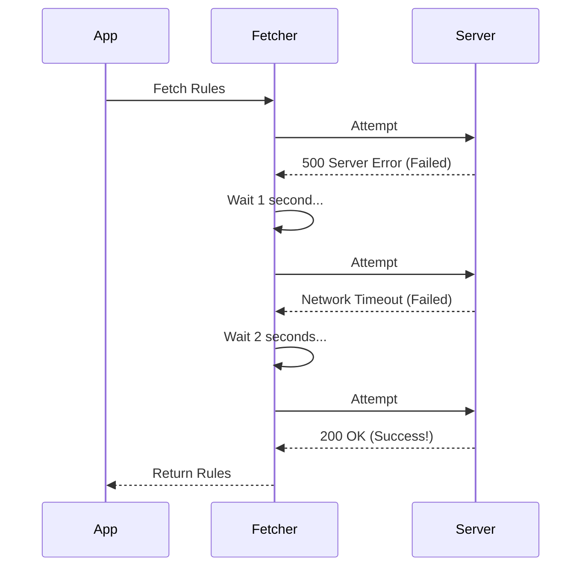

# Chapter 4: Resilient API Fetcher

Welcome back! In [Chapter 3: Caching & Persistence Layer](03_caching___persistence_layer.md), we created a system to store policy rules on the user's computer (the "Nightstand") so we don't have to run to the server (the "Library") for every little check.

But eventually, we *do* need to go to the Library to check for updates.

This introduces a new problem: **The Internet is unreliable.**
Wi-Fi drops, servers get overloaded, and packets get lost. In this chapter, we will build the **Resilient API Fetcher**.

## The Motivation: The "Persistent Courier"

Imagine you send a courier to pick up an important package.
1.  **Fragile Approach:** If the road is closed, the courier comes home empty-handed and gives up.
2.  **Resilient Approach:** If the road is closed, the courier waits 5 minutes and tries a different route. If that fails, they wait 10 minutes and try again.

For our Policy System, we need the Resilient Approach. We don't want to crash the application or disable features just because of a momentary network blip.

## Key Concepts

To build this, we need to master three specific skills:

1.  **Authentication Injection:** Proving who we are (showing our ID badge) so the server talks to us.
2.  **Smart Status Handling:** Understanding that a "404 Not Found" isn't always an error—sometimes it just means "No rules exist for you."
3.  **Exponential Backoff:** A fancy term for "Waiting longer and longer between retries" so we don't overwhelm a struggling server.

## The Workflow

Here is how our Fetcher behaves when things go wrong.



## Implementation Walkthrough

Let's build this logic piece by piece.

### Step 1: Showing Your ID (Authentication)

Before we make a request, we need to generate the correct headers. We support two types of users:
1.  **Console Users:** They have an API Key (starts with `sk-ant...`).
2.  **Web Users:** They have an OAuth Token (from logging into Claude.ai).

```typescript
function getAuthHeaders() {
  // 1. Try API Key first
  const { key } = getApiKey();
  if (key) return { headers: { 'x-api-key': key } };

  // 2. Try OAuth Token
  const tokens = getOAuthTokens();
  if (tokens?.accessToken) {
    return { 
      headers: { Authorization: `Bearer ${tokens.accessToken}` } 
    };
  }
  
  return { error: 'No credentials found' };
}
```
*Explanation:* We check for an API key first. If found, we use it. If not, we look for an OAuth token. If neither exists, we can't fetch policies.

### Step 2: Interpreting the Response

When the server replies, we need to decide what to do based on the **HTTP Status Code**.

*   **200 OK:** Success! We have new rules.
*   **304 Not Modified:** Success! The server says "Your cached copy is still perfect." (See [Chapter 3](03_caching___persistence_layer.md) regarding ETags).
*   **404 Not Found:** Success! The server says "This organization has no policy limits."
*   **500/Timeout:** Failure. We need to retry.

Here is how we handle the request:

```typescript
// inside fetchPolicyLimits()

const response = await axios.get(endpoint, {
  headers,
  // We treat 404 as a valid response, not an error
  validateStatus: status => 
    status === 200 || status === 304 || status === 404,
});

if (response.status === 404) {
  // 404 means "No Restrictions" -> Return empty object
  return { success: true, restrictions: {} };
}
```
*Explanation:* Axios usually throws an error on 404. We tell it to accept 404 as valid. If we see a 404, we return an empty list of restrictions. This effectively means "Everything is allowed."

### Step 3: The Retry Loop (Exponential Backoff)

Now we wrap the logic in a loop. If the request fails (network error or 500), we wait and try again.

```typescript
async function fetchWithRetry(cachedChecksum) {
  // Try up to 5 times
  for (let attempt = 1; attempt <= 5; attempt++) {
    
    // 1. Make the request
    const result = await fetchPolicyLimits(cachedChecksum);

    // 2. If successful (200, 304, or 404), return immediately
    if (result.success) return result;

    // 3. If failing, wait before retrying
    // Attempt 1 waits 1s, Attempt 2 waits 2s, etc.
    await sleep(attempt * 1000); 
  }

  // If all retries fail, give up
  return { success: false, error: "Max retries reached" };
}
```
*Explanation:*
1.  We loop up to 5 times.
2.  If `fetchPolicyLimits` returns success, we exit the loop immediately.
3.  If it fails, we `sleep` (pause execution). The pause gets longer with every attempt (`attempt * 1000`). This is a simple form of **Exponential Backoff**.

### Step 4: Putting it all together

The final function that the rest of the app calls looks like this. It combines the **Retry Logic** with the **File Saving** logic we learned in [Chapter 3](03_caching___persistence_layer.md).

```typescript
async function fetchAndLoadPolicyLimits() {
  // 1. Load current cache to get the ETag (Checksum)
  const currentRules = loadCachedRestrictions();
  const checksum = computeChecksum(currentRules);

  // 2. Fetch from network (with retries!)
  const result = await fetchWithRetry(checksum);

  // 3. If network failed completely, just use old cache
  if (!result.success) {
    return currentRules; // Better old rules than nothing
  }
  
  // ... proceed to save new rules to disk
}
```
*Explanation:* This is the definition of **Resilience**. Even if the retry loop fails 5 times (maybe the user is offline), we fallback to `currentRules` (what we have on disk). The app keeps working.

## Summary

In this chapter, we built a **Resilient API Fetcher**.

1.  We learned to **Inject Headers** dynamically based on how the user logged in.
2.  We handled **404s** not as errors, but as "No Restrictions" signals.
3.  We implemented **Retries with Backoff** to handle flaky internet connections gracefully.

Now we have a system that can check eligibility, enforce rules, cache data, and reliably update itself. But *when* should this update happen? Only at startup? What if the admin changes a rule while the user is working?

In the final chapter, we will build the manager that orchestrates all of this in the background.

[Next Chapter: Lifecycle Manager (Loading & Polling)](05_lifecycle_manager__loading___polling_.md)

---

Generated by [Code IQ](https://github.com/adityasoni99/Code-IQ)