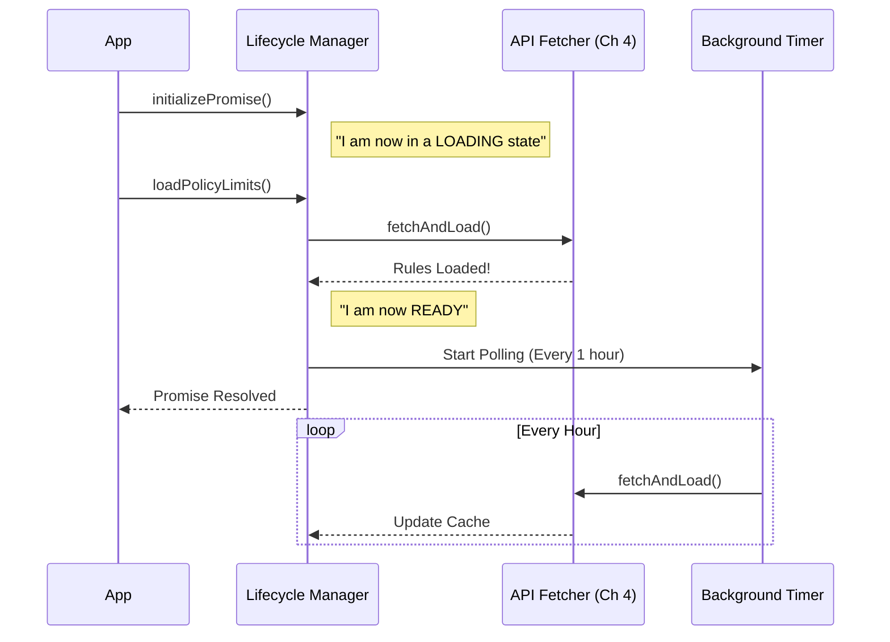

# Chapter 5: Lifecycle Manager (Loading & Polling)

Welcome to the final chapter of our **Policy Limits** series!

In [Chapter 4: Resilient API Fetcher](04_resilient_api_fetcher.md), we built a robust system to fetch rules from the server, handling errors and retries gracefully. We have the "courier" ready to deliver the package.

Now we must answer the question of **Timing**:
1.  **When** should we fetch the rules? (We can't let the user run commands before we know what's allowed!)
2.  **How** do we keep rules up to date if the app runs for hours?

In this chapter, we will build the **Lifecycle Manager**. It is the conductor of the orchestra, ensuring policies are loaded before the show starts and keeping the music playing in sync.

## The Motivation: The "Pre-Flight Check"

Imagine you are a pilot. Before you take off, you must complete a **Pre-Flight Checklist**.
*   **The Rule:** The plane does not move until the checklist is complete.
*   **The Update:** While in the air, the control tower might radio in new weather restrictions. You need to listen to these updates without stopping the plane.

Our CLI tool works the same way:
1.  **Startup:** We must wait for the policy check to finish before running the user's command.
2.  **Runtime:** We need to poll for updates in the background (e.g., every hour) without blocking the user's work.

## Key Concepts

We will use three main programming concepts to manage this lifecycle:

1.  **The Initialization Promise:** A "ticket" that represents the loading process. Other parts of the app can look at this ticket and say, "I'll wait right here until this is stamped 'Done'."
2.  **Background Polling:** A timer that runs forever in the background, periodically asking the server, "Anything new?"
3.  **Graceful Cleanup:** Ensuring that when the user quits the app, we stop our timers so the program can actually close.

## Use Case: The App Startup Flow

Here is the high-level flow we want to achieve in our application entry point (`init.ts`).

```typescript
// Ideally, our app startup looks like this:

async function startApp() {
  // 1. Start loading policies immediately (don't await yet!)
  initializePolicyLimitsLoadingPromise();
  
  // 2. Do other setup tasks...
  setupDatabase();
  
  // 3. Kick off the actual fetch
  loadPolicyLimits();
  
  // 4. WAIT. Ensure policies are loaded before running the command
  await waitForPolicyLimitsToLoad();
  
  // 5. Run the user's command
  runCommand();
}
```

## Internal Implementation

Let's look at how the Lifecycle Manager orchestrates these events step-by-step.

### The Sequence Diagram



### Code Walkthrough

We will break the implementation down into the **Loader**, the **Waiter**, and the **Poller**.

#### 1. The Initialization Promise (The "Ticket")
We need a global variable to track if we have finished loading. We use a standard JavaScript `Promise`.

```typescript
// Global variables to track state
let loadingCompletePromise: Promise<void> | null = null;
let loadingCompleteResolve: (() => void) | null = null;

export function initializePolicyLimitsLoadingPromise() {
  // If we already started, do nothing
  if (loadingCompletePromise) return;

  // Create a new Promise that stays pending...
  loadingCompletePromise = new Promise(resolve => {
    // Save the 'resolve' function so we can call it later
    loadingCompleteResolve = resolve;
  });
}
```
*Explanation:* We create a promise but we *don't* resolve it immediately. We save the `resolve` function into a variable (`loadingCompleteResolve`). This acts like a red light that stays red until we flip the switch.

#### 2. The Main Loader (The "Checklist")
This function calls the logic we built in [Chapter 4](04_resilient_api_fetcher.md). Once the fetch is done, it flips the switch to green.

```typescript
export async function loadPolicyLimits() {
  // 1. Ensure the promise exists
  if (!loadingCompletePromise) {
    initializePolicyLimitsLoadingPromise();
  }

  try {
    // 2. Perform the actual fetch (from Chapter 4)
    await fetchAndLoadPolicyLimits();

    // 3. Start the background heartbeat
    startBackgroundPolling();
  } finally {
    // 4. Flip the switch! Unlock the app.
    if (loadingCompleteResolve) {
      loadingCompleteResolve();
      loadingCompleteResolve = null;
    }
  }
}
```
*Explanation:* Even if `fetchAndLoadPolicyLimits` fails (remember, we "Fail Open"), the `finally` block ensures we resolve the promise. The app will never hang forever; it will eventually proceed, with or without rules.

#### 3. The Waiter (The "Gate")
Other parts of the application call this function to ensure they don't run too early.

```typescript
export async function waitForPolicyLimitsToLoad() {
  // If the promise exists, wait for it to finish
  if (loadingCompletePromise) {
    await loadingCompletePromise;
  }
  // If no promise exists, it means we don't need to check policies. Proceed.
}
```
*Explanation:* This is a simple wrapper. If the loading process is active, we `await` it. If it's already done (or never started), we return immediately.

#### 4. The Background Poller (The "Heartbeat")
We don't want the rules to get stale. We set up a timer to refresh them periodically.

```typescript
let pollingIntervalId: ReturnType<typeof setInterval> | null = null;
const ONE_HOUR = 60 * 60 * 1000;

export function startBackgroundPolling() {
  // Prevent starting two timers
  if (pollingIntervalId) return;

  // Set the timer
  pollingIntervalId = setInterval(async () => {
    // Silently fetch updates
    await fetchAndLoadPolicyLimits();
  }, ONE_HOUR);

  // IMPORTANT: Allow the program to exit even if this timer is running
  pollingIntervalId.unref(); 
}
```
*Explanation:*
*   `setInterval` runs our fetch logic every hour.
*   `.unref()` is a special Node.js command. Usually, a running timer keeps the program alive forever. `unref()` says, "If the user tries to quit the app, don't let this timer stop them."

#### 5. Cleaning Up
For testing or resetting the state (e.g., when a user logs out), we need to stop everything.

```typescript
export function stopBackgroundPolling() {
  if (pollingIntervalId) {
    clearInterval(pollingIntervalId);
    pollingIntervalId = null;
  }
}
```

## Putting It All Together

We have now built a complete lifecycle system:

1.  **Init:** `initializePolicyLimitsLoadingPromise()` prepares the gate.
2.  **Load:** `loadPolicyLimits()` fetches data from [Chapter 4](04_resilient_api_fetcher.md), caches it using [Chapter 3](03_caching___persistence_layer.md), and opens the gate.
3.  **Poll:** `startBackgroundPolling()` keeps data fresh.
4.  **Wait:** `waitForPolicyLimitsToLoad()` ensures the [Policy Enforcer from Chapter 2](02_fail_open_policy_enforcer.md) has data before making decisions.

## Conclusion

Congratulations! You have completed the **Policy Limits** tutorial series.

You have built a professional-grade feature flagging system from scratch. Let's review what you've accomplished:
*   **Chapter 1:** You built a filter to check *who* needs policies.
*   **Chapter 2:** You created a Fail-Open enforcer to check *what* is allowed.
*   **Chapter 3:** You implemented efficient disk caching and ETags.
*   **Chapter 4:** You handled network errors with retries and backoff.
*   **Chapter 5:** You orchestrated the entire lifecycle with promises and polling.

This architecture ensures that your application is **secure**, **fast**, and **reliable**, providing a great experience for both personal users and enterprise security teams.

Happy coding!

---

Generated by [Code IQ](https://github.com/adityasoni99/Code-IQ)