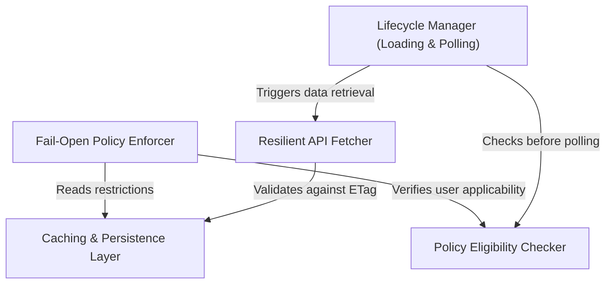

# Tutorial: policyLimits

This project implements a **Fail-Open Policy Enforcer** to manage feature restrictions for enterprise users, ensuring that network issues do not block critical work. It uses a **Resilient API Fetcher** to retrieve configuration rules, leveraging *ETag caching* and **local persistence** to minimize network traffic. A **Lifecycle Manager** orchestrates background polling and initialization to keep permissions fresh, while an **Eligibility Checker** ensures that policies are only applied to specific authentication tiers.

## Chapters

1. [Policy Eligibility Checker](01_policy_eligibility_checker.md)
2. [Fail-Open Policy Enforcer](02_fail_open_policy_enforcer.md)
3. [Caching & Persistence Layer](03_caching___persistence_layer.md)
4. [Resilient API Fetcher](04_resilient_api_fetcher.md)
5. [Lifecycle Manager (Loading & Polling)](05_lifecycle_manager__loading___polling_.md)

---

Generated by [Code IQ](https://github.com/adityasoni99/Code-IQ)