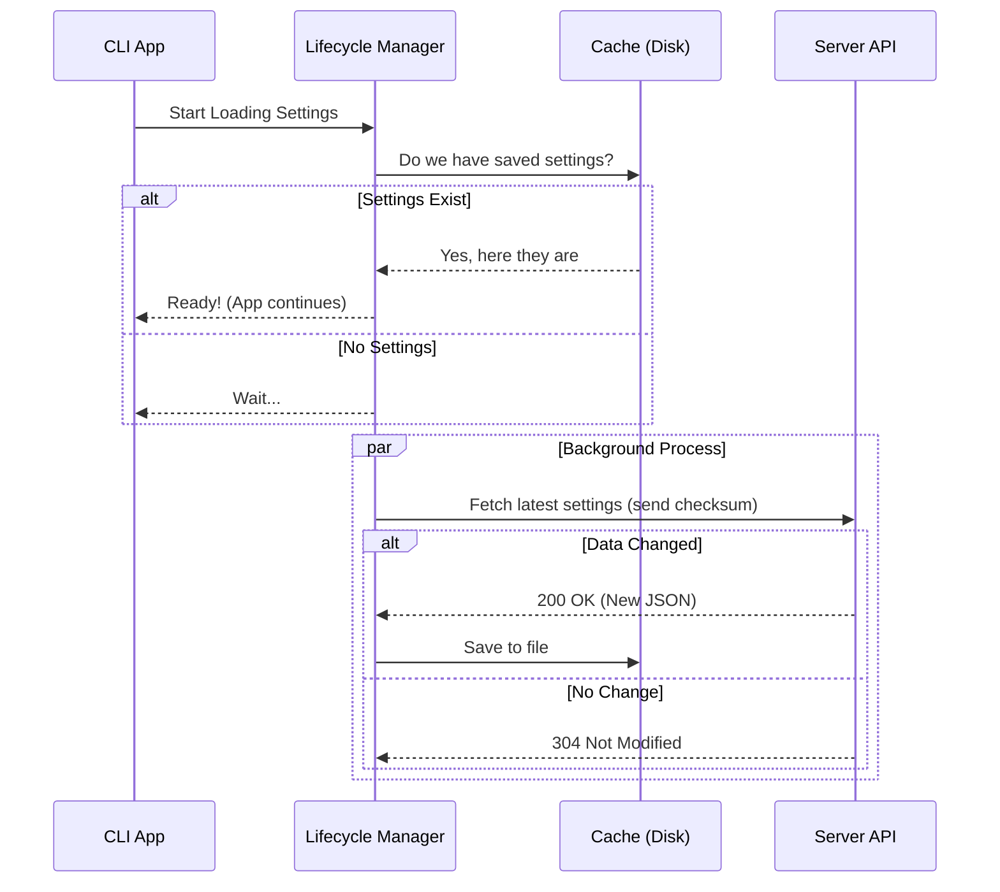

# Chapter 1: Remote Settings Lifecycle Manager

Welcome to the **Remote Managed Settings** project! 

Imagine you are building a tool used by thousands of developers in large companies. Sometimes, the company administrators need to change how the tool behaves—for example, disabling a specific feature for security compliance or rotating API keys.

You need a system that can:
1.  **Fetch** these rules from a server.
2.  **Save** them so they work offline.
3.  **Update** them automatically if they change.
4.  **Protect** the user from malicious updates.

This is the job of the **Remote Settings Lifecycle Manager**. It is the "Project Manager" of our system. It coordinates the work without blocking the application from starting up.

## The Goal: A Non-Blocking Start

When our application (the CLI) starts, we want to load settings immediately. However, we cannot wait for a slow network request to finish before showing the user the prompt. That would feel sluggish.

The Lifecycle Manager solves this by using a **"Stale-While-Revalidate"** strategy:
1.  If we have settings saved on the computer (Cache), use them immediately.
2.  In the background, ask the server (API) if there are new settings.
3.  If there are, update them silently or notify the system.

## Key Concepts

### 1. The Orchestrator
The main entry point is a function called `loadRemoteManagedSettings()`. It acts as the conductor. It checks if the user is even allowed to have remote settings, and if so, starts the process.

Here is a simplified look at how it works:

```typescript
// index.ts
export async function loadRemoteManagedSettings(): Promise<void> {
  // 1. Check if we even need to run this logic
  if (!isRemoteManagedSettingsEligible()) return

  // 2. If we have a cached file, unblock the app immediately!
  if (getRemoteManagedSettingsSyncFromCache()) {
    resolveLoadingPromise() 
  }

  // 3. Fetch fresh data in the background (fire and forget)
  await fetchAndLoadRemoteManagedSettings()
}
```

**What just happened?**
The code checks for eligibility (covered in [Eligibility Gatekeeper](03_eligibility_gatekeeper.md)). If a local file exists, it lets the app start immediately. Then, it goes to the network to get the latest version.

### 2. The Loading Promise
Sometimes, parts of the application *must* wait until we know if remote settings exist (e.g., to prevent an unauthorized action). We use a "Promise" mechanism to signal when we are ready.

```typescript
// index.ts
let loadingCompletePromise: Promise<void> | null = null

export function initializeRemoteManagedSettingsLoadingPromise(): void {
  if (isRemoteManagedSettingsEligible()) {
    loadingCompletePromise = new Promise(resolve => {
      // We will call this 'resolve' function when data is ready
      loadingCompleteResolve = resolve
    })
  }
}
```

Think of this like taking a ticket at a deli counter. Other parts of the app hold this ticket (`loadingCompletePromise`) and wait for their number to be called (`resolve`).

### 3. Fetching and Caching
When we actually go to the network, we don't want to download the same data over and over. We use a **Checksum** (a unique fingerprint of the data).

```typescript
// index.ts
async function fetchAndLoadRemoteManagedSettings() {
  // Get the fingerprint of our current file
  const cachedSettings = getRemoteManagedSettingsSyncFromCache()
  const checksum = computeChecksumFromSettings(cachedSettings)

  // Ask server: "Do you have anything newer than this checksum?"
  const result = await fetchWithRetry(checksum)

  if (result.success && result.settings) {
    // New data found! Save it to disk.
    await saveSettings(result.settings)
  }
}
```

If the server sees we have the latest checksum, it returns a **304 Not Modified** status. This is like the supplier telling the project manager: "You already have the latest inventory, no shipment needed."

### 4. Background Polling
Settings might change while the user is working. We don't want them to have to restart the app to get security updates. The Lifecycle Manager sets up a timer to check periodically.

```typescript
// index.ts
export function startBackgroundPolling(): void {
  // Check every hour (POLLING_INTERVAL_MS)
  pollingIntervalId = setInterval(() => {
    void pollRemoteSettings()
  }, 60 * 60 * 1000)
  
  // Make sure we stop this timer when the app closes
  registerCleanup(() => stopBackgroundPolling())
}
```

## How It All Works Together

Let's visualize the flow when the application starts. Notice how the "CLI App" gets to work quickly because of the Cache.



## Internal Implementation Details

The Lifecycle Manager isn't just about fetching; it's about **Resilience**.

### Handling Failures (Fail Open)
If the internet is down, or the API is broken, we don't want the user's tool to crash. The manager is designed to "Fail Open."

```typescript
// index.ts - fetchWithRetry logic
async function fetchWithRetry(cachedChecksum?: string) {
  for (let attempt = 1; attempt <= MAX_RETRIES; attempt++) {
    const result = await fetchRemoteManagedSettings(cachedChecksum)
    
    if (result.success) return result
    
    // If it's a network error, wait and try again
    await sleep(getRetryDelay(attempt))
  }
  // If all fails, return the error but don't crash!
  return lastResult
}
```
This logic ensures that if the "Supplier" (API) is unreachable, the "Factory" (Application) keeps running using whatever supplies (Cache) it has left, or defaults to standard behavior.

### Security Gates
Before applying new settings downloaded from the internet, the Lifecycle Manager consults a security layer. It's crucial not to blindly trust incoming data.

```typescript
// index.ts
if (hasContent) {
  // Check if the new settings are dangerous
  const securityResult = await checkManagedSettingsSecurity(
    cachedSettings,
    newSettings,
  )
  
  // If user rejects the change, stop here.
  if (!handleSecurityCheckResult(securityResult)) {
    return cachedSettings
  }
}
```
*Note: We will dive deep into this specific check in the next chapter.*

## Summary

The **Remote Settings Lifecycle Manager** is the heartbeat of our configuration system. It:
1.  **Prioritizes speed** by loading from disk first.
2.  **Saves bandwidth** by comparing checksums.
3.  **Ensures reliability** by retrying failed requests.
4.  **Keeps current** by polling in the background.

However, fetching the data is only half the battle. Once we receive new settings, how do we ensure they are safe? How do we ask the user for permission if a setting looks suspicious?

To answer that, we need to look at our next component.

[Next Chapter: Security & Consent Dialog](02_security___consent_dialog.md)

---

Generated by [Code IQ](https://github.com/adityasoni99/Code-IQ)