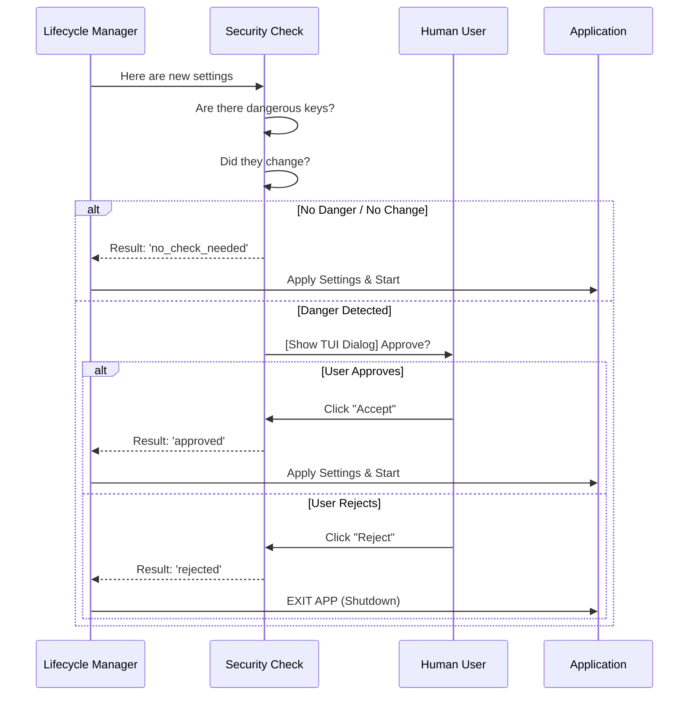

# Chapter 2: Security & Consent Dialog

In the previous chapter, [Remote Settings Lifecycle Manager](01_remote_settings_lifecycle_manager.md), we built a system that efficiently fetches configuration updates from a server.

But here is a scary thought: **What if the server gets hacked?**

If a malicious actor gains control of the settings server, they could push a configuration change that enables dangerous features on thousands of developer machines instantly. We cannot blindly trust the data just because we fetched it successfully.

We need a bodyguard. We need the **Security & Consent Dialog**.

## The Concept: The Customs Officer

Think of this component as a **Customs Officer** at an airport.

Most passengers (settings) are carrying standard luggage (harmless configurations like "change theme color"). The officer waves them through immediately.

However, if a passenger is carrying **Hazardous Materials** (dangerous configurations like "allow shell script execution"), the officer stops the line.
1.  **Halt:** The passenger cannot enter the country (the app).
2.  **Declare:** The officer shows the user exactly what is in the bag.
3.  **Consent:** The user must explicitly sign a form saying, "Yes, I know what this is, and I approve it."

## Central Use Case

**Scenario:** Your company's security team wants to enable a feature called `run_scripts_automatically`.
1.  The **Lifecycle Manager** downloads this new setting.
2.  The **Security Dialog** sees this is a "Dangerous Setting."
3.  It pauses the application start-up.
4.  It draws a box on the screen: *"Admin wants to enable script execution. Allow? [Y/N]"*
5.  Only if you press **Y**, the app continues.

## Implementation: How It Works

This logic lives in a function called `checkManagedSettingsSecurity`. Let's break down how it decides when to bother the user.

### 1. The "Fast Pass" Checks
We don't want to annoy the user with a popup every single time they run the command. We perform three quick checks to see if we can skip the dialog.

#### Check A: Are there any dangerous items?
First, we look at the new settings. If they only contain safe items (like UI preferences), we wave them through.

```typescript
// securityCheck.ts
// 1. If the new box is empty or only has safe items, let it pass.
if (
  !newSettings || 
  !hasDangerousSettings(extractDangerousSettings(newSettings))
) {
  return 'no_check_needed';
}
```
*Explanation:* `extractDangerousSettings` looks for specific keys (defined elsewhere) that are known to be risky. If none are found, we return immediately.

#### Check B: Have they changed?
If you approved `run_scripts_automatically` yesterday, we shouldn't ask you again today. We only ask if the dangerous setting has **changed** compared to what is currently saved on your disk (`cachedSettings`).

```typescript
// securityCheck.ts
// 2. If the dangerous items are exactly the same as last time, let it pass.
if (!hasDangerousSettingsChanged(cachedSettings, newSettings)) {
  return 'no_check_needed';
}
```
*Explanation:* We compare the "dangerous" subset of the old settings vs. the new settings. If they match, the user has already consented to this state.

#### Check C: Is a human present?
We can't show an interactive dialog if the tool is running in a CI/CD pipeline (like GitHub Actions) where no human can press a button.

```typescript
// securityCheck.ts
// 3. If this is a robot (non-interactive), skip the dialog.
if (!getIsInteractive()) {
  return 'no_check_needed'; // Or auto-reject depending on policy
}
```

### 2. The Blocking Dialog
If a setting is dangerous, new, and a human is present, we must stop the world. We do this by creating a **Promise** that doesn't resolve until the user interacts with the UI.

```typescript
// securityCheck.ts
return new Promise<SecurityCheckResult>(resolve => {
  // Render the TUI (Text User Interface)
  render(
    <ManagedSettingsSecurityDialog
      settings={newSettings}
      onAccept={() => {
        unmount();       // Clear the screen
        resolve('approved'); // Unfreeze the app
      }}
      onReject={() => {
        unmount();
        resolve('rejected');
      }}
    />
  )
})
```
*Explanation:*
1.  We launch a React Component (`ManagedSettingsSecurityDialog`) to draw the UI in the terminal.
2.  The code literally stops here. The `await` (in the caller) waits for this Promise.
3.  When the user presses Enter (Accept) or Esc (Reject), we `resolve` the promise, allowing the code to move to the next line.

### 3. Handling the Verdict
Once the user makes a choice, we need to respect it.

```typescript
// securityCheck.ts
export function handleSecurityCheckResult(result: SecurityCheckResult): boolean {
  if (result === 'rejected') {
    // If user said NO, we shut down immediately. 
    // We do not run the app with settings the user didn't approve.
    gracefulShutdownSync(1);
    return false;
  }
  return true; // Proceed!
}
```

## Visualizing the Flow

Here is how the Logic flows. Notice how the "User" is only involved if the "Gatekeeper" (Security Check) decides it is necessary.



## Internal Implementation Details

Under the hood, this system relies on a list of **Schema Definitions**. We don't guess what is dangerous; we define it explicitly in our code.

For example, our definition might look like this (pseudocode):
*   `ui.color`: **Safe**
*   `network.proxyUrl`: **Dangerous** (Could route traffic maliciously)
*   `system.executeScripts`: **Dangerous** (Could run malware)

The function `extractDangerousSettings` filters the JSON object against this "Red Flag" list. This ensures that when the dialog pops up, it only lists the specific items that require attention, keeping the UI clean and the user focused on the security risk.

## Summary

The **Security & Consent Dialog** is the ultimate fail-safe. It ensures that no matter what the server sends, the user retains final control over their machine's security posture.

We have learned:
1.  **Trust no one:** Even valid settings from our own server must be checked.
2.  **Differential Checks:** Only annoy the user when absolutely necessary (when things change).
3.  **Blocking UI:** How to pause code execution using a Promise to wait for user input.

Now that we know *how* to load settings and *how* to verify them, we need to step back. Before we even download settings, how do we know if this specific user is supposed to get them?

It's time to meet the bouncer.

[Next Chapter: Eligibility Gatekeeper](03_eligibility_gatekeeper.md)

---

Generated by [Code IQ](https://github.com/adityasoni99/Code-IQ)