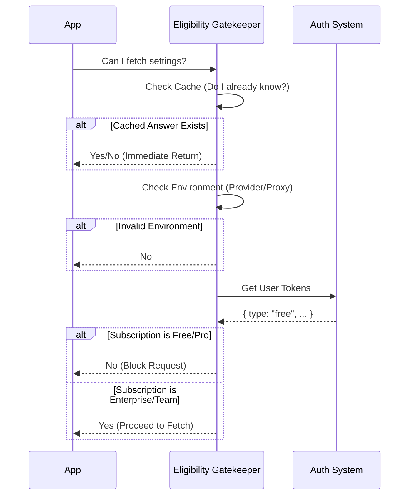

# Chapter 3: Eligibility Gatekeeper

In the previous chapter, [Security & Consent Dialog](02_security___consent_dialog.md), we learned how to protect the user from dangerous settings by asking for their permission. Before that, in [Remote Settings Lifecycle Manager](01_remote_settings_lifecycle_manager.md), we learned how to fetch those settings.

But here is a question of efficiency: **Should we try to fetch settings for everyone?**

Imagine you are a standard user using the tool for a personal hobby project. You don't have an IT department. You don't have an Enterprise administrator. If our tool tries to fetch "Company Rules" for you every time you start the app, we are wasting:
1.  **Your Time:** Waiting for a network request that will return 404 (Not Found).
2.  **Bandwidth:** Sending unnecessary data.
3.  **Server Costs:** Processing millions of useless requests.

We need a way to stop these requests *before* they even start. We need the **Eligibility Gatekeeper**.

## The Concept: The Nightclub Bouncer

Think of the API (where the settings live) as an exclusive **VIP Lounge**.

The **Eligibility Gatekeeper** is the **Bouncer** standing at the front door. Before you can even walk toward the bar, the bouncer looks at you and asks:
1.  "Are you on the guest list?" (Authentication)
2.  "Do you have a VIP membership card?" (Enterprise/Team Subscription)
3.  "Are you wearing the right dress code?" (Correct Environment)

If the answer to any of these is "No," the bouncer turns you away immediately. You don't get to request a drink (fetch settings).

## Central Use Case

**Scenario:**
*   **User A** is a free-tier user working on a personal laptop.
*   **User B** is a developer at a Fortune 500 company using an Enterprise license.

**Goal:**
*   **User A** should start the app instantly without making any network calls to the settings server.
*   **User B** should pass the check and proceed to fetch their company's security policies.

## Key Logic Concepts

The logic for this gatekeeper lives in a file called `syncCache.ts`. Let's break down the three checks the Bouncer performs.

### 1. The Environment Check
First, we check *where* the application is running. If the user is routing their traffic through a custom proxy or a 3rd party provider, we can't enforce our settings.

```typescript
// syncCache.ts
// 1. If using a 3rd party provider (not First Party), stop.
if (getAPIProvider() !== 'firstParty') {
  return setEligibility(false)
}

// 2. If using a custom base URL (proxy), stop.
if (!isFirstPartyAnthropicBaseUrl()) {
  return setEligibility(false)
}
```
*Explanation:* If you aren't connecting directly to our standard API, we assume you are outside our management jurisdiction. Access denied.

### 2. The Subscription Check (OAuth)
Most users log in via a web browser (OAuth). The token we get back tells us what plan they are on.

```typescript
// syncCache.ts
const tokens = getClaudeAIOAuthTokens()

// Check if they are on a 'team' or 'enterprise' plan
if (
  tokens?.accessToken &&
  (tokens.subscriptionType === 'enterprise' ||
    tokens.subscriptionType === 'team')
) {
  return setEligibility(true) // Open the gate!
}
```
*Explanation:* We peek at the `subscriptionType` inside their login token. If it says "Enterprise" or "Team", the Bouncer opens the velvet rope.

### 3. The API Key Check
Some users (like servers or CI/CD bots) don't use web login; they use a raw API Key (`sk-ant-...`). We treat any valid API key holder as *potentially* eligible.

```typescript
// syncCache.ts
// If they have a raw API key, let them through to check.
try {
  const { key: apiKey } = getAnthropicApiKeyWithSource()
  if (apiKey) {
    return setEligibility(true)
  }
} catch {
  // No key found
}
```
*Explanation:* If we find a valid API key, we mark them as eligible. The API server will decide later if that specific key has settings attached to it.

## Internal Implementation Details

The implementation is split into two files to prevent a specific coding headache called a "Circular Dependency" (we will cover the storage part of this in [Leaf State Storage](05_leaf_state_storage__circular_dependency_breaker_.md)).

For now, let's look at the flow of `isRemoteManagedSettingsEligible()`.

### The Decision Flow



### The Memory (Caching)
The Bouncer has a good memory. Once he checks your ID, he remembers you. He doesn't ask for your ID again every time you walk by.

This is handled by a simple variable cache.

```typescript
// syncCache.ts
let cached: boolean | undefined

export function isRemoteManagedSettingsEligible(): boolean {
  // 1. Do we already know the answer? Return immediately.
  if (cached !== undefined) return cached

  // ... perform heavy checks (environment, auth) ...

  // 2. Save the answer for next time
  return (cached = setEligibility(true)) // or false
}
```
*Explanation:* The first time the app starts, this function runs the logic. Every subsequent time (e.g., when the [Remote Settings Lifecycle Manager](01_remote_settings_lifecycle_manager.md) runs a background poll), it returns the saved `true` or `false` instantly.

### Why "Fail Open" for API Keys?
You might notice we allow generic API keys through (`setEligibility(true)`).

Why? Because API keys don't carry metadata like "Subscription Type" inside them locally. We can't know if an API key belongs to a student or a huge corporation until we ask the server.

So, for API keys, the Bouncer's rule is: *"I can't read this card, so go ask the bartender (Server)."* The server will simply return an empty settings file if the key doesn't belong to an Enterprise, which is a safe fail-back.

## Summary

The **Eligibility Gatekeeper** is a crucial optimization layer.
1.  It **filters out** users who definitely don't need remote settings.
2.  It **protects** the application from making useless network calls.
3.  It **remembers** its decision (caches) to keep the app fast.

Now that the Bouncer has let us into the club, we need to talk to the bartender (the API). How do we actually send the request? How do we make sure the data format is correct?

For that, we need to understand the transport layer.

[Next Chapter: API Transport & Schema Validation](04_api_transport___schema_validation.md)

---

Generated by [Code IQ](https://github.com/adityasoni99/Code-IQ)