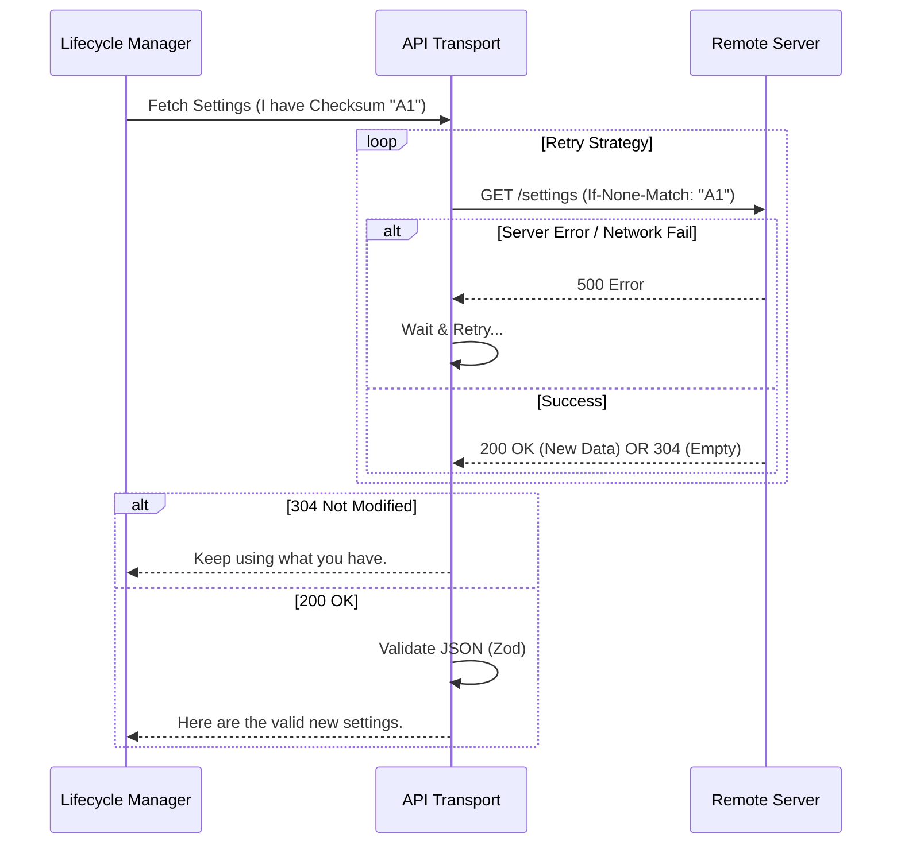

# Chapter 4: API Transport & Schema Validation

In the previous chapter, [Eligibility Gatekeeper](03_eligibility_gatekeeper.md), we set up a "Bouncer" to check if a user is even allowed to request remote settings.

Now that the Bouncer has opened the door, we have to actually go get the data. But the internet is a messy place. Wi-Fi drops, servers get overloaded, and sometimes data gets corrupted in transit.

This chapter introduces the **API Transport & Schema Validation** layer. Think of this as a **Secure Courier Service**.
1.  It picks up the package (HTTP Request).
2.  If the door is locked, it knocks again later (Retry Logic).
3.  It checks if the package is already in your house to avoid waste (Checksums).
4.  It X-rays the box to make sure it contains settings, not a bomb (Schema Validation).

## The Goal: Safe and Efficient Delivery

**Use Case:** You are a developer on a train with spotty Wi-Fi. You open the CLI tool.
*   **Without this layer:** The app tries to fetch settings once, fails because of a tunnel, and crashes or starts without security rules.
*   **With this layer:** The app tries, fails, waits 1 second, tries again, succeeds, verifies the data is valid JSON, and then applies it.

## Key Concepts

### 1. The Transport (Axios)
We use a library called `axios` to make HTTP requests. However, we don't just send a request blindly. We need to attach "Authentication" (proof of who we are) and "User-Agent" (what tool we are using).

```typescript
// index.ts (Simplified)
const headers = {
  'Authorization': `Bearer ${userToken}`, // Our ID Badge
  'User-Agent': 'ClaudeCode/1.0',         // Our Uniform
  'If-None-Match': `"${cachedChecksum}"`  // "Only give me new stuff"
}

// Send the request
const response = await axios.get(endpoint, { headers })
```

### 2. Efficiency (Checksums & 304)
Imagine ordering a book you already own. It’s a waste of money and shipping.
In our system, before we ask the server for settings, we look at the file we already have on disk. We create a **Checksum** (a unique fingerprint) of that file.

When we talk to the server, we say: *"I have the settings with fingerprint `abc-123`. Do you have anything newer?"*

*   **Scenario A (New Data):** Server sends 200 OK + New JSON.
*   **Scenario B (Same Data):** Server sends **304 Not Modified**. No data is downloaded. Bandwidth saved!

### 3. Resilience (Retry Logic)
If the server doesn't respond, we shouldn't give up immediately. We use **Exponential Backoff**. This means we wait a little longer after each failure.

*   Attempt 1: Fail.
*   Wait 500ms.
*   Attempt 2: Fail.
*   Wait 1000ms.
*   Attempt 3: Success!

### 4. Validation (Zod Schemas)
JavaScript is loosely typed, which can be dangerous. If the server sends us `{ "theme": "blue" }` but our code expects `{ "theme": { "color": "blue" } }`, the app will crash.

We use a library called **Zod** to define a "Schema"—a strict blueprint of what the data *must* look like. If the data doesn't fit the blueprint, we throw it away.

```typescript
// types.ts
// Define the blueprint
const ResponseSchema = z.object({
  uuid: z.string(),
  settings: z.record(z.string(), z.unknown())
})

// Check the data
const parsed = ResponseSchema.safeParse(incomingData)
```

## Visualizing the Courier's Job

Here is what happens when the [Remote Settings Lifecycle Manager](01_remote_settings_lifecycle_manager.md) asks for settings.



## Internal Implementation Details

Let's look at the code that powers this logic in `index.ts`.

### 1. Generating the Checksum
Before we send a request, we need to know what we currently have. We sort the keys to ensure the fingerprint is consistent.

```typescript
// index.ts
export function computeChecksumFromSettings(settings: SettingsJson): string {
  // Sort keys so {a:1, b:2} produces same hash as {b:2, a:1}
  const sorted = sortKeysDeep(settings)
  
  // Create a SHA-256 fingerprint
  const normalized = jsonStringify(sorted)
  const hash = createHash('sha256').update(normalized).digest('hex')
  
  return `sha256:${hash}`
}
```

### 2. The Retry Loop
This function wraps the actual network call. It refuses to give up easily.

```typescript
// index.ts
async function fetchWithRetry(cachedChecksum?: string) {
  // Try up to 5 times
  for (let attempt = 1; attempt <= DEFAULT_MAX_RETRIES + 1; attempt++) {
    const result = await fetchRemoteManagedSettings(cachedChecksum)

    // If successful or if error is fatal (like Auth error), stop.
    if (result.success || result.skipRetry) {
      return result
    }

    // Wait a bit before trying again
    await sleep(getRetryDelay(attempt))
  }
  return lastResult // Return the last error if all retries failed
}
```
*Why `skipRetry`?* If the server says "401 Unauthorized" (Bad Password), retrying won't help. We fail fast in that case.

### 3. The Network Request & Validation
This is the core worker function. It handles the specific HTTP status codes and validates the data.

```typescript
// index.ts - fetchRemoteManagedSettings
// ... setup headers ...
const response = await axios.get(endpoint, { headers, validateStatus: ... })

// Case 1: Server says "You already have the latest version"
if (response.status === 304) {
  return { success: true, settings: null, checksum: cachedChecksum }
}

// Case 2: Server sent new data. VERIFY IT!
const parsed = RemoteManagedSettingsResponseSchema().safeParse(response.data)

if (!parsed.success) {
  return { success: false, error: 'Invalid format' } // Reject the package
}

return { success: true, settings: parsed.data.settings, checksum: parsed.data.checksum }
```

### 4. The Zod Schema
In `types.ts`, we define exactly what we expect the server to send.

```typescript
// types.ts
export const RemoteManagedSettingsResponseSchema = lazySchema(() =>
  z.object({
    uuid: z.string(),   // Must have an ID
    checksum: z.string(), // Must have a checksum
    // "settings" must be an object, but we validate contents loosely here
    settings: z.record(z.string(), z.unknown()), 
  }),
)
```
*Note:* We use `z.unknown()` for the values initially to avoid a "Circular Dependency" issue with the full settings schema. We do a deeper check in a second pass inside `index.ts`.

## Summary

The **API Transport & Schema Validation** layer is the muscle of our operation.
1.  It talks to the outside world securely.
2.  It doesn't waste data (Checksums).
3.  It doesn't give up easily (Retries).
4.  It doesn't trust blindly (Validation).

At this point, we have:
1.  Checked Eligibility.
2.  Fetched the data safely.
3.  Verified the data format.

Now we have a valid settings object in memory. But where do we put it? We need to save it to disk so it works offline next time. However, saving settings can be tricky because the code that *reads* settings might depend on the code that *writes* settings, creating a loop.

To solve this, we need a specialized storage mechanism.

[Next Chapter: Leaf State Storage (Circular Dependency Breaker)](05_leaf_state_storage__circular_dependency_breaker_.md)

---

Generated by [Code IQ](https://github.com/adityasoni99/Code-IQ)