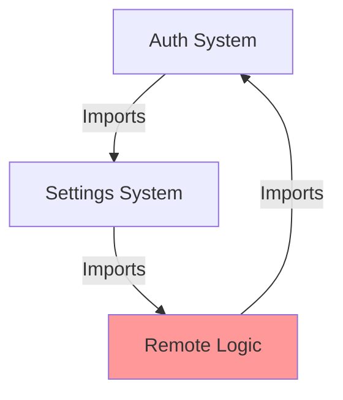

# Chapter 5: Leaf State Storage (Circular Dependency Breaker)

In the previous chapter, [API Transport & Schema Validation](04_api_transport___schema_validation.md), we successfully contacted the server, downloaded the settings, and verified they were safe.

Now, we simply need to save them to a file and read them when the app starts, right?

**Not quite.** In large applications, reading a file can accidentally crash the entire system before it even starts. This happens due to a coding trap called a **Circular Dependency**.

This chapter explains how we avoid that trap using a **Leaf State Storage** module.

## The Problem: The "Chicken and Egg" Loop

To understand why this specific module exists, let's look at a common problem in software architecture.

1.  **Authentication System:** Needs to log you in. To do that, it needs to check **Settings** (to see if there is a Proxy URL configured).
2.  **Settings System:** Needs to load configuration. To do that, it needs to check **Remote Settings**.
3.  **Remote Settings Logic:** Needs to fetch updates. To do that, it needs the **Authentication System** (to get your user token).

**The Loop:**
`Auth` -> needs -> `Settings` -> needs -> `Remote Logic` -> needs -> `Auth` ...

If we write our code like this, the computer gets stuck in an infinite loop trying to load the files. The application crashes immediately.

## The Solution: Leaf State Storage

To break this loop, we split our Remote Settings logic into two parts:

1.  ** The Brain (`syncCache.ts`):** Handles logic, Auth, and API calls. (Discussed in [Eligibility Gatekeeper](03_eligibility_gatekeeper.md)).
2.  **The Box (`syncCacheState.ts`):** A "dumb" storage container. It reads and writes files but **knows nothing about authentication**.

This chapter focuses on "The Box." In computer science terms, we call this a **Leaf Node** because it sits at the very bottom of the dependency tree—like a leaf on a branch, it doesn't branch out to anything else.

## Use Case: Safe Startup

**Scenario:** The user starts the CLI tool.
1.  The **Settings System** wakes up.
2.  It asks the **Leaf Storage**: "Do you have a file on disk named `remote-settings.json`?"
3.  The **Leaf Storage** says: "Yes, here is the JSON data."

**Crucially:** The Leaf Storage does **not** check if the user is logged in. It does **not** check if the token is valid. It just hands over the raw data from the disk. This allows the app to start up without triggering the "Auth" logic, breaking the infinite loop.

## Key Concepts

### 1. The "Leaf" Concept
Imagine a dependency tree like a family tree.
*   **Parents** rely on Children.
*   **Children** rely on Grandchildren.
*   **Leaves** rely on nothing (except basic system tools).

Our storage module imports `path` and `fs` (file system), but it never imports `auth.ts`. This makes it safe to use anywhere.

### 2. The Physical Safe
Think of this module as a physical safe in a bank.
*   **The Manager (Logic):** Decides who is allowed to open the safe.
*   **The Safe (Storage):** Just holds the money. It doesn't care who puts the money in or takes it out, as long as the door is open.

### 3. In-Memory Caching
Reading from the hard drive is slow. Once we read the settings once, we store them in a JavaScript variable (memory). Future requests get the data instantly.

## Implementation: How It Works

This logic lives in `syncCacheState.ts`. Let's look at how it handles the data without causing trouble.

### Step 1: Holding the State
We use simple variables to hold the data. This is our "In-Memory Cache."

```typescript
// syncCacheState.ts
import type { SettingsJson } from '../../utils/settings/types.js'

// 1. The Container (The Box)
let sessionCache: SettingsJson | null = null
let eligible: boolean | undefined

// 2. A setter to put data in
export function setSessionCache(value: SettingsJson | null): void {
  sessionCache = value
}
```
*Explanation:* We declare a variable `sessionCache`. It starts empty (`null`). We provide a function to fill it. Notice there are no complex imports here.

### Step 2: The Physical Read (Disk Access)
When we need to read from the disk, we use a basic file reader.

```typescript
// syncCacheState.ts
function loadSettings(): SettingsJson | null {
  try {
    // Read the raw text from the hard drive
    const content = readFileSync(getSettingsPath())
    
    // Convert text to JSON object
    return jsonParse(stripBOM(content)) as SettingsJson
  } catch {
    // If file doesn't exist or is broken, return null (don't crash!)
    return null
  }
}
```
*Explanation:* This function physically goes to the user's hard drive, finds `remote-settings.json`, and turns it into a JavaScript object. If the file is missing, it returns `null` safely.

### Step 3: The Public Accessor (The Safe Door)
This is the function that the rest of the app calls. It includes a guard clause using the `eligible` flag.

```typescript
// syncCacheState.ts
export function getRemoteManagedSettingsSyncFromCache(): SettingsJson | null {
  // 1. If we haven't confirmed eligibility, don't show settings.
  if (eligible !== true) return null

  // 2. If we already have it in memory, return it fast!
  if (sessionCache) return sessionCache

  // 3. Otherwise, load from disk
  const cachedSettings = loadSettings()
  
  // ... (save to memory and return) ...
  return cachedSettings
}
```
*Explanation:*
1.  It checks `eligible`. This boolean is set by the complex logic in [Eligibility Gatekeeper](03_eligibility_gatekeeper.md), but the boolean *itself* lives here.
2.  It checks the memory cache.
3.  It falls back to the disk.

## Visualizing the Circular Dependency Breaker

Here is how separating "Logic" from "State" saves the day.

**The Dangerous Cycle (What we avoided):**

*Result: Crash!*

**The "Leaf" Architecture (What we built):**
```mermaid
graph TD
    Auth[Auth System] -->|Imports| Settings[Settings System]
    Settings -->|Imports| LeafStorage[Leaf Storage (State)]
    
    RemoteLogic[Remote Logic] -->|Imports| Auth
    RemoteLogic -->|Imports| LeafStorage
    
    style LeafStorage fill:#99ff99
```
*Result: Success!* The `Settings` system can read from `LeafStorage` without triggering `RemoteLogic` or `Auth`.

## Internal Implementation Details

One tricky part of caching is knowing when data has changed. If the settings update, we need to tell the rest of the app to refresh.

In `syncCacheState.ts`, we handle this synchronization:

```typescript
// syncCacheState.ts
if (cachedSettings) {
  sessionCache = cachedSettings
  
  // ALERT: Settings have changed! 
  // Clear the main application config cache so it re-reads this new data.
  resetSettingsCache()
  
  return cachedSettings
}
```

**Why is this important?**
The application might have started assuming "No Remote Settings." Half a second later, we successfully read the file. We call `resetSettingsCache()` to tell the main application: *"Stop! Forget what you know. Re-calculate the configuration because we found new rules."*

## Summary

The **Leaf State Storage** is the unsung hero of the architecture. It doesn't do anything fancy—no network calls, no security checks—but its simplicity is its strength.

1.  It acts as a **Circular Dependency Breaker**, allowing the app to start safely.
2.  It provides **High Performance** via in-memory caching.
3.  It serves as the **Single Source of Truth** for the physical data.

We have now covered the entire journey:
1.  **Lifecycle Manager:** Orchestrates the process.
2.  **Security:** Checks for danger.
3.  **Gatekeeper:** Checks for permission.
4.  **Transport:** Fetches the data.
5.  **Leaf Storage:** Saves and serves the data safely.

You now understand the complete architecture of a robust, secure, and non-blocking Remote Managed Settings system!

[Back to Chapter 1: Remote Settings Lifecycle Manager](01_remote_settings_lifecycle_manager.md)

---

Generated by [Code IQ](https://github.com/adityasoni99/Code-IQ)