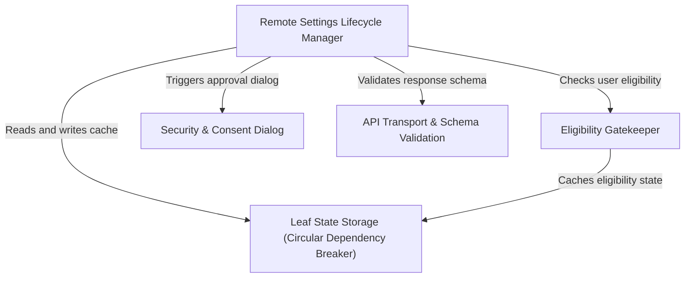

# Tutorial: remoteManagedSettings

This system manages the **remote configuration** of the application, allowing enterprise administrators to push settings to users securely. It features a central **lifecycle manager** that orchestrates fetching updates from the network, checking user *eligibility*, and caching data locally to avoid circular dependencies. Crucially, it includes a **security layer** that halts execution to ask for **user consent** via an interactive dialog if any "dangerous" settings are detected.

## Chapters

1. [Remote Settings Lifecycle Manager](01_remote_settings_lifecycle_manager.md)
2. [Security & Consent Dialog](02_security___consent_dialog.md)
3. [Eligibility Gatekeeper](03_eligibility_gatekeeper.md)
4. [API Transport & Schema Validation](04_api_transport___schema_validation.md)
5. [Leaf State Storage (Circular Dependency Breaker)](05_leaf_state_storage__circular_dependency_breaker_.md)

---

Generated by [Code IQ](https://github.com/adityasoni99/Code-IQ)