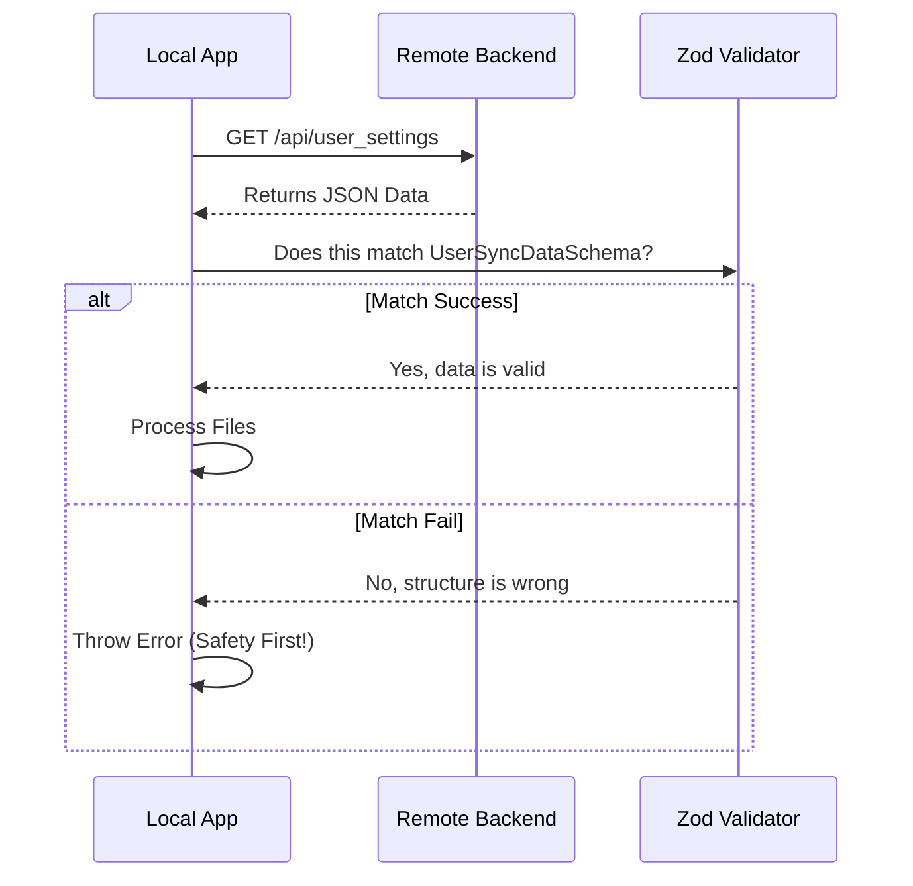

# Chapter 1: Sync Data Protocol

Welcome to the **Settings Sync** project! 

Imagine you have customized your CLI tool with specific preferences, but when you switch to a new computer, everything is gone. You have to configure it all over again. Frustrating, right?

The goal of this project is to save your settings to the cloud and restore them anywhere. To do this safely, we first need to agree on a **Sync Data Protocol**.

This chapter explains the "language" or "contract" the local computer and the remote server use to talk to each other.

### The Problem: Sending Data Safely

We can't just throw raw files at a server. We need to answer questions like:
1.  **What files are these?** (Settings? Memory files?)
2.  **Is the data complete?** (Did it get cut off?)
3.  **Which version is this?** (Is it older than what I already have?)

### The Solution: The "Shipping Manifest"

Think of the **Sync Data Protocol** as a strict **Shipping Manifest** attached to a package. 

*   **The Package:** Your actual setting files.
*   **The Manifest:** A strict list that says, "This package contains exactly 2 files, weighs 5kb, and has this specific ID."

If the package arrives and doesn't match the manifest, we reject it immediately. This keeps your data safe and predictable.

### Key Concepts

We use a library called **Zod** to define this manifest. Zod is like a strict customs officer that validates every piece of data.

#### 1. The Content (The Cargo)
Inside the package, we don't send folders or complex trees. We flatten everything into a simple list of **Key-Value pairs**.
*   **Key:** The filename (e.g., `~/.claude/settings.json`).
*   **Value:** The text inside that file.

```typescript
// types.ts
// This defines the "Cargo" inside our package
export const UserSyncContentSchema = lazySchema(() =>
  z.object({
    // A record is just a dictionary: "filename" -> "file content"
    entries: z.record(z.string(), z.string()),
  }),
)
```
*   **Beginner Note:** `z.record(z.string(), z.string())` means "I accept an object where every key is a string and every value is a string." Simple!

#### 2. The Envelope (Metadata)
We wrap the content with metadata to track versions and integrity.

```typescript
// types.ts
export const UserSyncDataSchema = lazySchema(() =>
  z.object({
    userId: z.string(),       // Who does this belong to?
    version: z.number(),      // Used to solve conflicts
    checksum: z.string(),     // A unique hash to prove data hasn't changed
    content: UserSyncContentSchema(), // The actual settings defined above
  }),
)
```
*   **Beginner Note:** The `checksum` is crucial. It acts like a wax seal on a letter. If the seal is broken (the hash doesn't match), we know the data is corrupted.

### Example: What the Data Looks Like

If we were to look at the JSON travelling over the wire, it would look like this:

```json
{
  "userId": "user_123",
  "version": 42,
  "checksum": "abc123hash...",
  "content": {
    "entries": {
      "~/.claude/settings.json": "{ \"theme\": \"dark\" }",
      "~/.claude/CLAUDE.md": "Always answer in concise text."
    }
  }
}
```

### Internal Implementation: The Verification Flow

When our application downloads settings, it doesn't just blindly save them. It follows a strict verification process.



#### Code Walkthrough: Fetching and Validating

Here is how the code in `index.ts` actually uses the protocol we defined.

First, we request the data from the API:

```typescript
// index.ts
const response = await axios.get(endpoint, {
  headers,
  // We handle 404 specially (it means "new user, no settings yet")
  validateStatus: status => status === 200 || status === 404,
})
```

Next, we run the **Validation Step**. This is where the magic happens. We use `.safeParse()` from our Zod schema.

```typescript
// index.ts
// The 'Customs Officer' checks the package
const parsed = UserSyncDataSchema().safeParse(response.data)

if (!parsed.success) {
  // If the manifest doesn't match the package, we stop.
  logForDiagnosticsNoPII('warn', 'settings_sync_fetch_invalid_format')
  return { success: false, error: 'Invalid settings sync response format' }
}
```

If validation passes, we know `parsed.data` is guaranteed to have the correct structure, so we can use it safely.

```typescript
// index.ts
return {
  success: true,
  data: parsed.data, // This is now typed as UserSyncData
  isEmpty: false,
}
```

### Summary

The **Sync Data Protocol** is the foundation of our feature. 
1.  It defines a strict shape for our data using **Zod schemas**.
2.  It separates **Metadata** (version, checksum) from **Content** (files).
3.  It ensures that we never process corrupted or unexpected data.

Now that we know *what* the data looks like, we need to figure out *how* to download it efficiently without slowing down the application startup.

[Next Chapter: Memoized Download Strategy](02_memoized_download_strategy.md)

---

Generated by [Code IQ](https://github.com/adityasoni99/Code-IQ)