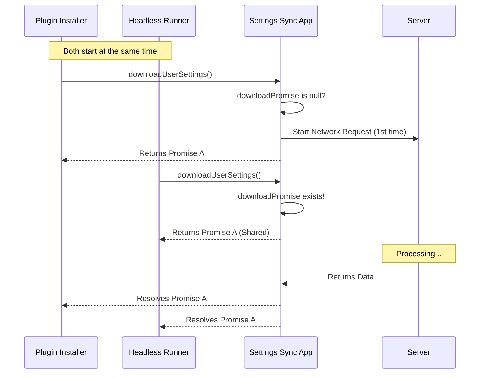

# Chapter 2: Memoized Download Strategy

In the previous [Sync Data Protocol](01_sync_data_protocol.md), we defined the exact shape of the package we send to the server. We know *what* data looks like (Safe Zod Schemas), but we haven't discussed *when* and *how* to fetch it.

This chapter solves a critical performance problem: **How do we make sure multiple parts of the app can ask for settings without flooding the server with duplicate requests?**

### The Motivation: The Town Crier

Imagine a village (our Application) and a distant castle (the Server). The villagers (Components) need news from the castle to start their day.

**The "Bad" Approach:**
Every time a villager needs news, they walk all the way to the castle, ask the King, and walk back.
*   If 5 components start up at the same time, we make 5 network requests.
*   This is slow, wastes bandwidth, and might trigger rate limits.

**The "Memoized" Approach (The Strategy):**
We hire a **Town Crier**.
1.  The first villager asks the Crier for news.
2.  The Crier sees he doesn't have it, so he starts walking to the castle.
3.  While he is walking, a second villager asks for news.
4.  The Crier says: *"I'm already on my way! Just wait here."*
5.  When the Crier returns, he gives the news to **both** villagers at the exact same moment.

We only made **one** trip to the castle, no matter how many people asked.

### Key Concept: The Shared Promise

In JavaScript, we implement this "Town Crier" using a variable that holds a **Promise**.

Usually, we cache the *result* (the data). But here, we are caching the **request itself**. This is called **Memoization**.

#### How to Use It

We use a simple check: "Is there already a download happening?"

```typescript
// index.ts

// This variable is our "Town Crier"
// It holds the ongoing request (or null if nothing is happening)
let downloadPromise: Promise<boolean> | null = null;

export function downloadUserSettings(): Promise<boolean> {
  // 1. If we are already downloading, return the existing ticket!
  if (downloadPromise) {
    return downloadPromise;
  }
  
  // 2. Otherwise, start a new download and save the ticket
  downloadPromise = doDownloadUserSettings();
  return downloadPromise;
}
```

*   **Step 1:** We check `downloadPromise`. If it is not null, it means the Crier is already running. We return that exact same promise.
*   **Step 2:** If it is null, we call the heavy function `doDownloadUserSettings()` and save it.

### The Flow: Visualized

Here is how the application handles simultaneous requests during startup.



As you can see, `Cloud` is only bothered once.

### Internal Implementation

Now let's look at `doDownloadUserSettings`. This is the function that actually does the work. It uses the protocols we learned in [Sync Data Protocol](01_sync_data_protocol.md).

#### 1. Fetching and Applying

This function handles the heavy lifting: fetching, validating, and saving files.

```typescript
// index.ts (Simplified)
async function doDownloadUserSettings(): Promise<boolean> {
  // 1. Get the raw data using our Protocol
  const result = await fetchUserSettings(); 

  // 2. If it failed or is empty, stop.
  if (!result.success || result.isEmpty) {
    return false;
  }

  // 3. Save the files to disk
  const entries = result.data.content.entries;
  await applyRemoteEntriesToLocal(entries);
  
  return true;
}
```
*   **Beginner Note:** This function is `async`, so it returns a Promise. This is exactly what we stored in our `downloadPromise` variable earlier!

#### 2. What about updates? (Force Refresh)

Sometimes, the user manually types a command (like `/reload-plugins`) and wants to force a fresh check, ignoring the cache. We need a way to bypass the Town Crier's memory.

```typescript
// index.ts
export function redownloadUserSettings(): Promise<boolean> {
  // overwrite the cached promise with a BRAND NEW one
  downloadPromise = doDownloadUserSettings(0); 
  return downloadPromise;
}
```
By overwriting `downloadPromise`, we force the application to go back to the server. Any subsequent calls will now latch onto this *new* request.

### Summary

The **Memoized Download Strategy** ensures that our application starts up fast and efficient.

1.  We use a **module-level variable** (`downloadPromise`) to act as a cache.
2.  If a request is active, we share that **Promise** with all callers.
3.  We avoid "Thundering Herd" problems where many components hit the API at once.

Now that we have efficiently downloaded our settings, what happens when we edit a file locally? We don't want to re-upload *everything* every time we change a single comma.

[Next Chapter: Incremental Upload Strategy](03_incremental_upload_strategy.md)

---

Generated by [Code IQ](https://github.com/adityasoni99/Code-IQ)