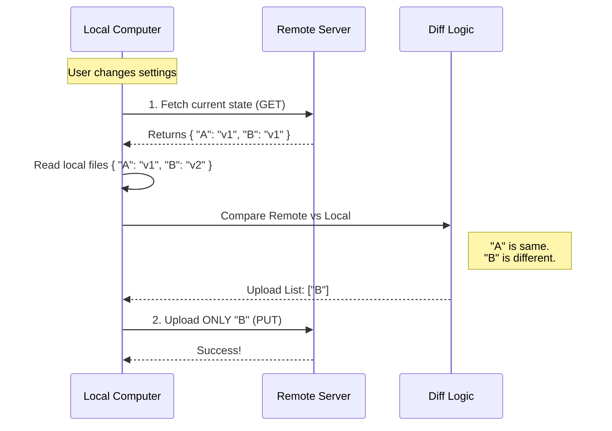

# Chapter 3: Incremental Upload Strategy

In the previous [Memoized Download Strategy](02_memoized_download_strategy.md), we ensured our application starts up quickly by downloading settings only once.

Now, we face the opposite challenge: **Saving your changes.**

When you edit a setting locally, we need to send that change to the cloud. But we must be efficient. We shouldn't re-upload your entire configuration history just because you changed a single comma in one file.

This chapter introduces the **Incremental Upload Strategy**, a smart logic that ensures we only upload exactly what is necessary.

### The Motivation: The Smart Editor

Imagine you are an author writing a 500-page book. You hire an editor (the Server) who keeps a copy of your manuscript.

**The "Brute Force" Approach:**
You fix a typo on page 42. To update the editor, you print out the entire 500-page book again and mail it.
*   **Result:** Huge shipping costs (bandwidth), slow delivery (latency), and the editor is annoyed (server load).

**The "Incremental" Approach:**
You fix a typo on page 42. You call the editor: "What do you have currently?" The editor checks. You realize page 42 is different. You print **only page 42** and mail just that one sheet.
*   **Result:** Fast, cheap, and efficient.

This is exactly how our **Incremental Upload Strategy** works.

### Key Concepts

To achieve this, our code performs a specific dance in the background.

#### 1. Fetch Before Push
It sounds counter-intuitive, but before we *upload* (push), we must *download* (fetch). We need to know the **Current Remote State**. We can't know what is different if we don't know what the server already has.

#### 2. The Diff Calculation
Once we have the remote state and the local state, we compare them. We identify files where:
*   The content exists locally but not remotely (New files).
*   The content exists in both, but is different (Updated files).

#### 3. Silent Background Execution
Since this happens while the user is working, it must not block the screen. We run this process "fire-and-forget"—we start the process and let it run without making the user wait for it to finish.

### Visualizing the Flow

Here is the conversation between your computer and the server during an upload.



### Internal Implementation

Let's look at how this is built in `index.ts`. The main function orchestrating this is `uploadUserSettingsInBackground`.

#### Step 1: Get the Remote State

First, we ask the server what it currently holds. We reuse the download logic we learned in previous chapters.

```typescript
// index.ts
// 1. Fetch what the server currently has
const result = await fetchUserSettings()

if (!result.success) {
  // If we can't see the server, we can't safely upload. Abort.
  return
}

// "remoteEntries" is a list of filenames and their content on the server
const remoteEntries = result.isEmpty ? {} : result.data.content.entries
```
*   **Beginner Note:** If the fetch fails (maybe the internet is down), we stop immediately. It is safer to do nothing than to guess.

#### Step 2: Read Local Files

Next, we read the files from your computer's hard drive.

```typescript
// index.ts
// 2. Read all relevant files from the local disk
const localEntries = await buildEntriesFromLocalFiles(projectId)
```
*   **Note:** `buildEntriesFromLocalFiles` is a helper that reads files like `settings.json` and `CLAUDE.md`. We will learn how it safely handles paths in [File Path Abstraction](05_file_path_abstraction.md).

#### Step 3: Calculate the Difference (The "Diff")

This is the most critical part. We use a utility called `pickBy` to filter the data.

```typescript
// index.ts
import pickBy from 'lodash-es/pickBy.js'

// 3. Find only the entries that have changed
const changedEntries = pickBy(
  localEntries,
  // Keep the file IF local content is NOT EQUAL to remote content
  (localValue, key) => remoteEntries[key] !== localValue,
)
```
*   **Beginner Note:** `pickBy` loops through every file. If `localValue` (what you have) is different from `remoteValue` (what the server has), it keeps it. If they are identical, it throws it away.

#### Step 4: Upload the Changes

Finally, if `changedEntries` is not empty, we send it to the server.

```typescript
// index.ts
const entryCount = Object.keys(changedEntries).length

// 4. If nothing changed, we are done!
if (entryCount === 0) {
  return
}

// 5. Upload only the changed items
await uploadUserSettings(changedEntries)
```

### The Upload Request

The `uploadUserSettings` function sends the data. Notice we use `axios.put` (Update) instead of `axios.get`.

```typescript
// index.ts
async function uploadUserSettings(entries) {
  // ... authentication logic ...

  // Send the specific entries to the API
  const response = await axios.put(
    endpoint,
    { entries }, // We wrap it in an object
    { headers }
  )

  return { success: true }
}
```
*   **Optimization:** The server side is smart enough to take these partial updates and merge them into your master account data.

### Summary

The **Incremental Upload Strategy** optimizes our network usage and ensures speed.
1.  It **Fetches** the current state first.
2.  It **Compares** local files against the remote version.
3.  It **Uploads** only the differences.

However, interacting with the hard drive (reading and writing files) is dangerous. What if the computer crashes while writing? What if we read a file while it's being deleted? 

In the next chapter, we will discuss how to handle file operations safely.

[Next Chapter: Safe IO & Cache Invalidation](04_safe_io___cache_invalidation.md)

---

Generated by [Code IQ](https://github.com/adityasoni99/Code-IQ)