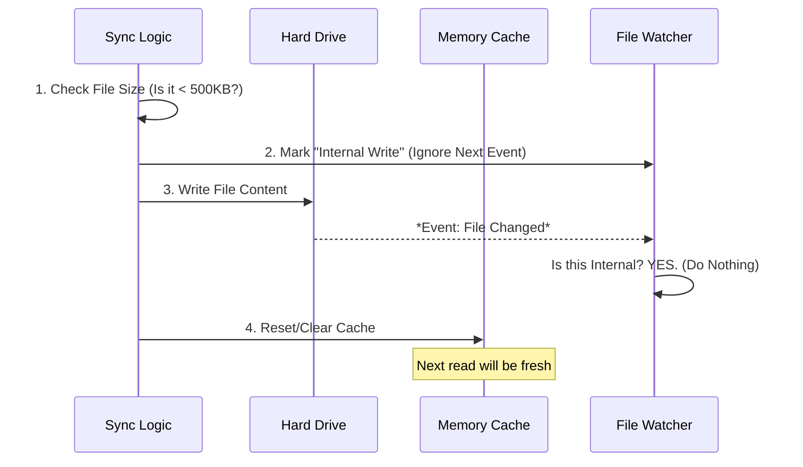

# Chapter 4: Safe IO & Cache Invalidation

In the previous [Incremental Upload Strategy](03_incremental_upload_strategy.md), we learned how to efficiently calculate which files need to be sent to the cloud.

Now we face the final and most dangerous step: **Actually writing files to the disk.**

It sounds simple—just save the file, right? But in a complex application, blindly writing files can cause crashes, memory leaks, or the dreaded "Infinite Loop of Doom."

This chapter explains **Safe IO & Cache Invalidation**, the safety protocols we use when the application modifies your settings.

### The Motivation: The "Infinite Loop" Danger

Our application has a **File Watcher**. This is a background process that watches your settings file.
1.  **Normal Flow:** You edit `settings.json` -> Watcher sees change -> App uploads to cloud.

But what happens when the **App itself** downloads a new setting from the cloud and writes it to disk?
1.  **Bad Flow:** App writes `settings.json` -> Watcher sees change -> Watcher thinks *you* edited it -> App uploads back to cloud -> Cloud sends it back...

This creates an infinite loop that eats up your bandwidth and CPU. We need a way to tell the Watcher: *"Ignore this specific change, I did it myself."*

### The Analogy: The Surgeon and the Nurse

Think of our file writing process as a **Surgeon** operating on a patient (the Hard Drive).
*   **The Nurse (File Watcher):** Monitors the patient's vitals. If they spike, the Nurse calls for help (Trigger Upload).
*   **The Surgeon (Safe IO):** Needs to perform surgery (Write File) which will naturally spike the vitals.

If the Surgeon doesn't warn the Nurse, the Nurse will panic.
So, the Surgeon says: *"I am making an incision now. Do not raise the alarm."*

This is exactly what our **Safe IO** does.

### Key Concepts

To perform this "surgery" safely, we follow three strict rules.

#### 1. The Bouncer (Size Limits)
Before we write anything, we check its size. If a user accidentally tries to sync a 2GB log file as a "setting," we must reject it. If we don't, the application might freeze trying to read it.

#### 2. The "Internal Write" Flag
This is the warning to the Nurse. We mark the file path as "currently being written by the app." The File Watcher checks this list before triggering an upload.

#### 3. Cache Invalidation (Updating the Chart)
Our app keeps a copy of settings in memory (RAM) so it runs fast (remember the [Memoized Download Strategy](02_memoized_download_strategy.md)?).
If we update the file on the **Disk** but forget to update the **RAM**, the app will continue acting as if the old settings are still there. We must force the app to "forget" the old data and re-read the file.

### Internal Implementation: The Workflow

Here is the sequence of events when `applyRemoteEntriesToLocal` is called.



### Code Walkthrough

Let's look at the implementation in `index.ts`. We break this down into small, safe steps.

#### Step 1: The Safety Check

First, we define a helper to ensure we never touch a file that is too big.

```typescript
// index.ts
const MAX_FILE_SIZE_BYTES = 500 * 1024 // 500 KB

const exceedsSizeLimit = (content: string, _path: string): boolean => {
  // Calculate actual byte size (not just character count)
  const sizeBytes = Buffer.byteLength(content, 'utf8')
  
  if (sizeBytes > MAX_FILE_SIZE_BYTES) {
    // Log a warning and refuse to proceed
    return true
  }
  return false
}
```

#### Step 2: The "Do Not Disturb" Signal

Before we write, we call `markInternalWrite`. This functions acts as a coordination signal with the rest of the app.

```typescript
// index.ts
import { markInternalWrite } from '../../utils/settings/internalWrites.js'

// Inside applyRemoteEntriesToLocal...
if (!exceedsSizeLimit(content, filePath)) {
  
  // TELL THE WATCHER: "I am doing this, ignore the change event."
  markInternalWrite(filePath)

  // Now it is safe to write to disk
  await writeFileForSync(filePath, content)
}
```

#### Step 3: Performing the Write

We use a wrapper `writeFileForSync` to handle directory creation automatically. If the folder `~/.claude/` doesn't exist, this function creates it for us.

```typescript
// index.ts
async function writeFileForSync(path: string, content: string) {
  try {
    // Ensure the folder exists (e.g. create .claude if missing)
    await mkdir(dirname(path), { recursive: true })
    
    // Write the actual text
    await writeFile(path, content, 'utf8')
    return true
  } catch {
    return false // Fail safely, don't crash the app
  }
}
```

#### Step 4: Clearing the Cache

Finally, after the file is successfully written, we must tell the rest of the application that the data has changed.

```typescript
// index.ts
// If we wrote at least one settings file...
if (settingsWritten) {
  // Force the configuration loader to re-read from disk next time
  resetSettingsCache()
}

// If we updated the memory file (CLAUDE.md)...
if (memoryWritten) {
  // Clear the specific memory cache
  clearMemoryFileCaches()
}
```

### Summary

**Safe IO & Cache Invalidation** ensures our application is robust and predictable.

1.  **Size Limits** prevent performance issues.
2.  **Internal Write Flags** prevent infinite upload loops.
3.  **Cache Invalidation** ensures the user sees their new settings immediately.

We have now covered almost every aspect of the Sync engine. We know *what* to send, *when* to send it, and *how* to save it.

But there is one loose thread. Throughout these chapters, we've used file paths like `settings.json` or `CLAUDE.md`. But where exactly are these files? How do we handle Windows vs Mac paths? How do we handle project-specific settings?

[Next Chapter: File Path Abstraction](05_file_path_abstraction.md)

---

Generated by [Code IQ](https://github.com/adityasoni99/Code-IQ)