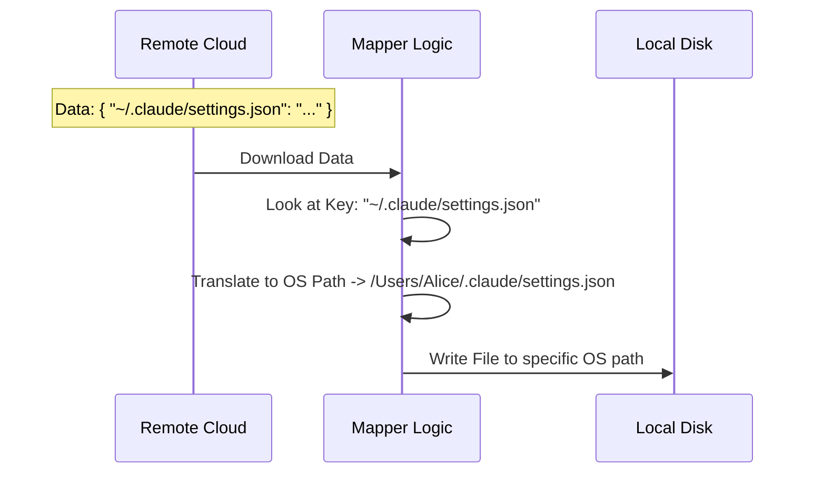

# Chapter 5: File Path Abstraction

In the previous chapter, [Safe IO & Cache Invalidation](04_safe_io___cache_invalidation.md), we learned how to write files to the disk without crashing the application or creating infinite loops.

But we left one major question unanswered: **Where exactly do we put these files?**

If you sync settings from a Windows laptop (`C:\Users\Alice\...`) to a MacBook (`/Users/Alice/...`), the file paths are completely different. If we tried to sync the raw file path, the Mac would try to create a `C:` drive folder, which is impossible.

This chapter introduces **File Path Abstraction**, the system we use to translate "Cloud Addresses" into "Local Disk Addresses."

### The Motivation: The Universal Post Office

Imagine you are sending a package to the manager of a store chain.

*   **The Wrong Way:** You write "Deliver to the desk at the back left corner of the 3rd floor at 123 Main St."
    *   *Problem:* If the manager moves to a new building, this address fails.
*   **The Abstract Way:** You write "Deliver to: Store Manager, Branch #101."
    *   *Solution:* The local mailroom looks up Branch #101 and knows exactly where that desk is physically located in the current building.

In our project:
*   **Cloud Key (The Label):** `~/.claude/settings.json` (Abstract, Universal).
*   **Local Path (The Destination):** `C:\Users\Alice\.claude\settings.json` (Concrete, Specific).

### Key Concepts

We use a simple dictionary (Map) to handle this translation.

#### 1. The Global Key
For settings that apply to the *User* (regardless of what project they are working on), we use a standard key.

```typescript
// types.ts
export const SYNC_KEYS = {
  // This string works for Windows, Mac, and Linux
  USER_SETTINGS: '~/.claude/settings.json',
  USER_MEMORY: '~/.claude/CLAUDE.md',
  // ...
}
```
*   **Beginner Note:** Even though we see `~` (tilde), this is just a **Label**. The cloud doesn't know what `~` means. It's just a string ID.

#### 2. The Project Key (Context Specific)
What if you want specific settings for just *one* project? We can't use the folder name (e.g., `my-project`) because you might rename the folder locally.

Instead, we use the **Git Remote Hash**. This is a unique ID for your code repository that stays the same even if you move the folder.

```typescript
// types.ts
// We generate a dynamic key based on the project ID
projectSettings: (projectId: string) =>
  `projects/${projectId}/.claude/settings.local.json`,
```

### Visualizing the Translation

Here is how the application translates a Cloud Key into a Local Path during a download.



### Internal Implementation

Let's look at how the code in `index.ts` handles this mapping.

#### Step 1: Generating the Project ID

First, we need to know "Who acts as Branch #101?" We use a utility to get the Git hash.

```typescript
// index.ts
import { getRepoRemoteHash } from '../../utils/git.js'

// Get the unique ID for the current folder's repository
const projectId = await getRepoRemoteHash()
```

#### Step 2: Mapping Local Files to Cloud Keys (Upload)

When we upload, we read local files and assign them their "Cloud Label."

```typescript
// index.ts
async function buildEntriesFromLocalFiles(projectId) {
  const entries = {}

  // 1. Read the physical file from disk
  const userSettingsPath = getSettingsFilePathForSource('userSettings')
  const content = await tryReadFileForSync(userSettingsPath)

  // 2. Assign it the abstract Cloud Key
  if (content) {
    entries[SYNC_KEYS.USER_SETTINGS] = content
  }
  
  return entries
}
```
*   **Explanation:** `getSettingsFilePathForSource` gives us the messy real path (like `C:\Users...`). We read that file, but when we put it into `entries`, we file it under the clean name `SYNC_KEYS.USER_SETTINGS`.

#### Step 3: Mapping Cloud Keys to Local Files (Download)

When downloading, we do the reverse. We look for specific keys in the downloaded package and decide where they go.

```typescript
// index.ts
// "entries" is the data from the cloud
const projectSettingsKey = SYNC_KEYS.projectSettings(projectId)
const content = entries[projectSettingsKey]

if (content) {
  // Find where local settings live on THIS computer
  const localPath = getSettingsFilePathForSource('localSettings')
  
  // Write the cloud content to the local path
  await writeFileForSync(localPath, content)
}
```
*   **Explanation:** We ask `SYNC_KEYS` to generate the ID for "Current Project Settings." We check if the cloud sent us data for that ID. If yes, we save it to the correct local file.

### Why This Matters for Teams

This abstraction allows for a magical user experience:

1.  **Alice** sets `color: blue` on her Mac in Project A.
2.  The app saves it to Cloud Key: `projects/hash-123/settings`.
3.  **Bob** pulls Project A on his Windows machine.
4.  The app sees `projects/hash-123/settings`.
5.  The app writes `color: blue` to `C:\Work\ProjectA\settings`.

Bob gets the settings without Alice needing to know anything about Bob's computer file system.

### Conclusion

Congratulations! You have completed the **Settings Sync** tutorial series.

We have built a robust system that:
1.  Defines a strict **Protocol** ([Chapter 1](01_sync_data_protocol.md)).
2.  Optimizes startup with **Memoization** ([Chapter 2](02_memoized_download_strategy.md)).
3.  Saves bandwidth with **Incremental Uploads** ([Chapter 3](03_incremental_upload_strategy.md)).
4.  Protects data with **Safe IO** ([Chapter 4](04_safe_io___cache_invalidation.md)).
5.  And finally, allows cross-platform syncing with **File Path Abstraction**.

You now understand the core architecture of how we keep user environments synchronized across machines and projects!

---

Generated by [Code IQ](https://github.com/adityasoni99/Code-IQ)