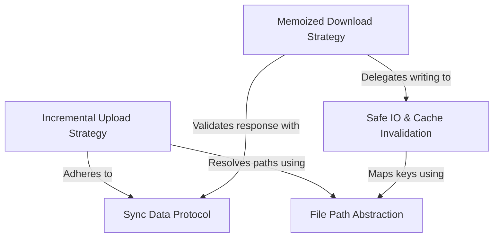

# Tutorial: settingsSync

The `settingsSync` project manages the synchronization of user configuration and memory files between the local environment and the remote backend. It utilizes an **Incremental Upload Strategy** to efficiently push only changed settings to the cloud and a **Memoized Download Strategy** to retrieve and cache remote configurations during startup, ensuring a consistent application state without redundant network requests.

## Chapters

1. [Sync Data Protocol](01_sync_data_protocol.md)
2. [Memoized Download Strategy](02_memoized_download_strategy.md)
3. [Incremental Upload Strategy](03_incremental_upload_strategy.md)
4. [Safe IO & Cache Invalidation](04_safe_io___cache_invalidation.md)
5. [File Path Abstraction](05_file_path_abstraction.md)

---

Generated by [Code IQ](https://github.com/adityasoni99/Code-IQ)