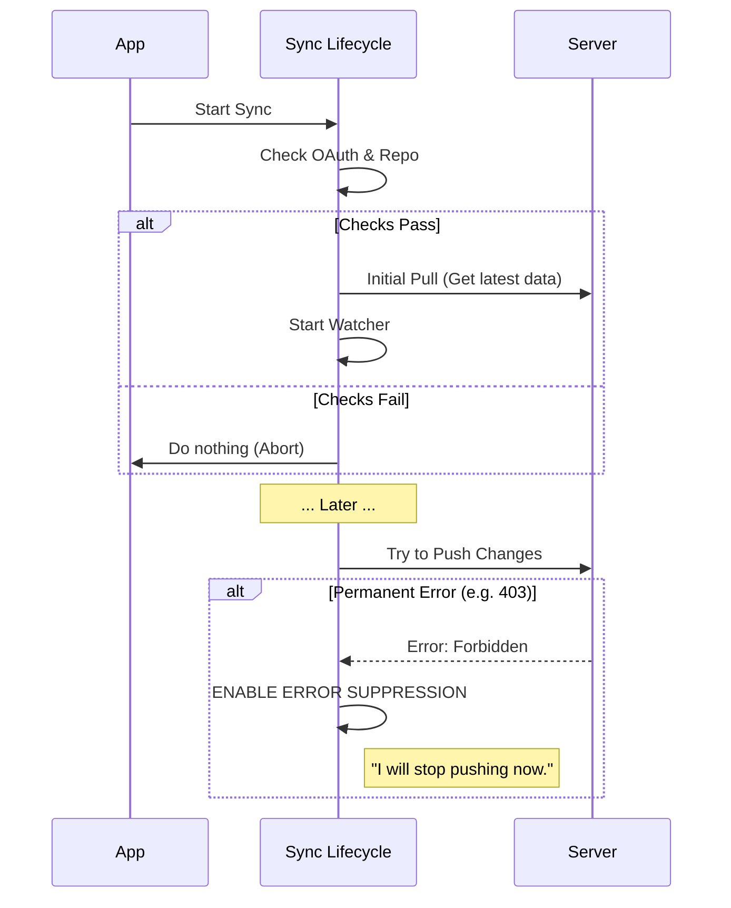

# Chapter 1: Sync Lifecycle & Error Suppression

Welcome to the **Team Memory Sync** project! 

In this first chapter, we are going to build the "brain" of our synchronization engine. Before we worry about reading files or scanning for secrets, we need a system that knows **when** to start, **when** to stop, and most importantly, **when to give up** if things go wrong.

### The Problem: The "Infinite Retry" Trap

Imagine you have a program that tries to upload a file to a server every time you save it. Now, imagine your password is wrong. 

1. You save the file.
2. The program tries to upload.
3. **Error:** `403 Forbidden` (Wrong password).
4. The program retries immediately.
5. **Error:** `403 Forbidden`.
6. ...Repeat 1,000 times a minute.

This is called an **infinite retry loop**. It slows down your computer and spams the server. To solve this, we need a **Sync Lifecycle** with **Error Suppression**.

### Key Concept: The Circuit Breaker

We will implement a logic similar to a "Circuit Breaker" in your house's electrical panel.
1. **Normal State:** Sync works fine.
2. **Permanent Failure:** If we get an error that *won't* fix itself (like "No Permission" or "No Internet Account"), we **trip the breaker**.
3. **Suppressed State:** We stop trying to push completely.
4. **Recovery:** We only try again if the user takes a drastic action (like deleting a file or restarting the app).

---

### High-Level Workflow

Here is how our Lifecycle Manager makes decisions:



---

### Step 1: Starting the Engine

We don't want to start the sync engine if the feature is disabled or if the user isn't logged into GitHub. We perform a "Pre-flight Check" before doing anything expensive.

**The Logic:**
1. Check if the feature flag is on.
2. Check if the user has an OAuth token.
3. Check if the current folder is a GitHub repository.

```typescript
// From: watcher.ts

export async function startTeamMemoryWatcher(): Promise<void> {
  // 1. Safety Checks
  if (!feature('TEAMMEM')) return
  if (!isTeamMemoryEnabled() || !isTeamMemorySyncAvailable()) return

  // 2. Github Repo Check
  const repoSlug = await getGithubRepo()
  if (!repoSlug) return // No repo, no sync.

  // ... (Code continues below)
}
```
**Explanation:**  
We return early (`return`) if any requirement is missing. This prevents the system from waking up in environments where it shouldn't run.

---

### Step 2: The Initial Pull

Once we know we *can* sync, we must first download the latest state from the server. This ensures we don't accidentally overwrite your teammate's work with our local files.

```typescript
// From: watcher.ts (inside startTeamMemoryWatcher)

  syncState = createSyncState() // Initialize state container

  // 3. Initial Pull
  try {
    const pullResult = await pullTeamMemory(syncState)
    if (pullResult.success) {
      // Log success...
    }
  } catch (e) {
    // Log warning, but don't crash...
  }
  
  // 4. Start the file watcher (covered in Chapter 2)
  await startFileWatcher(getTeamMemPath())
```
**Explanation:**  
We create a `syncState` object to hold our data. We try to `pullTeamMemory`. Even if the pull fails (maybe offline?), we still start the watcher so we can track local changes.

---

### Step 3: Determining "Permanent" Failures

This is the core of our **Error Suppression**. We need to distinguish between "The server is busy" (Temporary) and "You are not allowed" (Permanent).

```typescript
// From: watcher.ts

export function isPermanentFailure(r: TeamMemorySyncPushResult): boolean {
  // 1. Missing Auth or Missing Repo
  if (r.errorType === 'no_oauth' || r.errorType === 'no_repo') return true
  
  // 2. Client Errors (4xx) usually mean WE did something wrong
  // Exception: 409 (Conflict) and 429 (Too Many Requests) are temporary.
  if (r.httpStatus !== undefined && r.httpStatus >= 400 && r.httpStatus < 500) {
    return r.httpStatus !== 409 && r.httpStatus !== 429
  }
  return false
}
```
**Explanation:**
*   **Permanent:** `no_oauth` (Not logged in), `403` (Forbidden), `404` (Repo not found).
*   **Temporary:** `429` (Rate Limit/Slow Down), `409` (Merge Conflict - try again after pulling), `500` (Server Error).

---

### Step 4: The Circuit Breaker Implementation

When we attempt to push, we check the result. If it's a permanent failure, we set a "flag" (`pushSuppressedReason`) that blocks all future pushes.

```typescript
// From: watcher.ts

// Global variable to hold the "Stop" reason
let pushSuppressedReason: string | null = null

async function executePush(): Promise<void> {
  // ... perform push ...
  if (!result.success) {
    if (isPermanentFailure(result) && pushSuppressedReason === null) {
      // TRIP THE BREAKER
      pushSuppressedReason = result.errorType ?? 'unknown'
      
      logForDebugging(`Suppressing retry until restart (${pushSuppressedReason})`)
    }
  }
}
```
**Explanation:**  
Once `pushSuppressedReason` is set to a string (like `"no_oauth"`), the variable becomes not null. We use this variable in our scheduler to block actions.

---

### Step 5: Checking the Breaker (Debouncing)

Every time a file changes, we want to schedule a push. But first, we check if the breaker is tripped.

```typescript
// From: watcher.ts

function schedulePush(): void {
  // 1. The Circuit Breaker Check
  if (pushSuppressedReason !== null) return // STOP HERE if suppressed

  // 2. Debouncing (Wait 2 seconds)
  if (debounceTimer) clearTimeout(debounceTimer)
  
  debounceTimer = setTimeout(() => {
    currentPushPromise = executePush()
  }, 2000)
}
```
**Explanation:**
If `pushSuppressedReason` has a value, `schedulePush` returns immediately. The push never happens, and the loop is broken. The `setTimeout` ensures we wait 2 seconds after the last file edit, preventing rapid-fire uploads.

---

### Step 6: Graceful Shutdown

When the application closes, we need to clean up nicely. We stop the watcher and try one last "best-effort" push to save pending work.

```typescript
// From: watcher.ts

export async function stopTeamMemoryWatcher(): Promise<void> {
  // 1. Stop the timer
  if (debounceTimer) clearTimeout(debounceTimer)

  // 2. Close the file watcher
  if (watcher) watcher.close()

  // 3. Flush pending changes (if not suppressed)
  if (hasPendingChanges && syncState && pushSuppressedReason === null) {
    await pushTeamMemory(syncState) // Try to save before dying
  }
}
```

---

### Conclusion

You have now built a robust **Lifecycle Manager**. 
1. It performs safety checks on startup.
2. It classifies errors as "Temporary" or "Permanent".
3. It uses a **Circuit Breaker** to stop infinite loops if a permanent error occurs.

However, our lifecycle currently calls `startFileWatcher` and `pullTeamMemory`, but we haven't explained how those actually work yet!

In the next chapter, we will look at how to efficiently watch the file system for changes without eating up all your computer's memory.

[Next Chapter: Team Memory File Watcher](02_team_memory_file_watcher.md)

---

Generated by [Code IQ](https://github.com/adityasoni99/Code-IQ)