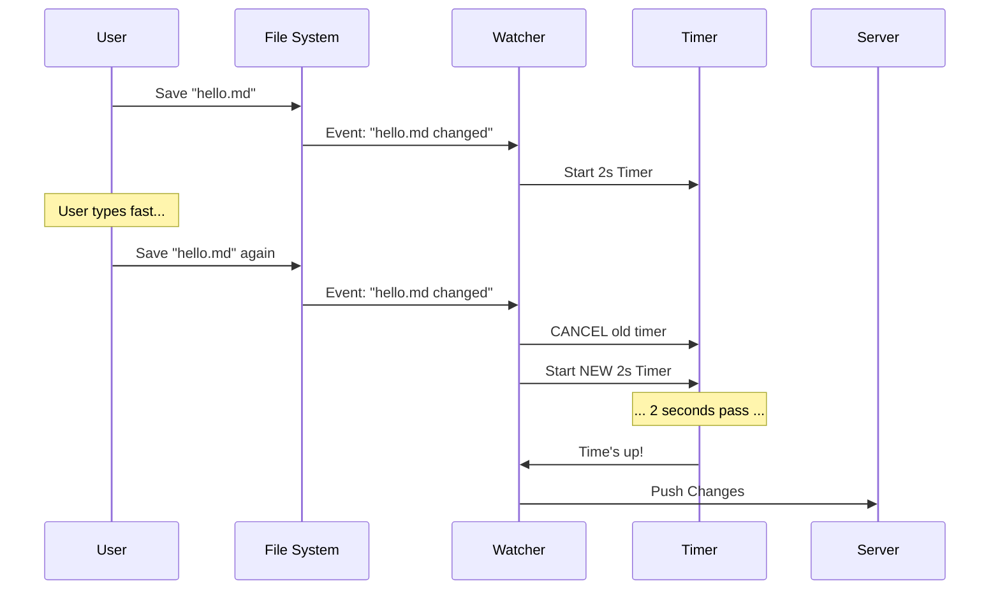

# Chapter 2: Team Memory File Watcher

Welcome back! In the previous chapter, [Sync Lifecycle & Error Suppression](01_sync_lifecycle___error_suppression.md), we built the "brain" of our system—the logic that decides *if* we are allowed to sync and *when* to stop if errors occur.

Now, we need to build the "eyes." We need a system that watches your files and tells the server when you've updated your team memory.

### The Problem: The "Over-Eager" Messenger

Imagine you are writing a letter to your friend. 
1. You write "Dear".
2. You run to the mailbox and post it.
3. You run back, write "Mom".
4. You run to the mailbox and post it.

This is exhausting for you and annoying for the mail carrier! 

In software, if we tried to upload a file every time you pressed `Ctrl+S` (or every time an autosave triggered), we would flood the network with tiny requests. This causes:
*   **Server Spam:** Too many API calls.
*   **Race Conditions:** Version 1 starts uploading, then Version 2 starts uploading before Version 1 is finished.

### The Solution: The Smart Outbox (Debouncing)

We are going to build a **Team Memory File Watcher**. It acts like a smart outbox. 

When you make a change, the watcher doesn't send it immediately. It starts a **2-second timer**.
*   If you make *another* change within those 2 seconds, the timer **resets**.
*   Only when you have been "silent" for 2 full seconds does the watcher finally say, "Okay, they are done writing. I'll send this batch now."

This technique is called **Debouncing**.

---

### Step 1: Watching the Directory

We use the Node.js built-in `fs.watch` function. We point it at our Team Memory directory. We need to make sure we use `recursive: true` so that if you create folders inside the memory directory, we see those changes too.

```typescript
// From: watcher.ts

async function startFileWatcher(teamDir: string): Promise<void> {
  // Ensure the directory exists first
  await mkdir(teamDir, { recursive: true })

  // Start watching!
  watcher = watch(
    teamDir,
    { persistent: true, recursive: true }, 
    (_eventType, filename) => {
      // Every time a file changes, run this:
      schedulePush() 
    }
  )
}
```
**Explanation:**  
We tell the operating system: "Keep an eye on `teamDir`. If anything changes (add, delete, modify), let me know." When the OS notifies us, we simply call `schedulePush()`.

---

### Step 2: The Debounce Timer

This is the most critical part of this chapter. We need a variable to hold our timer (`debounceTimer`).

```typescript
// From: watcher.ts

const DEBOUNCE_MS = 2000 // 2 seconds

let debounceTimer: ReturnType<typeof setTimeout> | null = null

function schedulePush(): void {
  // 1. If a timer is already running, cancel it!
  if (debounceTimer) {
    clearTimeout(debounceTimer)
  }

  // 2. Start a brand new timer
  debounceTimer = setTimeout(() => {
    executePush() // Actually send data to server
  }, DEBOUNCE_MS)
}
```
**Explanation:**  
Imagine the timer is a bomb with a 2-second fuse. Every time `schedulePush` is called (which happens on every file save), we **cut the wire** on the existing bomb and light a **new one**. The explosion (`executePush`) only happens if you stop cutting wires for 2 seconds.

---

### Step 3: Respecting the Circuit Breaker

Remember the **Circuit Breaker** we built in [Sync Lifecycle & Error Suppression](01_sync_lifecycle___error_suppression.md)? We need to make sure our watcher respects it. If the lifecycle manager has suppressed errors (because of a permanent failure like "No Permission"), the watcher should stay quiet.

We add one line to the top of our scheduler:

```typescript
// From: watcher.ts

function schedulePush(): void {
  // STOP if the Circuit Breaker is tripped
  if (pushSuppressedReason !== null) return 

  // ... existing debounce logic ...
  if (debounceTimer) clearTimeout(debounceTimer)
  
  debounceTimer = setTimeout(() => {
     executePush()
  }, DEBOUNCE_MS)
}
```
**Explanation:**  
If `pushSuppressedReason` is not null (e.g., it equals `"no_oauth"`), we `return` immediately. The timer never starts, and `executePush` is never called.

---

### Visualization: The Watcher Workflow

Here is how the User, the File System, and our Watcher interact.



---

### Step 4: Executing the Push

When the timer finally fires, we call `executePush`. This function grabs the `syncState` (the data container we initialized in Chapter 1) and sends it to the server.

```typescript
// From: watcher.ts

async function executePush(): Promise<void> {
  pushInProgress = true
  
  try {
    // Attempt to push changes
    const result = await pushTeamMemory(syncState)
    
    if (result.success) {
       console.log("Files synced successfully!")
    }
  } finally {
    pushInProgress = false
  }
}
```
**Explanation:**  
We set a flag `pushInProgress = true` so we know we are busy. We then try to push. Whether it succeeds or fails, we turn the flag off in the `finally` block.

---

### Why this is "Beginner Friendly" to the Computer

You might wonder why we use `fs.watch` specifically. 

Some libraries (like `chokidar`) are very popular, but they can be "expensive." On some operating systems, they open a "file handle" for every single file they watch. If your team memory has 500 files, that's 500 open handles!

Our implementation uses `recursive: true` with the native `fs.watch`. On macOS and Windows, this uses a single "handle" to watch the entire folder tree. It's very efficient and keeps your computer running smoothly.

### Conclusion

You have built the **Team Memory File Watcher**.
1. It watches the directory efficiently.
2. It uses **Debouncing** to wait 2 seconds, grouping rapid edits into one sync.
3. It respects the **Error Suppression** rules from Chapter 1.

But wait... what happens if you try to edit a file that you don't have permission to edit? Or what if you try to delete a file that the server says is "Read Only"?

The watcher detects changes, but it doesn't know if those changes are *safe*. For that, we need a guard.

[Next Chapter: Write Protection Guard](03_write_protection_guard.md)

---

Generated by [Code IQ](https://github.com/adityasoni99/Code-IQ)