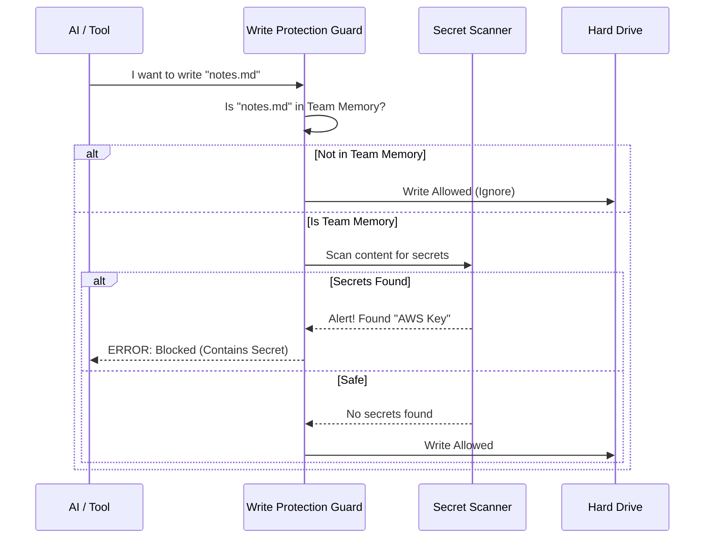

# Chapter 3: Write Protection Guard

Welcome to the third chapter of the **Team Memory Sync** tutorial!

In the previous chapter, [Team Memory File Watcher](02_team_memory_file_watcher.md), we built a system that watches for changes and efficiently uploads them. But there is a hidden danger in automation: **What if we accidentally upload something we shouldn't?**

### The Problem: The "Reply-All" Disaster

Imagine you are working with an AI assistant. You paste your company's AWS password or your personal API key into the chat to get help debugging a script. 

If the AI decides to save that conversation into a "Team Memory" file (to "remember" how to fix the bug later), that file gets synced to **everyone on your team**.

Suddenly, your private password is on ten other computers. This is a security nightmare.

### The Solution: The Bouncer

We need a **Write Protection Guard**. Think of this guard as a security bouncer standing in front of the hard drive. 

Before any file is written to the "Team Memory" folder:
1.  The Guard intercepts the request.
2.  It checks: "Is this going into the shared folder?"
3.  It scans the content: "Are there any secrets (passwords, keys) here?"
4.  **Verdict:**
    *   **Clean:** The Guard steps aside. Write allowed.
    *   **Dirty:** The Guard blocks the write and yells, "Security Risk!"

---

### High-Level Workflow

Here is how the interaction works when an AI tool tries to write a file.



---

### Step 1: The Gatekeeper Function

We implement this logic in a single function: `checkTeamMemSecrets`. This function doesn't write the file itself; it just returns an error if something is wrong.

**Inputs:**
*   `filePath`: Where we want to save the file.
*   `content`: What we want to write.

**Output:**
*   `null`: Everything is fine.
*   `string`: An error message explaining why the write is blocked.

```typescript
// From: teamMemSecretGuard.ts

export function checkTeamMemSecrets(
  filePath: string, 
  content: string
): string | null {
  
  // 1. Feature Flag Check
  // If the feature is disabled globally, we let everything pass.
  if (!feature('TEAMMEM')) return null

  // ... logic continues ...
}
```

---

### Step 2: Checking the Location

We don't want to scan every single file on your computer. If you are saving a file to your personal Desktop, that's your business. We only care if you are writing to the **Team Memory** folder (the shared folder).

```typescript
// From: teamMemSecretGuard.ts

  // Import the path checker helper
  const { isTeamMemPath } = require('../../memdir/teamMemPaths.js')

  // 2. Location Check
  // If the file is NOT inside the team memory folder, ignore it.
  if (!isTeamMemPath(filePath)) {
    return null
  }
```

**Explanation:**  
`isTeamMemPath` returns `true` only if the path is inside the synchronized repository. If it returns `false`, we return `null` immediately, allowing the write to proceed without scanning.

---

### Step 3: Scanning the Content

Now that we know the file is destined for the shared folder, we must look at the content. We delegate this heavy lifting to the `scanForSecrets` function (which we will build in the next chapter).

```typescript
// From: teamMemSecretGuard.ts

  const { scanForSecrets } = require('./secretScanner.js')

  // 3. run the Scan
  const matches = scanForSecrets(content)

  // 4. Check results
  if (matches.length === 0) {
    return null // No secrets found, write is safe!
  }
```

**Explanation:**  
`matches` is an array. If it is empty, the file is clean. We return `null`, giving the "Green Light."

---

### Step 4: Blocking the Write

If `matches` is *not* empty, it means we found something dangerous (like a GitHub Personal Access Token or an OpenAI Key). We must construct a helpful error message and return it.

```typescript
// From: teamMemSecretGuard.ts

  // 5. Construct Error Message
  const labels = matches.map(m => m.label).join(', ')
  
  return (
    `Content contains potential secrets (${labels}) and cannot be written ` +
    'to team memory. Remove the sensitive content and try again.'
  )
```

**Explanation:**  
We return a string. The system calling this function (usually the text editor or the AI agent) receives this string and throws an error, preventing the file from ever touching the disk.

### Example Scenario

Let's trace what happens with real data.

**Input:**
*   **File:** `project_root/.team_memory/credentials.md`
*   **Content:** "Use this key: sk-ant-12345..."

**Execution:**
1.  **Location Check:** Is it in `.team_memory`? **Yes.**
2.  **Scan:** Does "sk-ant-12345..." match a rule? **Yes** (Matches "Anthropic API Key").
3.  **Result:** The function returns: `"Content contains potential secrets (Anthropic API Key)..."`

**Outcome:**
The file write fails. The secret is **never saved** to the disk, so the [Team Memory File Watcher](02_team_memory_file_watcher.md) never sees it, and it never gets uploaded to the server.

---

### Why this structure?

You might wonder why we use `require` inside the function instead of `import` at the top of the file.

```typescript
if (feature('TEAMMEM')) {
  const { scanForSecrets } = require('./secretScanner.js')
  // ...
}
```

This is an optimization. The "Secret Scanner" contains a lot of large Regex patterns (rules for finding secrets). By putting the `require` inside the `if`, we only load those heavy rules into memory **if** the Team Memory feature is actually turned on. If the user disables this feature, we save memory!

### Conclusion

You have implemented the **Write Protection Guard**.
1.  It acts as a gatekeeper for the shared folder.
2.  It ignores personal files.
3.  It blocks writes immediately if secrets are found.

This layer ensures that our repository remains clean and secure. But how does the system actually recognize what an "Anthropic API Key" or a "Slack Token" looks like?

In the final chapter, we will open up the engine and look at the Regex patterns that make this possible.

[Next Chapter: Secret Scanning Engine](04_secret_scanning_engine.md)

---

Generated by [Code IQ](https://github.com/adityasoni99/Code-IQ)