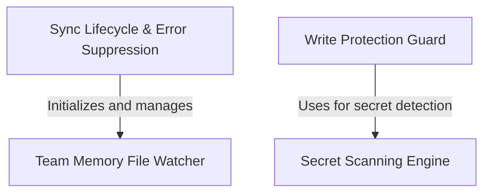

# Tutorial: teamMemorySync

This project implements a **secure synchronization system** for shared "team memory" files, ensuring local notes are automatically backed up to a server. It features a **file watcher** with debounce logic to efficiently batch updates and a **secret scanning engine** that acts as a gatekeeper, preventing sensitive credentials (like API keys) from being written to shared storage. A robust **lifecycle manager** handles startup, shutdown, and **error suppression** to prevent infinite retry loops during permanent failures.

## Chapters

1. [Sync Lifecycle & Error Suppression](01_sync_lifecycle___error_suppression.md)
2. [Team Memory File Watcher](02_team_memory_file_watcher.md)
3. [Write Protection Guard](03_write_protection_guard.md)
4. [Secret Scanning Engine](04_secret_scanning_engine.md)

---

Generated by [Code IQ](https://github.com/adityasoni99/Code-IQ)