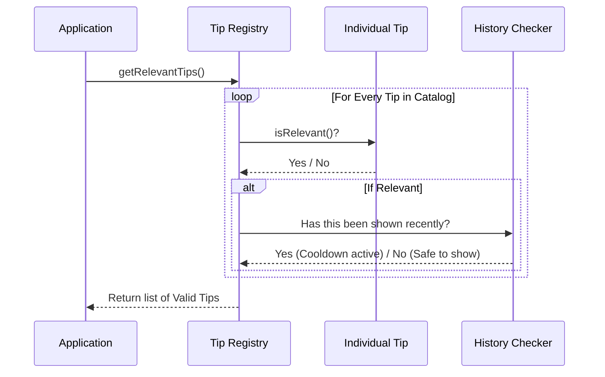

# Chapter 1: Tip Registry

Welcome to the **Tip Registry**! This is the foundation of our entire suggestion system. 

If you've ever wondered how an application knows exactly which helpful hint to show you at the right time, you are in the right place. In this chapter, we will build the "brain" that holds all the knowledge the system can offer.

## The Motivation: Why a Registry?

Imagine you want to display helpful hints to your users. The simplest way might be a list of strings:

```javascript
const tips = [
  "Use /help to see commands",
  "Press Ctrl+C to exit"
]
```

**The Problem:** This simple list is "dumb." It doesn't know *when* to show a tip. It might tell an expert user how to exit the app (which they already know) or show the same message five times in a row.

**The Solution:** The **Tip Registry**. Instead of a simple list of text, we create a catalog of smart objects. 

**The Analogy:** Think of the Registry as a **Recipe Book**. 
*   It doesn't just list the name of the dish ("Spaghetti").
*   It lists the **Ingredients** (the text message).
*   It lists the **Serving Instructions** (when to show it and who it is for).

## Use Case: The "New User" Tip

Let's look at a concrete example we want to solve. 

**Goal:** We want to show a tip saying *"Start with small features..."* but **only** if the user has opened the app fewer than 10 times.

To do this, we need to define a **Tip Object** in our registry.

### Key Concept: The Tip Object

In our system, a "Tip" is not just text. It is an object with three main parts.

#### 1. ID (The Name Tag)
Every tip needs a unique name so the system can track if it has been shown before.

```typescript
// A unique identifier string
id: 'new-user-warmup',
```

#### 2. Content (The Ingredients)
This is the actual message the user sees. In our system, this is a function, not just a string. This allows us to change the text dynamically (like changing colors based on the user's theme).

```typescript
// Returns the text to display
content: async () => 
  `Start with small features or bug fixes...`,
```

#### 3. Metadata & Logic (The Instructions)
This is where the magic happens. We define `cooldownSessions` (how long to wait before showing it again) and `isRelevant` (a logic check to see if we should show it now).

```typescript
// Don't show again for 3 sessions
cooldownSessions: 3,

// Only show if the user is new (< 10 startups)
isRelevant: async () => {
    const config = getGlobalConfig()
    return config.numStartups < 10
},
```

---

## Internal Implementation: How It Works

Before looking at the full code, let's visualize what happens when the application asks the Registry for tips.

The Registry acts like a filter. It holds all possible tips but only releases the ones that pass specific tests.



### Code Deep Dive

Let's look at how this is implemented in `tipRegistry.ts`.

#### 1. The Catalog (`externalTips`)
The registry is essentially a large array containing these Tip objects. Here is how the "New User" tip looks in the actual code:

```typescript
const externalTips: Tip[] = [
  {
    id: 'new-user-warmup',
    content: async () =>
      `Start with small features or bug fixes...`,
    cooldownSessions: 3, 
    // Logic to check if user is new
    async isRelevant() {
      const config = getGlobalConfig()
      return config.numStartups < 10
    },
  },
  // ... dozens of other tips follow
]
```

#### 2. The Filter Logic (`getRelevantTips`)
This is the main function the application calls. It filters the big list down to what is useful *right now*.

```typescript
export async function getRelevantTips(context?: TipContext): Promise<Tip[]> {
  // 1. Get all standard tips
  const tips = [...externalTips]

  // 2. Check "isRelevant" for every tip in parallel
  const isRelevant = await Promise.all(
    tips.map(tip => tip.isRelevant(context))
  )

  // ... (filtering continues below)
```

After checking relevance, the function applies the "Cooldown" logic. This ensures we don't annoy the user with the same tip repeatedly.

*(Note: The logic for tracking history is detailed in [Session History Tracking](04_session_history_tracking.md))*

```typescript
  // 3. Filter by relevance AND cooldown
  const filtered = tips
    .filter((_, index) => isRelevant[index])
    .filter(tip => 
      getSessionsSinceLastShown(tip.id) >= tip.cooldownSessions
    )

  return filtered
}
```

### Integration with Other Systems

The Tip Registry doesn't work alone. It acts as a hub connecting several other concepts:

1.  **Context:** The registry receives a `context` object. This helps determine if a tip is useful *right now* (e.g., if the user is editing a CSS file, show a CSS tip). This is covered in [Contextual Relevance Engine](03_contextual_relevance_engine.md).
2.  **Overrides:** Sometimes, advanced users want to define their own tips or hide default ones. The registry handles this by merging `externalTips` with custom ones. We will learn this in [Custom Tip Overrides](02_custom_tip_overrides.md).

## Summary

You have learned that the **Tip Registry** is the central catalog of our system. 
*   It treats tips as **Smart Objects**, not just strings.
*   It uses **IDs** for tracking.
*   It uses **Relevance Functions** to decide *if* a tip should be shown.
*   It uses **Cooldowns** to decide *when* a tip should be shown again.

In the next chapter, we will see how users can inject their own "recipes" into this book.

[Next Chapter: Custom Tip Overrides](02_custom_tip_overrides.md)

---

Generated by [Code IQ](https://github.com/adityasoni99/Code-IQ)