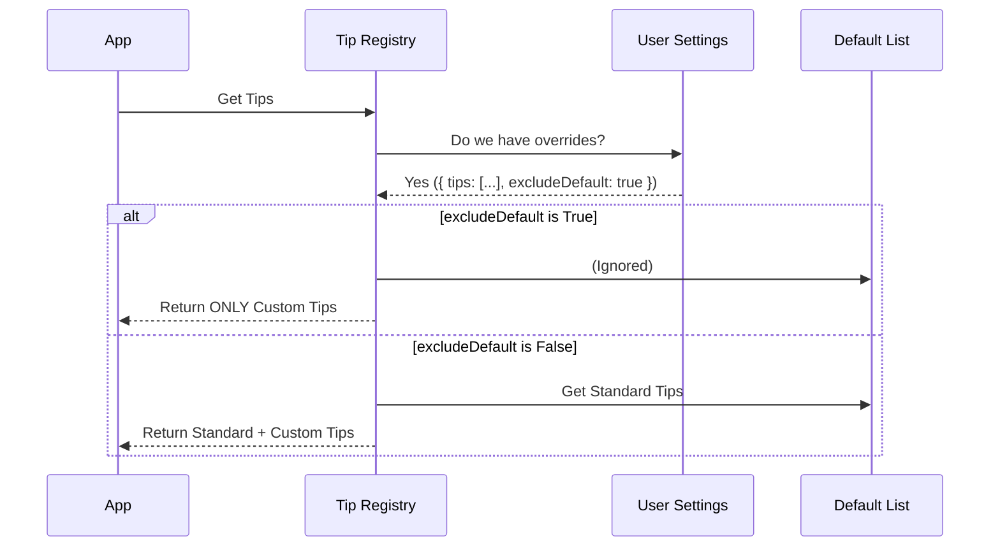

# Chapter 2: Custom Tip Overrides

In [Tip Registry](01_tip_registry.md), we built a "Recipe Book" containing all the standard helpful hints our application can show.

But what if you are the head chef and you want to serve a specific special today, regardless of what the book says? Or what if a company wants to hide all the standard "fun" tips and only show serious compliance reminders?

This is where **Custom Tip Overrides** come in.

## The Motivation: Why Override?

The standard registry is great for general users, but it is static. We need a way to make the system flexible without changing the source code.

**Common Scenarios:**
1.  **Enterprise Policy:** A company wants every developer to see: *"Remember to run security checks!"*
2.  **Announcements:** An admin wants to broadcast: *"Server maintenance at 5 PM."*
3.  **Focus Mode:** A user wants to turn off all tips to avoid distraction.

**The Analogy:** Think of this as a **"Chef's Special"** insert in a menu.
*   The restaurant has a standard menu (The Registry).
*   The Chef clips a paper note to the front (The Override).
*   The customer sees the special note first. The Chef can even decide to *remove* the standard menu and only offer the special.

## Use Case: The "Compliance" Reminder

Let's say our goal is to force the application to display a specific message: *"Always run lint before pushing."*

We also want to ensure the user sees *only* this message, hiding standard tips like "Did you know you can drag and drop images?"

To do this, we use a configuration setting called `spinnerTipsOverride`.

---

## Key Concept: The Configuration Object

Instead of writing code, the user provides a simple configuration (usually in a JSON file or settings object).

We look for two specific properties:

1.  **`tips`**: A list of simple strings (the custom messages).
2.  **`excludeDefault`**: A switch (true/false). If true, we throw away the standard registry.

### Example Configuration

Here is how a user might configure this in their settings:

```json
{
  "spinnerTipsOverride": {
    "tips": ["Always run lint before pushing"],
    "excludeDefault": true
  }
}
```

By setting `excludeDefault: true`, we effectively silence the rest of the application's "brain" and only speak what is in the `tips` array.

---

## Internal Implementation: How It Works

When the application asks for tips, we don't just look at the internal list anymore. We first check if the user has provided "Chef's Specials."

### The Logic Flow



### Code Deep Dive

Let's look at `tipRegistry.ts` to see how we handle this.

#### 1. Converting Strings to Tips (`getCustomTips`)

In [Chapter 1](01_tip_registry.md), we learned that the system needs complex **Tip Objects** (with IDs and functions), but the user provides simple **Strings**.

We need a helper function to convert the user's simple text into the object format the system understands.

```typescript
function getCustomTips(): Tip[] {
  const settings = getInitialSettings()
  const override = settings.spinnerTipsOverride
  
  // If no custom tips exist, return empty list
  if (!override?.tips?.length) return []

  // Map strings to Tip Objects
  return override.tips.map((content, i) => ({
    id: `custom-tip-${i}`,     // Generate a fake ID
    content: async () => content, // Wrap string in a function
    cooldownSessions: 0,       // Show immediately!
    isRelevant: async () => true, // Always show
  }))
}
```

**What happened here?**
*   We gave the tip a generated ID (`custom-tip-0`).
*   We set `cooldownSessions: 0`. Unlike standard tips which track history (see [Session History Tracking](04_session_history_tracking.md)), custom tips are usually urgent, so we don't want to wait.
*   We set `isRelevant` to `true`. If the user added it, they want to see it.

#### 2. The Decision Logic (`getRelevantTips`)

Now we update our main function to handle the `excludeDefault` logic. This is the "Switch" that decides whether to show the standard menu or just the specials.

```typescript
export async function getRelevantTips(context?: TipContext): Promise<Tip[]> {
  const settings = getInitialSettings()
  const override = settings.spinnerTipsOverride
  const customTips = getCustomTips() // Convert user strings to objects

  // THE OVERRIDE CHECK
  // If user wants to exclude defaults AND has custom tips...
  if (override?.excludeDefault && customTips.length > 0) {
    return customTips // ...return ONLY custom tips
  }

  // Otherwise, load standard tips...
  const tips = [...externalTips, ...internalOnlyTips]
  
  // (Filter standard tips logic from Chapter 1 goes here...)
  
  // Combine standard filtered tips WITH custom tips
  return [...filteredStandardTips, ...customTips]
}
```

## Integration with Other Systems

It is important to note how Custom Tips interact with the rest of the system:

1.  **Bypassing Relevance:** Standard tips rely on the [Contextual Relevance Engine](03_contextual_relevance_engine.md) to know if they fit the situation. Custom tips bypass this—they assume the user knows best.
2.  **Bypassing History:** Standard tips rely on [Session History Tracking](04_session_history_tracking.md) so they don't appear too often. Custom tips set their cooldown to `0`, ensuring they are always eligible for display.

## Summary

You have learned how to inject **Custom Tip Overrides**.
*   We allow users to provide a simple list of strings via configuration.
*   We convert those simple strings into full **Tip Objects** dynamically.
*   We implemented a "Chef's Special" logic: if `excludeDefault` is on, we ignore the standard registry entirely.

This gives our system flexibility. It works out-of-the-box for beginners, but allows power users and enterprises to take full control.

Now that we have our list of tips (Standard or Custom), how does the system know which *Standard* tip applies to the file you are currently editing?

[Next Chapter: Contextual Relevance Engine](03_contextual_relevance_engine.md)

---

Generated by [Code IQ](https://github.com/adityasoni99/Code-IQ)