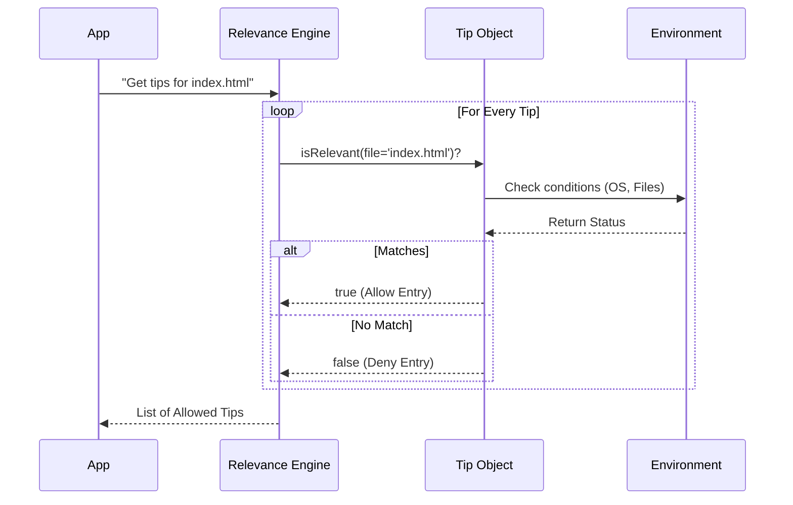

# Chapter 3: Contextual Relevance Engine

Welcome back! In [Chapter 2: Custom Tip Overrides](02_custom_tip_overrides.md), we learned how to force the system to show specific messages.

However, for most users, we don't want to force messages. We want the system to be smart. We want it to "know" what the user is doing and offer help that makes sense *right now*.

This brings us to the **Contextual Relevance Engine**.

## The Motivation: The "Bouncer" Analogy

In [Chapter 1](01_tip_registry.md), we created a registry full of tips. But if we just pick a random tip, we might look foolish.

Imagine a user working on a **Windows** computer, writing **Python** code.
*   **Bad Tip:** "Press Cmd+Space to search" (This is a Mac shortcut).
*   **Bad Tip:** "Try this CSS trick!" (The user is writing Python).

We need a logic layer that acts like a **Bouncer at a Club**. 
*   The Tip is the guest trying to get in.
*   The Bouncer checks their credentials (OS, current file, installed tools).
*   If the credentials match, the tip is allowed through. If not, it is turned away.

## Use Case: The "Frontend Helper"

Let's solve a specific problem. We have a tip suggesting a "Frontend Design Plugin."

**The Rule:**
1.  **Show** this tip if the user is editing an `.html` or `.css` file.
2.  **Hide** this tip if the user is editing a `.python` or `.sql` file.

To achieve this, we use the `isRelevant` function inside our Tip Object.

## Key Concepts

To build this engine, we rely on three specific signals.

### 1. The Environment (Global Signals)
These are things that rarely change during a session.
*   **OS:** Is it Mac, Windows, or Linux?
*   **User Type:** Is this a beginner or an employee (ANT)?
*   **Installed Tools:** Is VS Code installed? Is Git installed?

### 2. The Context (Dynamic Signals)
These change every time the user presses a key or runs a command.
*   **Current File:** What file is currently open? (`index.html`)
*   **Recent Command:** Did they just run a build command?

### 3. The Boolean Decision
The engine expects a simple `true` (Show it!) or `false` (Hide it!).

## Implementation: How to Write Relevance Logic

Let's look at how we write this logic inside a tip. We define an `async` function called `isRelevant`.

### Example 1: Checking the OS

Here is a tip that should **only** appear for Mac users.

```typescript
{
  id: 'paste-images-mac',
  content: async () => 'Use Cmd+V to paste images',
  
  // The Bouncer Logic
  isRelevant: async () => {
    // Check our helper function for the platform
    return getPlatform() === 'macos'
  }
}
```

If `getPlatform()` returns `'windows'`, `isRelevant` becomes `false`, and the user never sees this tip.

### Example 2: Checking the Current File (Context)

Now let's look at our "Frontend Helper" use case. The `isRelevant` function receives a `context` argument containing details about the current state.

```typescript
{
  id: 'frontend-design-plugin',
  content: async () => 'Try the frontend-design plugin!',
  
  // context contains information about the current file
  isRelevant: async (context) => {
    // A Regex to look for .html or .css
    const isFrontendFile = /\.(html|css|htm)$/i
    
    // Check if the current file matches
    return isFrontendFile.test(context.filePath)
  }
}
```

## Internal Implementation: How It Works

How does the system process these checks? It happens every time the application requests tips.

### The Flow



### Code Deep Dive

Let's look at `tipRegistry.ts` to see the engine in action.

#### 1. The Context Interface
First, we define what information is available to the tips.

```typescript
// type definitions (simplified)
export type TipContext = {
  // The file currently being edited/read
  readFileState?: FileState 
  
  // Tools currently active (like npm, git)
  bashTools?: Set<string>
}
```

#### 2. The Engine Execution (`getRelevantTips`)
This is the heart of the engine. It takes the list of all tips and filters them.

```typescript
export async function getRelevantTips(context?: TipContext): Promise<Tip[]> {
  // 1. Load all potential tips
  const tips = [...externalTips]

  // 2. Run the "Bouncer" check for ALL tips in parallel
  // This results in an array like [true, false, true, false...]
  const isRelevantResults = await Promise.all(
    tips.map(tip => tip.isRelevant(context))
  )

  // 3. Keep only the tips that returned 'true'
  const allowedTips = tips.filter((_, index) => isRelevantResults[index])

  // ... (History checking happens next)
  return allowedTips
}
```

### Advanced Example: The "Complex" Check

Sometimes the checks involve multiple steps. Look at this example from the source code regarding **VS Code Commands**.

We only want to tell the user to install the `code` command if:
1.  They are in a VS Code terminal.
2.  They are on a Mac.
3.  They do **not** have the command installed yet.

```typescript
{
  id: 'vscode-command-install',
  // ... content ...
  async isRelevant() {
    // Check 1: Must be VS Code terminal
    if (!isSupportedVSCodeTerminal()) return false
    
    // Check 2: Must be Mac
    if (getPlatform() !== 'macos') return false

    // Check 3: Is it already installed?
    // If installed, we return false (don't show tip)
    return !(await isVSCodeInstalled())
  },
}
```

This ensures we don't annoy users by telling them to install something they already have!

## Summary

The **Contextual Relevance Engine** is the filter that makes our tips feel intelligent.

*   It acts as a **Bouncer**, checking credentials before letting a tip pass.
*   It uses **Global Signals** (OS, User Type) for static checks.
*   It uses **Context** (Current File) for dynamic checks.
*   It runs these checks in **Parallel** for speed.

However, even if a tip is relevant (e.g., "Use Cmd+V"), we shouldn't show it *every single time* the user opens the app. That would be annoying.

We need a memory system to remember: "I already told them this yesterday."

[Next Chapter: Session History Tracking](04_session_history_tracking.md)

---

Generated by [Code IQ](https://github.com/adityasoni99/Code-IQ)