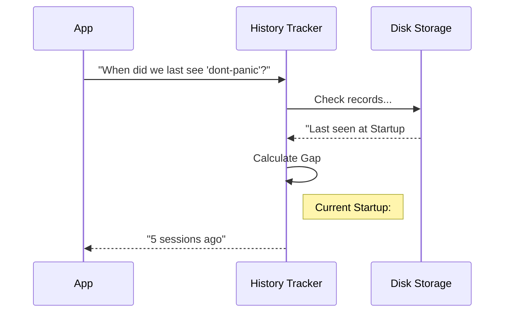

# Chapter 4: Session History Tracking

Welcome back! In [Contextual Relevance Engine](03_contextual_relevance_engine.md), we taught our system to be smart enough to know *which* tips fit the current situation (like showing Python tips only when editing Python files).

However, being smart isn't enough. We also need to be **polite**.

## The Motivation: The Annoying Friend

Imagine a friend who tells you the same joke every time they see you. Even if the joke is funny (relevant), hearing it five times in a row makes it annoying.

**The Problem:** Without memory, our system is that annoying friend. It sees you open a Python file and immediately shouts the Python tip—even if it just told you that 10 seconds ago.

**The Solution:** We need **Session History Tracking**. We need a way to remember when a tip was last shown so we can enforce a "Cooldown" period.

### The Librarian Analogy

Think of our system as a **Librarian**.
1.  Every time you visit the library (start the application), the Librarian stamps your card with a number (Session ID).
2.  If the Librarian wants to recommend a book, they check your card.
3.  "Oh, you borrowed this yesterday? I won't recommend it again until you've visited 5 more times."

## Use Case: The "Don't Panic" Tip

Let's say we have a helpful tip called `dont-panic`.
*   **Cooldown:** 5 Sessions.
*   **Goal:** If the user sees it today, they should not see it again until they have restarted the application 5 times.

To do this, we need to persist data to the user's disk.

## Key Concept: The "Session" Counter

In our system, we don't track time in minutes or hours. We track **Startups**.

Every time the user runs the command `tengu`, we increment a global counter called `numStartups`.

*   **Yesterday:** `numStartups` was 100.
*   **Today:** You run the app. `numStartups` becomes 101.
*   **Tomorrow:** You run the app twice. `numStartups` becomes 103.

This counter is our "Clock."

## Internal Implementation: How It Works

Before we look at the code, let's visualize the flow when the system decides if a tip is "on cooldown."



If the tip requires a cooldown of 10 sessions, and it has only been 5, the App knows to stay silent.

## Code Deep Dive

Let's look at `tipHistory.ts` to see how we implement this memory.

### 1. Calculating the Gap (`getSessionsSinceLastShown`)

This function answers the question: "How long has it been?"

```typescript
export function getSessionsSinceLastShown(tipId: string): number {
  const config = getGlobalConfig() // Load the disk storage
  
  // 1. Look up the "stamp" for this specific tip
  const lastShown = config.tipsHistory?.[tipId]

  // 2. If never shown, return Infinity (it's been forever!)
  if (!lastShown) return Infinity

  // 3. Calculate the difference: Current - Last
  return config.numStartups - lastShown
}
```
**Explanation:**
*   We load the configuration (which holds `numStartups`).
*   We check `tipsHistory`, which is a simple list like `{ "dont-panic": 95, "other-tip": 99 }`.
*   We do the math. If `numStartups` is 100 and `lastShown` was 95, the result is `5`.

### 2. Stamping the Card (`recordTipShown`)

When we actually decide to show a tip, we must record it so we don't show it again too soon.

```typescript
export function recordTipShown(tipId: string): void {
  // 1. Get the current "Time" (Session number)
  const currentSession = getGlobalConfig().numStartups

  // 2. Save it to the permanent config file
  saveGlobalConfig(config => {
    const history = config.tipsHistory ?? {}
    
    // Update the record for this specific tip ID
    return { 
      ...config, 
      tipsHistory: { ...history, [tipId]: currentSession } 
    }
  })
}
```
**Explanation:**
*   We identify the current session number (e.g., 101).
*   We update the `tipsHistory` object.
*   We save this back to the hard drive so we remember it next time the computer is turned on.

### 3. Tying it Together

In [Chapter 1: Tip Registry](01_tip_registry.md), we saw a property called `cooldownSessions`. Now we can see how that is used in the main logic.

This logic usually resides in our filtering step:

```typescript
// Inside our filtering logic...
const sessionsPassed = getSessionsSinceLastShown(tip.id)

// Check if the gap is big enough
if (sessionsPassed >= tip.cooldownSessions) {
   // Safe to show!
} else {
   // Still on cooldown. Hide it.
}
```

## Integration with Analytics

We also use this moment to log data. In `tipScheduler.ts`, when a tip is recorded, we often send a signal to our analytics system.

```typescript
export function recordShownTip(tip: Tip): void {
  // 1. Update the local history file (The "Librarian Stamp")
  recordTipShown(tip.id)

  // 2. Log to analytics (for our own stats)
  logEvent('tengu_tip_shown', {
    tipIdLength: tip.id, 
    cooldownSessions: tip.cooldownSessions,
  })
}
```

This helps us track which tips are most popular, but the crucial part for the user is `recordTipShown`.

## Summary

You have learned how to give the system **Memory**.

*   We treat "Time" as the number of times the app has started (`numStartups`).
*   We store a simple record: "Tip X was seen at Startup Y".
*   We calculate the gap to enforce **Cooldowns**.

**Where we are now:**
1.  We have a Registry of tips.
2.  We know which ones are contextually relevant.
3.  We know which ones are allowed (not on cooldown).

**The Final Problem:**
Imagine we run our filters and we are left with **3 valid tips**.
*   Tip A (Relevant, not on cooldown).
*   Tip B (Relevant, not on cooldown).
*   Tip C (Relevant, not on cooldown).

We can only show **one**. Which one do we pick? Randomly? Alphabetically?

In the next chapter, we will build the logic to pick the *most urgent* tip.

[Next Chapter: Priority Scheduler](05_priority_scheduler.md)

---

Generated by [Code IQ](https://github.com/adityasoni99/Code-IQ)