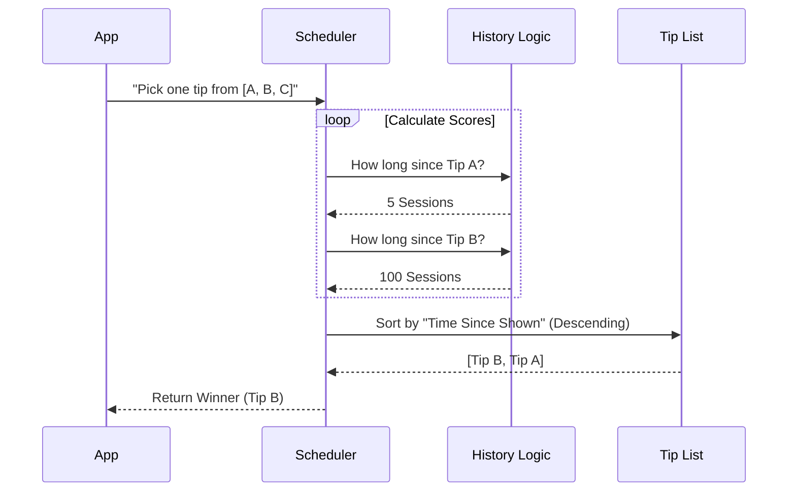

# Chapter 5: Priority Scheduler

Welcome to the final chapter of our Tips system!

In [Session History Tracking](04_session_history_tracking.md), we gave our system a memory. It knows when to be quiet because a tip is "on cooldown."

However, we still have a small problem. After filtering out irrelevant tips (Chapter 3) and annoying recent tips (Chapter 4), we might still be left with **five valid tips** that are all eager to be shown.

We can only show **one**. Which one do we pick?

This is where the **Priority Scheduler** comes in.

## The Motivation: The Playlist Analogy

Imagine you are building a music player. You select a "Chill" genre (Context) and remove songs you skipped recently (History). You are left with 3 songs:
1.  "Ocean Waves" (Played yesterday)
2.  "Forest Rain" (Played last week)
3.  "Desert Wind" (Played last month)

**The Problem:** If you pick randomly, you might play "Ocean Waves" again, which feels repetitive.

**The Solution:** You should prioritize the song you haven't heard in the longest time. This keeps the playlist feeling fresh.

Our **Priority Scheduler** does exactly this. It looks at the eligible tips and picks the "stalest" one (the one shown least recently).

## Use Case: The "Python" Scenario

Let's look at a concrete example. The user is editing a Python file. The [Contextual Relevance Engine](03_contextual_relevance_engine.md) determines that three tips are valid:

1.  **Tip A (Linting):** Last seen at Session #100.
2.  **Tip B (Debugging):** Last seen at Session #90.
3.  **Tip C (Virtual Env):** Never seen before.

**Current Session:** #105.

**The Scheduler's Job:**
1.  Calculate the gap for Tip A: `105 - 100 = 5` sessions ago.
2.  Calculate the gap for Tip B: `105 - 90 = 15` sessions ago.
3.  Calculate the gap for Tip C: Infinity (It has been forever).

**Result:** The Scheduler picks **Tip C** because Infinity is the largest gap.

## Internal Implementation: How It Works

This logic happens at the very end of the decision pipeline, right before the text appears on the user's screen.

### The Flow



### Code Deep Dive

Let's look at `tipScheduler.ts` to see how we implement this sorting logic.

#### 1. Calculating the Score

We need to associate every tip with a number representing how "fresh" or "stale" it is.

```typescript
// Inside selectTipWithLongestTimeSinceShown...

// map() creates a new list connecting the Tip to its Score
const tipsWithSessions = availableTips.map(tip => ({
  tip,
  // Ask the History module for the number
  sessions: getSessionsSinceLastShown(tip.id),
}))
```
*   **Input:** `[TipA, TipB]`
*   **Output:** `[{ tip: TipA, sessions: 5 }, { tip: TipB, sessions: 100 }]`

*(Note: The function `getSessionsSinceLastShown` was covered in [Session History Tracking](04_session_history_tracking.md))*

#### 2. Sorting the Winners

Now we sort the list so the highest number (the stalest tip) floats to the top.

```typescript
// Sort in descending order (Big numbers first)
tipsWithSessions.sort((a, b) => b.sessions - a.sessions)

// The first item is now the one with the biggest gap
return tipsWithSessions[0]?.tip
```

If a tip has never been shown, its score is `Infinity`. In programming, `Infinity` is greater than any number, so new tips will **always** win against old tips.

#### 3. The Main Pipeline (`getTipToShowOnSpinner`)

This is the main function the application calls. It ties together every chapter we have written so far.

```typescript
export async function getTipToShowOnSpinner(
  context?: TipContext,
): Promise<Tip | undefined> {
  // 1. Check if user turned off tips completely
  if (getSettings_DEPRECATED().spinnerTipsEnabled === false) {
    return undefined
  }

  // 2. Filter: Contextual Relevance + History Cooldowns
  // (See Chapter 3 and 4)
  const tips = await getRelevantTips(context)

  // 3. Selection: Run the Priority Scheduler
  return selectTipWithLongestTimeSinceShown(tips)
}
```

### Recording the Event

Once the Scheduler picks a winner and the app displays it, we must update our records. If we don't, the Scheduler will think the tip is still "stale" and show it again next time!

```typescript
export function recordShownTip(tip: Tip): void {
  // 1. Stamp the history card (Reset the clock)
  recordTipShown(tip.id)

  // 2. Send data to our analytics team
  logEvent('tengu_tip_shown', {
    tipIdLength: tip.id,
    cooldownSessions: tip.cooldownSessions,
  })
}
```

By calling `recordTipShown` (from [Session History Tracking](04_session_history_tracking.md)), we reset the "staleness" score of this tip to **0**. It moves to the bottom of the playlist.

## Summary

Congratulations! You have completed the full tour of the **Tips System**.

Let's recap the journey of a single tip:

1.  **Creation:** It is born in the **Registry** as a smart object with metadata. ([Chapter 1](01_tip_registry.md))
2.  **Customization:** A user might replace it with a **Custom Override**. ([Chapter 2](02_custom_tip_overrides.md))
3.  **Filtration:** The **Relevance Engine** checks if it fits the current file/OS. ([Chapter 3](03_contextual_relevance_engine.md))
4.  **Cooldown:** The **History Tracker** ensures it hasn't been seen too recently. ([Chapter 4](04_session_history_tracking.md))
5.  **Selection:** Finally, the **Priority Scheduler** compares it against other survivors and picks the one that has been waiting the longest.

The result is a system that feels intelligent, helpful, and never annoying.

You now understand the architecture behind a smart suggestion engine!

---

Generated by [Code IQ](https://github.com/adityasoni99/Code-IQ)