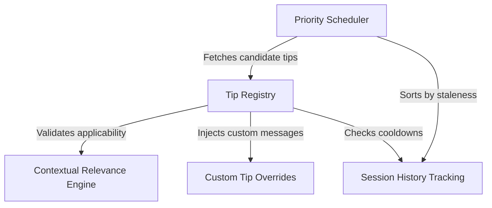

# Tutorial: tips

The project implements a smart suggestion system that displays **context-aware tips** on the application's loading spinner. It maintains a **Tip Registry** and uses a **Contextual Relevance Engine** to filter content based on the user's environment (e.g., OS, active plugins). A **Priority Scheduler** leverages **Session History Tracking** to cycle through advice, prioritizing tips not seen recently, while supporting **Custom Tip Overrides** for user-defined messaging.

## Chapters

1. [Tip Registry](01_tip_registry.md)
2. [Custom Tip Overrides](02_custom_tip_overrides.md)
3. [Contextual Relevance Engine](03_contextual_relevance_engine.md)
4. [Session History Tracking](04_session_history_tracking.md)
5. [Priority Scheduler](05_priority_scheduler.md)

---

Generated by [Code IQ](https://github.com/adityasoni99/Code-IQ)