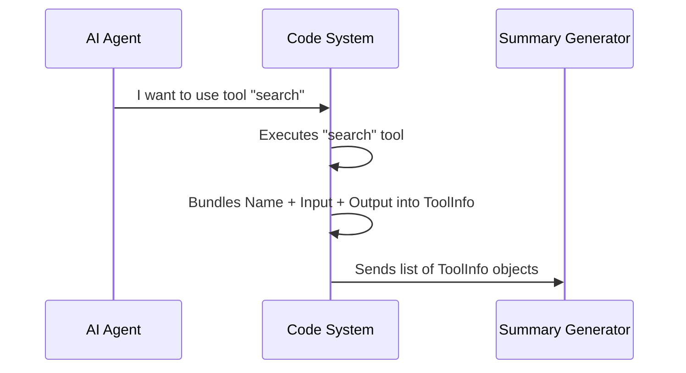

# Chapter 1: Tool Execution Structure

Welcome to the **Tool Use Summary** project! In this tutorial series, we will build a system that watches an AI Agent perform complex technical tasks and summarizes them into a simple, human-readable sentence (like a git commit message).

## The Motivation

Imagine you have a robot assistant helping you code. You ask it to "Set up a new login page." To do this, the robot might:
1.  Read your existing code.
2.  Create a new file called `login.html`.
3.  Run a test to make sure it works.

If the robot just tells you "I'm done," you don't really know what happened. You need a detailed log. However, before we can write a summary of the work, we need a standard way to record **exactly what action took place**.

We need a standardized "container" or "report card" for every single action the robot takes. This container is called the **Tool Execution Structure** (or `ToolInfo`).

## The Concept: `ToolInfo`

The `ToolInfo` structure is the fundamental building block of our summary system. It acts as a snapshot of a single event.

Think of it like a **receipt** from a store. A receipt always has the same structure regardless of what you bought:
1.  **Store Name** (Who did it?)
2.  **Items Purchased** (What went in?)
3.  **Total/Result** (What came out?)

In our code, we map this directly to three properties:
1.  **`name`**: The specific tool used (e.g., "readFile", "runTest").
2.  **`input`**: The arguments passed to the tool (e.g., the filename).
3.  **`output`**: The result returned by the tool (e.g., the file contents or "Success").

### Solving the Use Case

Let's look at how we represent the robot creating a file using this structure.

Here is how we define the shape in TypeScript. It is very simple:

```typescript
type ToolInfo = {
  name: string
  input: unknown
  output: unknown
}
```

*Explanation:*
*   `name`: A string text representing the tool.
*   `input`: Defined as `unknown` because tools can accept text, numbers, or complex JSON objects.
*   `output`: Also `unknown` because a tool might return a string, a list of files, or nothing at all.

## Using the Structure

Let's see this in action. If our AI agent runs a tool called `createFile`, we capture that event into a `ToolInfo` object like this:

```typescript
const fileCreationEvent: ToolInfo = {
  name: 'createFile',
  input: { path: '/src/login.html', content: '...' },
  output: 'File created successfully'
}
```

*Explanation:*
Now we have a bundled object `fileCreationEvent`. We don't have to guess what happened; we have the **name**, the **parameters**, and the **result** all in one place.

## Internal Implementation

How does this structure fit into the bigger picture?

Before the system can generate a summary (which we will cover in the next chapter), it must collect these `ToolInfo` objects into a list.

### The Flow

Here is a simple sequence of how an action becomes data:



### Code Deep Dive

Let's look at the actual code in `toolUseSummaryGenerator.ts` to see where this structure lives.

The system is designed to handle a **batch** (a list) of these tools. The main function `generateToolUseSummary` expects an array of these objects.

```typescript
// From file: toolUseSummaryGenerator.ts

export type GenerateToolUseSummaryParams = {
  // This is where our structure is used!
  // It accepts a list of tool executions.
  tools: ToolInfo[] 
  
  signal: AbortSignal
  isNonInteractiveSession: boolean
}
```

*Explanation:*
The `GenerateToolUseSummaryParams` type defines the inputs for our main generator. The most important part is `tools: ToolInfo[]`. The square brackets `[]` mean "list of". So, the generator doesn't just look at one action; it looks at the history of actions to understand the context.

## Summary

In this chapter, we established the foundation of our project: the **Tool Execution Structure**.

We learned that:
1.  We need a standardized way to record actions.
2.  The `ToolInfo` type acts as a "report card" holding the **Name**, **Input**, and **Output**.
3.  This structure allows us to bundle complex events into a simple data shape.

Now that we have our data neatly packaged, we are ready to feed it into an AI model to write a summary for us.

[Next Chapter: Tool Summary Generator](02_tool_summary_generator.md)

---

Generated by [Code IQ](https://github.com/adityasoni99/Code-IQ)