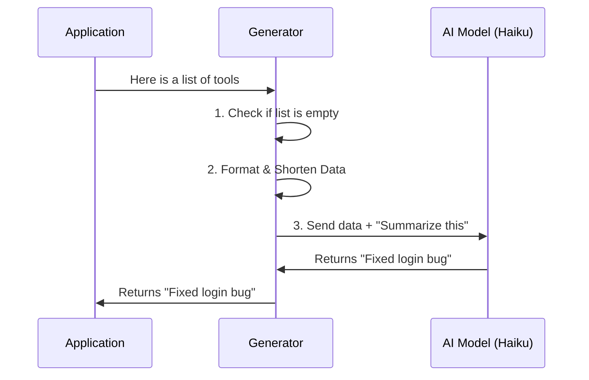

# Chapter 2: Tool Summary Generator

Welcome back! In the previous chapter, [Tool Execution Structure](01_tool_execution_structure.md), we learned how to package raw technical actions into neat "report cards" called `ToolInfo`.

Now that we have a stack of these report cards, we need to turn them into something a human can actually read. We don't want to show the user a JSON object; we want to show them a headline.

In this chapter, we will build the **Tool Summary Generator**, the "News Editor" that takes raw facts and produces a clean story.

## The Motivation

Imagine your AI agent just finished a complex task.
*   **What happened:** It ran a tool called `grep` to search 50 files, then `sed` to replace text, then `git` to save changes.
*   **What the user sees:** If we show the raw logs, the user sees 500 lines of code. Panic ensues.
*   **What we want:** A simple notification saying: *"Refactored database configuration."*

The **Tool Summary Generator** is the bridge between the raw computer logs and that simple sentence.

### The Use Case

We have a list of tools executed by the AI. We want to pass this list to a function and get back a simple string summary.

**Input:**
```json
[
  { "name": "readFile", "input": "config.json", "output": "..." },
  { "name": "writeFile", "input": "config.json", "output": "success" }
]
```

**Desired Output:**
```text
"Updated configuration settings"
```

## The Concept: The "News Editor"

Think of the **Tool Summary Generator** as an Editor at a newspaper.
1.  **Reporters (Tools)** come in with raw notes (inputs/outputs).
2.  The **Editor (Generator)** looks at the notes.
3.  The Editor cuts out boring details (truncation).
4.  The Editor asks a **Senior Writer (The AI Model)** to write a headline.
5.  The Editor publishes the final headline.

## Using the Generator

Before we look inside the code, let's see how we use it. We call the main function `generateToolUseSummary`.

```typescript
// Example of how we call the function
const summary = await generateToolUseSummary({
  tools: myToolHistory, // The list from Chapter 1
  signal: abortSignal,  // Allows us to cancel if needed
  isNonInteractiveSession: false
});

console.log(summary); // Prints: "Updated configuration settings"
```

*Explanation:*
It's a simple async function. We give it history (`tools`), and it gives us back text (`summary`). It handles all the complexity of talking to the AI API internally.

## Internal Implementation

How does it work under the hood? It follows a strict pipeline to ensure the summary is accurate but doesn't cost too much time or money.

### The Workflow



### Step-by-Step Code Walkthrough

Let's break down the `toolUseSummaryGenerator.ts` file into small, understandable pieces.

#### 1. The Safety Check
First, the function checks if there is actually anything to summarize.

```typescript
export async function generateToolUseSummary({
  tools,
  signal, // ... other params
}: GenerateToolUseSummaryParams): Promise<string | null> {
  
  // If no tools were used, there is nothing to say.
  if (tools.length === 0) {
    return null
  }
  
  // ... continue logic
```

*Explanation:*
If the `tools` array is empty, we return `null` immediately. This saves us from making an unnecessary call to the AI.

#### 2. Preparing the Notes
The raw data might be huge (imagine a tool that read a 10,000-line file). We can't send all that to the AI just for a one-line summary. We need to format and shorten it.

```typescript
    // Inside the function...
    const toolSummaries = tools
      .map(tool => {
        // Shorten the input and output (explained in Chapter 4)
        const inputStr = truncateJson(tool.input, 300)
        const outputStr = truncateJson(tool.output, 300)
        
        // Create a simple text block for this tool
        return `Tool: ${tool.name}\nInput: ${inputStr}\nOutput: ${outputStr}`
      })
      .join('\n\n')
```

*Explanation:*
We loop through every tool. We use a helper helper function `truncateJson` (which we will optimize in [Payload Optimization](04_payload_optimization.md)) to cut text off at 300 characters. We then stack them into a single string called `toolSummaries`.

#### 3. Asking the Writer (The AI)
Now we have clean, short notes. We send them to the AI model (specifically "Haiku", a fast and cheap model) to write the actual text.

```typescript
    // We send our formatted notes to the AI
    const response = await queryHaiku({
      // We'll learn about this prompt in Chapter 3!
      systemPrompt: asSystemPrompt([TOOL_USE_SUMMARY_SYSTEM_PROMPT]), 
      userPrompt: `Tools completed:\n\n${toolSummaries}\n\nLabel:`,
      signal,
      options: { /* ... options ... */ },
    })
```

*Explanation:*
We call `queryHaiku`. This is the API call. We provide a `systemPrompt` (instructions on *how* to write) and a `userPrompt` (the data *to* write about).

#### 4. Extracting the Headline
The AI returns a complex object. We just want the text.

```typescript
    // Extract just the text from the AI's answer
    const summary = response.message.content
      .filter(block => block.type === 'text')
      .map(block => (block.type === 'text' ? block.text : ''))
      .join('')
      .trim()

    return summary || null
```

*Explanation:*
We look at the response, filter for text blocks, join them together, and remove extra whitespace (`.trim()`). This is our final headline!

## Summary

In this chapter, we built the **Tool Summary Generator**.

1.  It acts as the **Editor**, taking raw data and preparing it for publication.
2.  It **protects** the system by checking for empty lists.
3.  It **formats** the data by shortening long inputs (truncation).
4.  It **delegates** the creative writing to an AI model.

However, the quality of the summary depends entirely on *how* we ask the AI to write it. If we give bad instructions, we get bad headlines.

In the next chapter, we will look at the specific instructions we give to the AI to ensure the summaries look like professional Git commit messages.

[Next Chapter: Prompt Configuration](03_prompt_configuration.md)

---

Generated by [Code IQ](https://github.com/adityasoni99/Code-IQ)