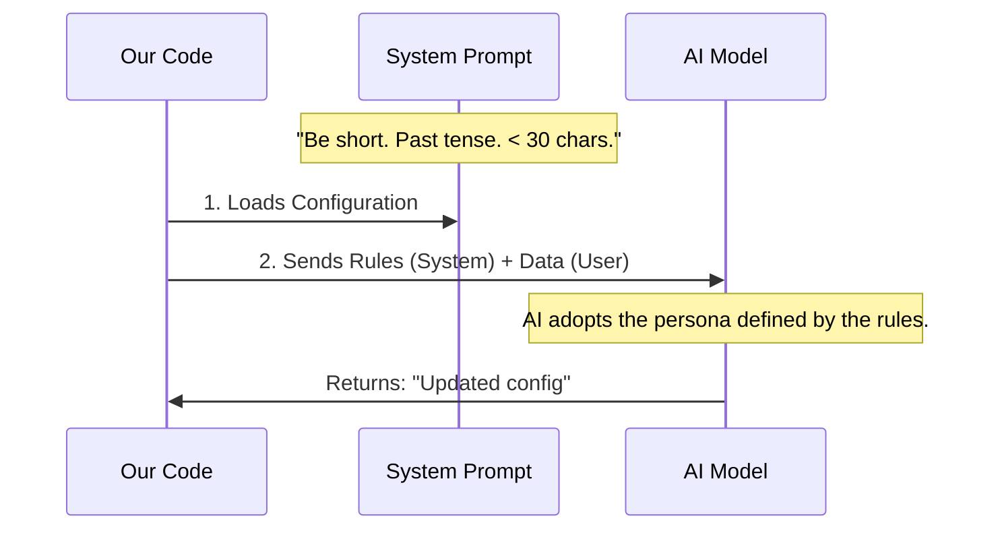

# Chapter 3: Prompt Configuration

Welcome back! In the previous chapter, [Tool Summary Generator](02_tool_summary_generator.md), we built the engine that sends data to an AI model to get a summary.

However, having an engine isn't enough. If you simply ask an AI to "summarize what happened," it might reply with:
> *"I have reviewed the logs and it appears that a file was read successfully. After that, the system..."*

This is **too long**. We are building a mobile app notification or a single-line status bar. We have limited space. We need the AI to be concise, robotic, and specific.

In this chapter, we will learn about **Prompt Configuration**. We will define the "persona" or "style guide" for our AI to ensure the output fits perfectly into our user interface (UI).

## The Motivation

Imagine you hire a copywriter to write a headline for a billboard.
*   **Bad Instruction:** "Write something about our coffee."
    *   *Result:* "Our coffee is roasted with love and care and tastes great in the morning." (Too long!)
*   **Good Instruction:** "Write exactly 3 words. Use punchy verbs. No pleasantries."
    *   *Result:* "Wake Up Happy." (Perfect).

In our code, the **System Prompt** is that set of strict instructions. It tells the AI *how* to speak before it even knows *what* to speak about.

### The Use Case

We want to transform a complex tool action like `deleteFile('/src/temp/unused.log')` into a summary.

*   **Without Prompt Configuration:** "The file located in the temporary folder was deleted." (55 characters - cut off on mobile).
*   **With Prompt Configuration:** "Deleted temp log" (16 characters - fits perfectly).

## The Concept: The "Creative Brief"

The **System Prompt** is like a Creative Brief given to an employee. For this project, our brief has three strict rules:

1.  **The Constraint:** It must fit on a single line (approx. 30 characters).
2.  **The Style:** "Git Commit Subject" style. This is a standard way programmers write notes (imperative or past tense, very short).
3.  **The Grammar:** Drop "articles" (words like *the*, *a*, *an*) and pleasantries.

## Defining the Configuration

Let's look at the actual text we send to the AI. This is defined as a constant string in our code.

```typescript
// From file: toolUseSummaryGenerator.ts

const TOOL_USE_SUMMARY_SYSTEM_PROMPT = `
Write a short summary label describing what these tool calls accomplished. 
It appears as a single-line row in a mobile app and truncates around 30 characters, 
so think git-commit-subject, not sentence.

Keep the verb in past tense and the most distinctive noun. 
Drop articles, connectors, and long location context first.

Examples:
- Searched in auth/
- Fixed NPE in UserService
- Created signup endpoint
- Read config.json
- Ran failing tests
`
```

*Explanation:*
*   **"Mobile app... 30 characters":** This gives the AI the *reason* for the brevity. AI models follow rules better when they understand the context.
*   **"Past tense":** We want "Fixed" (done), not "Fixing" (happening).
*   **"Examples":** This is the most powerful part. Giving the AI examples (called "few-shot prompting") shows it exactly what success looks like.

## Internal Implementation

How does this text get used?

When we communicate with an AI (like Claude or ChatGPT), we send two types of messages:
1.  **System Message:** The rules (our Prompt Configuration).
2.  **User Message:** The actual data (our Tool Info).

### The Flow



### Code Deep Dive

Let's see where we actually inject this configuration into the generator function we looked at in the last chapter.

```typescript
// From file: toolUseSummaryGenerator.ts

// 1. We prepare the prompt configuration
const systemPrompt = asSystemPrompt([TOOL_USE_SUMMARY_SYSTEM_PROMPT])

// 2. We send it to the AI alongside the data
const response = await queryHaiku({
  systemPrompt: systemPrompt, 
  userPrompt: `Tools completed:\n\n${toolSummaries}\n\nLabel:`,
  signal,
  // ... options
})
```

*Explanation:*
*   `asSystemPrompt`: This is a helper that formats our string into the specific object structure the API requires.
*   `queryHaiku`: This function takes the `systemPrompt` as a separate argument from the `userPrompt`. This ensures the rules are kept separate from the data, preventing the data from confusing the AI about its instructions.

## Why "Git Commit" Style?

You might wonder why we specifically asked for "Git commit subject" style.

In software development, a "Git commit" is a saved change to the code. Developers are trained to write the subject line of these saves in a very specific way:
*   **Specific:** Don't say "Fixed stuff." Say "Fixed login."
*   **Concise:** No wasted words.

By telling the AI to use this specific style, we leverage a concept the AI already knows very well from its training data (which includes millions of lines of code). It creates a mental shortcut for the model to produce high-quality technical summaries.

## Summary

In this chapter, we learned about **Prompt Configuration**.

1.  We identified the problem: AI can be too chatty for a UI.
2.  We solved it using a **System Prompt**, which acts as a "style guide."
3.  We enforced strict constraints: **30 characters**, **past tense**, and **no filler words**.
4.  We used examples to train the AI instantly.

Now our AI knows *how* to write. But what if the data we send it is too big? Even the best AI will crash or cost too much money if we try to paste a 10-megabyte file into the chat window.

In the next chapter, we will learn how to trim the data before it ever reaches the prompt.

[Next Chapter: Payload Optimization](04_payload_optimization.md)

---

Generated by [Code IQ](https://github.com/adityasoni99/Code-IQ)