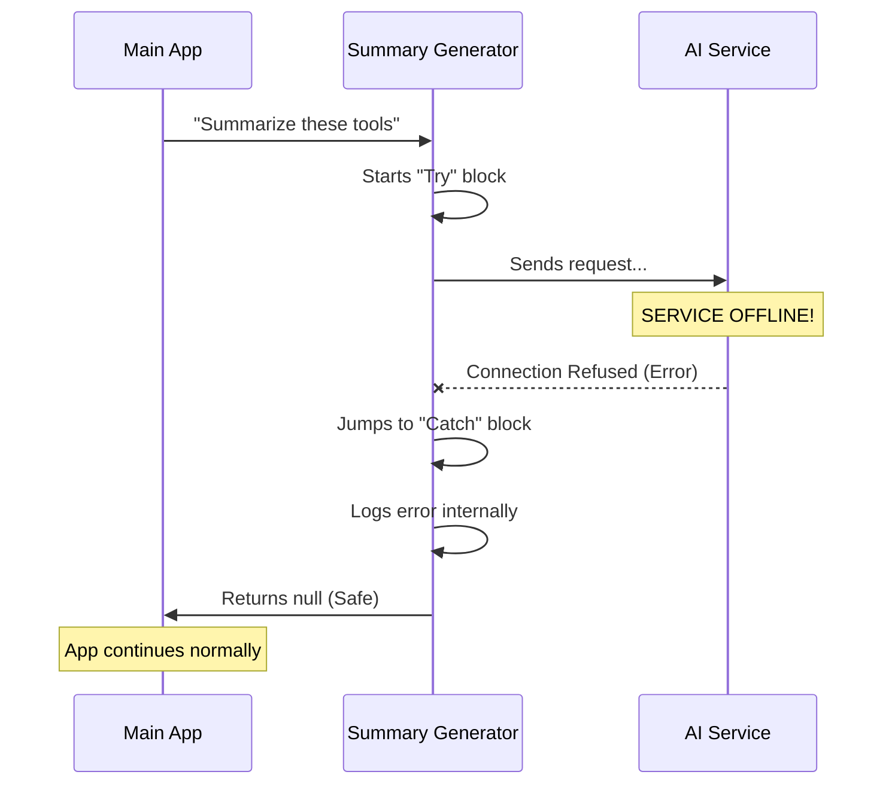

# Chapter 5: Non-Blocking Error Handling

Welcome to the final chapter of our tutorial series!

In the previous chapter, [Payload Optimization](04_payload_optimization.md), we learned how to shrink our data to make sure it fits into the AI's "context window." We made our system efficient.

Now, we must make our system **resilient**.

We are dealing with external AI services (APIs). Sometimes the internet is slow. Sometimes the AI service is down. Sometimes the data is weird. If our summary generator fails, what should happen to the rest of the application?

In this chapter, we will implement **Non-Blocking Error Handling**, ensuring our cosmetic features never crash the essential ones.

## The Motivation: The Car Radio Analogy

Imagine you are driving a car.
*   **Critical System:** The Engine. If the engine fails, the car stops. This is a "Blocking" failure.
*   **Non-Critical System:** The Radio. If the radio fails, it's annoying, but the car keeps driving. This is a "Non-Blocking" failure.

In our application:
1.  **The Engine:** The AI Agent performing the actual task (e.g., writing code, saving files). This *must* work.
2.  **The Radio:** The **Tool Summary**. It is a "nice-to-have" cosmetic label.

If our summary generator crashes, we **do not** want the Agent to stop working. We simply want the summary to disappear silently.

### The Use Case

**Scenario:** The user asks the Agent to "Create a database."
1.  The Agent successfully creates the database (The Engine works).
2.  The system tries to generate the summary label "Created database" (The Radio).
3.  **Error:** The AI API for the summary is offline!

**Desired Outcome:**
*   The application continues running.
*   The user sees the database was created.
*   The summary label simply doesn't appear (or returns `null`).
*   The application **does not** crash or show a "Fatal Error" screen.

## The Concept: The "Try-Catch" Safety Net

To achieve this, we wrap our code in a **Try-Catch** block.

Think of it like a trapeze artist:
*   **`try`**: The artist attempts the flip (the code runs).
*   **`catch`**: If they fall, the net catches them (the error logic runs).

If the `try` block succeeds, the `catch` block is skipped. If the `try` block explodes, the code instantly jumps to the `catch` block, preventing the explosion from affecting the rest of the program.

## Internal Implementation

Let's look at how the data flows when things go wrong.

### The Workflow



### Code Deep Dive

Let's look at `toolUseSummaryGenerator.ts`. We wrap almost the entire logic inside this safety structure.

#### 1. The "Try" Block
This is where we attempt to do the work we defined in Chapters 2, 3, and 4.

```typescript
// From file: toolUseSummaryGenerator.ts

export async function generateToolUseSummary(params): Promise<string | null> {
  // ... check for empty tools ...

  try {
    // 1. Optimize data (Chapter 4)
    // 2. Prepare System Prompt (Chapter 3)
    // 3. Call AI API (Chapter 2)
    const response = await queryHaiku({ /* ... */ })

    // If successful, return the text
    return summary || null
```

*Explanation:*
The `try { ... }` bracket opens a safe zone. Everything happening inside here is monitored. If `queryHaiku` fails because the internet is down, the code stops execution immediately and jumps to the `catch` block.

#### 2. The "Catch" Block
This block *only* runs if an error occurred above.

```typescript
  } catch (error) {
    // Log but don't fail - summaries are non-critical
    const err = toError(error)
    
    // Tag the error so developers know where it came from
    err.cause = { errorId: E_TOOL_USE_SUMMARY_GENERATION_FAILED }
    
    // Write to the server logs (The "Black Box")
    logError(err)
    
    // Return null effectively says: "No summary available"
    return null
  }
}
```

*Explanation:*
1.  **`catch (error)`**: We capture the explosion.
2.  **`logError(err)`**: We record the error in our system logs. This is like the car's dashboard light coming on. The car still drives, but the mechanic needs to know the radio broke.
3.  **`return null`**: This is the most important line. By returning `null`, we satisfy the function's contract without throwing an exception. The part of the app that called this function will just see `null` and know "Okay, I just won't show a label today."

## Integrating with the "JSON Stringify" Safety

You might remember in [Payload Optimization](04_payload_optimization.md) that we also had a try-catch block inside `truncateJson`.

```typescript
function truncateJson(value: unknown, maxLength: number): string {
  try {
    // Attempt to turn object to string
    const str = jsonStringify(value)
    // ...
  } catch {
    // If that fails, return a placeholder
    return '[unable to serialize]'
  }
}
```

*Explanation:*
This is **Granular Error Handling**.
*   If `truncateJson` fails, it returns a placeholder string. The summary generator *continues*.
*   If the AI API fails, the `generateToolUseSummary` returns `null`. The app *continues*.

We have multiple layers of safety nets to ensure the user's experience is never interrupted by a cosmetic failure.

## Conclusion

Congratulations! You have completed the **Tool Use Summary** tutorial series.

In this chapter, we learned:
1.  **Prioritization:** Distinguishing between critical features (the engine) and cosmetic features (the radio).
2.  **Safety:** Using `try-catch` blocks to prevent crashes.
3.  **Stability:** Returning `null` effectively isolates failures so the main application keeps running smoothly.

### Series Recap

Let's review what you have built:
1.  [Tool Execution Structure](01_tool_execution_structure.md): You defined a standard way (`ToolInfo`) to record robot actions.
2.  [Tool Summary Generator](02_tool_summary_generator.md): You built the engine to process these actions.
3.  [Prompt Configuration](03_prompt_configuration.md): You taught the AI a specific persona ("Git Commit" style).
4.  [Payload Optimization](04_payload_optimization.md): You ensured the data is small and efficient.
5.  **Non-Blocking Error Handling**: You ensured the feature is safe and robust.

You now have a production-ready system that takes complex technical logs and converts them into beautiful, human-readable summaries without risking the stability of your application.

Happy Coding!

---

Generated by [Code IQ](https://github.com/adityasoni99/Code-IQ)