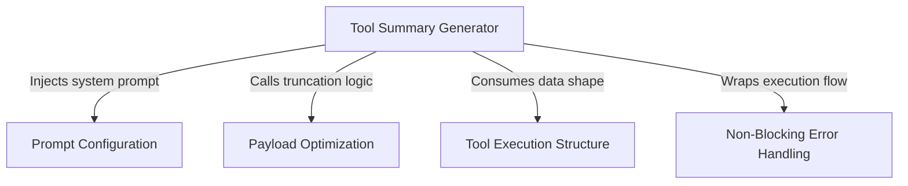

# Tutorial: toolUseSummary

This project is designed to generate concise, human-readable labels for technical actions performed by the system. It uses **Artificial Intelligence** to transform raw execution logs into short, *Git-commit style* summaries, ensuring that users receive clear progress updates without being overwhelmed by massive amounts of technical data.

## Chapters

1. [Tool Execution Structure](01_tool_execution_structure.md)
2. [Tool Summary Generator](02_tool_summary_generator.md)
3. [Prompt Configuration](03_prompt_configuration.md)
4. [Payload Optimization](04_payload_optimization.md)
5. [Non-Blocking Error Handling](05_non_blocking_error_handling.md)

---

Generated by [Code IQ](https://github.com/adityasoni99/Code-IQ)