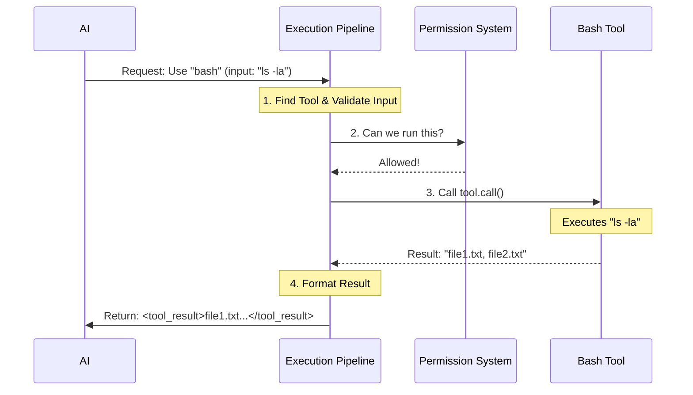

# Chapter 1: Tool Execution Pipeline

Welcome to the **Tool Execution Pipeline**! This is the engine room of our application. If the AI is the "brain," this pipeline is the "nervous system" that connects thoughts to actual actions.

## Motivation: The "Concierge" Analogy

Imagine you are at a high-end hotel. You (the AI) pick up the phone and ask the Concierge (the Pipeline) to "Book a table for two at 8 PM."

The Concierge doesn't just run out the door immediately. They follow a strict process:
1.  **Validation:** They check if the restaurant actually exists and if you provided a time.
2.  **Permission:** They check if your credit card works or if you are allowed to make bookings.
3.  **Execution:** They call the restaurant and make the reservation.
4.  **Reporting:** They call you back to say, "It's done," or "They are fully booked."

Without this pipeline, the AI might try to "call a restaurant" that doesn't exist, or perform actions the user hasn't authorized (like formatting your hard drive!). The **Tool Execution Pipeline** ensures every action is safe, valid, and successful.

### Central Use Case: Listing Files
Throughout this chapter, we will follow a simple example:
**The AI wants to list the files in your current directory using the `bash` tool.**

## Key Concepts

The pipeline is handled primarily in `toolExecution.ts`. It breaks down a tool call into these distinct phases:

1.  **Discovery:** Finding the tool the AI asked for (e.g., looking up "bash" in the toolbox).
2.  **Validation:** Using a schema (Zod) to ensure the AI sent the right data (e.g., ensuring `command` is a string).
3.  **Permission Check:** Asking the user (or a policy) "Is this safe to run?"
4.  **Execution:** Actually running the function.
5.  **Result Formatting:** Packaging the output (or error) so the AI can read it.

## The Process: Step-by-Step

Before looking at the code, let's visualize the flow.



## Internal Implementation

Let's look at how `toolExecution.ts` handles this in code. We will look at simplified versions of the real logic to make it easy to follow.

### 1. The Entry Point: `runToolUse`

This is where the request starts. The pipeline receives a `toolUse` object from the AI.

```typescript
// Inside runToolUse function
export async function* runToolUse(toolUse, context, ...) {
  const toolName = toolUse.name;
  
  // 1. Discovery: Find the tool in our toolbox
  let tool = findToolByName(context.options.tools, toolName);

  if (!tool) {
    // If the tool doesn't exist, tell the AI immediately
    yield createErrorResult(`No such tool available: ${toolName}`);
    return;
  }
  
  // ... continue to execution
}
```
**Explanation:** The code first checks if the requested tool (like `bash`) actually exists. If not, it returns an error immediately, saving time.

### 2. Input Validation

The AI might hallucinate and send a number instead of text. We use `Zod` schemas to catch this.

```typescript
// Inside checkPermissionsAndCallTool function

// 2. Validate: Check inputs against the tool's strict schema
const parsedInput = tool.inputSchema.safeParse(input);

if (!parsedInput.success) {
  // If validation fails, format the Zod error for the AI
  const errorMsg = formatZodValidationError(tool.name, parsedInput.error);
  
  return [{ 
    message: createErrorResult(`InputValidationError: ${errorMsg}`) 
  }];
}
```
**Explanation:** Every tool defines what inputs it accepts. If the `bash` tool expects a `command` string, but the AI sends a `file_path`, this step rejects it before any code runs.

### 3. Permission Resolution

We cannot blindly trust the tool to run. We must determine if the user allows it.

```typescript
// 3. Permission: Ask the system/user if this is okay
const resolved = await resolveHookPermissionDecision(
  tool, 
  parsedInput.data, 
  context
);

if (resolved.decision.behavior !== 'allow') {
  // User or Policy said NO
  return createRejectionMessage("Permission denied by user");
}
```
**Explanation:** This step might trigger a popup for the user or check a whitelist. We will dive deeper into this in [Permission Resolution](03_permission_resolution.md).

### 4. Execution

If we pass validation and permission, we finally do the work!

```typescript
// 4. Execution: Run the actual tool logic
const startTime = Date.now();

try {
  // logic: call the specific tool's function
  const result = await tool.call(
    parsedInput.data,
    context
  );
  
  // logic: Success! Move to formatting.
} catch (error) {
  // logic: Handle execution crashes gracefully
}
```
**Explanation:** `tool.call()` is where the `ls -la` command actually runs on the system. We wrap it in a `try/catch` block so that if the tool crashes, the whole application doesn't crash—instead, we report the error to the AI.

### 5. Formatting the Result

The AI needs the result in a specific format (usually an XML-like tag called `tool_result`).

```typescript
// 5. Result: Package the output
const toolResultBlock = await processToolResultBlock(
  tool, 
  result.data, 
  toolUseID
);

// Add the result to the message history
resultingMessages.push({
  message: createUserMessage({
    content: [toolResultBlock],
    is_error: false
  })
});
```
**Explanation:** The raw data (e.g., a list of files) is wrapped in a standardized block. This ensures the AI always knows which tool answer corresponds to which question.

## Lifecycle Hooks

You might have noticed the code handles a lot of "metadata" like logging, analytics, and special checks. The pipeline allows specific logic to run *before* and *after* the tool executes.

For example:
*   **Pre-Tool:** "Log that we are about to run Bash."
*   **Post-Tool:** "Summarize how long the command took."

These are covered in detail in the next chapter: [Lifecycle Hooks](02_lifecycle_hooks.md).

## Conclusion

The **Tool Execution Pipeline** is the safe bridge between the AI's intent and your computer's reality. It ensures:
1.  The tool exists.
2.  The arguments are valid.
3.  The user has given permission.
4.  The result is returned safely.

Now that we understand the main flow, let's look at how we can inject custom logic into this pipeline.

[Next Chapter: Lifecycle Hooks](02_lifecycle_hooks.md)

---

Generated by [Code IQ](https://github.com/adityasoni99/Code-IQ)