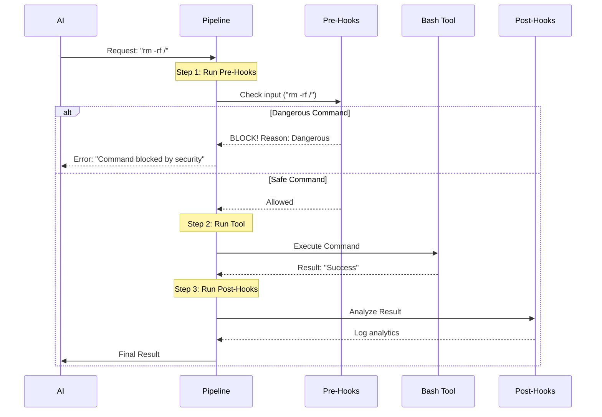

# Chapter 2: Lifecycle Hooks

Welcome back! In the previous chapter, [Tool Execution Pipeline](01_tool_execution_pipeline.md), we looked at how the application receives a request from the AI and executes a tool like `bash`.

But there is a missing piece. What if the AI tries to run a dangerous command? Or what if we want to log every single time a file is written, without modifying the code of every single tool?

This is where **Lifecycle Hooks** come in.

## Motivation: The "Airport Security" Analogy

Think of the Tool Execution Pipeline as a flight. The "Tool" is the plane execution itself. But you can't just walk onto a plane.

1.  **Pre-Hooks (Security Checkpoint):** Before you board, you pass through security. They might:
    *   **Block you:** "You have a dangerous item. You cannot fly."
    *   **Modify your luggage:** "You must throw away this water bottle."
    *   **Allow you:** "Have a nice flight."

2.  **The Tool (The Flight):** The actual action takes place.

3.  **Post-Hooks (Customs/Survey):** After you land, you go through customs. They might:
    *   **Log your arrival:** "Passenger arrived at 10:00 AM."
    *   **Check the result:** "Did you lose your luggage?"

Without hooks, our `bash` tool would have to handle security, logging, and error handling all inside itself. Hooks let us separate these concerns cleanly.

### Central Use Case: Stopping a Dangerous Command
In this chapter, we will solve this specific problem:
**The AI tries to run `rm -rf /` (delete everything). We want a Pre-Hook to spot this and stop it *before* the command runs.**

## Key Concepts

### 1. Pre-Hooks
These run **before** `tool.call()`. They are the gatekeepers.
*   **Input:** The tool name and the arguments the AI wants to use.
*   **Power:** They can **stop** the execution completely.
*   **Use Cases:** Security checks, asking the user for confirmation, fixing bad inputs.

### 2. Post-Hooks
These run **after** `tool.call()` finishes.
*   **Input:** The result of the tool (or the error if it failed).
*   **Power:** They cannot change the past, but they can analyze what happened or modify what the AI sees.
*   **Use Cases:** Analytics logging, formatting results, triggering follow-up actions.

## Internal Implementation: The Flow

Let's visualize where hooks sit in the pipeline we built in Chapter 1.



## How It Works in Code

The logic for running these hooks is located in `toolHooks.ts`, and they are called from `toolExecution.ts`. Let's look at the simplified implementation.

### 1. Running Pre-Hooks

Before the tool runs, we iterate through all registered pre-hooks.

```typescript
// Inside runPreToolUseHooks (toolHooks.ts)
export async function* runPreToolUseHooks(tool, input, ...) {
  // Loop through every hook (e.g., SecurityHook, LoggingHook)
  for await (const result of executePreToolHooks(tool.name, input, ...)) {
    
    // Check if a hook decided to BLOCK the tool
    if (result.blockingError) {
      // Create a denial message
      yield { 
        type: 'hookPermissionResult', 
        hookPermissionResult: { behavior: 'deny', message: result.blockingError } 
      };
      
      // Stop the pipeline immediately!
      yield { type: 'stop' }; 
      return;
    }
    
    // Hooks can also just modify the input (e.g. trimming whitespace)
    if (result.updatedInput) {
      yield { type: 'hookUpdatedInput', updatedInput: result.updatedInput };
    }
  }
}
```

**Explanation:**
1.  We call `executePreToolHooks`, which runs the logic for every hook.
2.  If any hook returns a `blockingError` (like our security check finding `rm -rf`), we immediately `yield { type: 'stop' }`.
3.  The tool never executes. The AI receives the error message.

### 2. Calling the Pre-Hooks

Back in the main pipeline (`toolExecution.ts`), we wait for these hooks to finish before doing anything else.

```typescript
// Inside checkPermissionsAndCallTool (toolExecution.ts)

// 1. Run Pre-Hooks
for await (const result of runPreToolUseHooks(context, tool, input...)) {
  
  if (result.type === 'stop') {
    // A hook blocked us! 
    // Return the error message to the AI and EXIT the function.
    return resultingMessages; 
  }
  
  // If a hook modified the input (e.g. fixed a file path), update it here
  if (result.type === 'hookUpdatedInput') {
    processedInput = result.updatedInput;
  }
}

// 2. If we survived the hooks, NOW we check permissions and run the tool...
```

**Explanation:** This confirms that the pipeline is strictly sequential. If `runPreToolUseHooks` says "stop," the code hits a `return` statement and the `tool.call()` function lower down is never reached.

### 3. Running Post-Hooks

If the tool runs successfully, we want to record what happened.

```typescript
// Inside runPostToolUseHooks (toolHooks.ts)
export async function* runPostToolUseHooks(tool, input, toolOutput, ...) {
  
  // Loop through post-hooks (e.g. AnalyticsHook)
  for await (const result of executePostToolHooks(tool.name, input, toolOutput...)) {
    
    // If the hook has something to say to the AI (like "Files saved"), send it
    if (result.message) {
      yield { message: result.message };
    }

    // Advanced: A hook can even change the tool's output before the AI sees it
    if (result.updatedMCPToolOutput) {
       yield { updatedMCPToolOutput: result.updatedMCPToolOutput };
    }
  }
}
```

**Explanation:**
Post-hooks have access to `toolOutput`. This allows an analytics hook to calculate how many bytes of data were returned, or how long the operation took, and log that to a database or file.

### 4. Handling Failures

What if the tool crashes? We have a special set of hooks for that: `runPostToolUseFailureHooks`.

```typescript
// Inside toolExecution.ts catch block
catch (error) {
  // The tool crashed!
  
  // Run failure hooks (e.g., to log the stack trace)
  for await (const hookMsg of runPostToolUseFailureHooks(..., error)) {
    // Add hook messages to the output
    hookMessages.push(hookMsg);
  }
  
  // Return the error to the AI
  return createErrorResult(error);
}
```

**Explanation:** Even if the flight crashes (the tool errors), we still need "Post-Hooks" (the crash investigation team) to run to log exactly what went wrong.

## Summary: Solving the Use Case

Let's look at our "Dangerous Command" scenario one last time with our new understanding:

1.  **AI Request:** "Run `rm -rf /`"
2.  **Pipeline:** Calls `runPreToolUseHooks`.
3.  **Pre-Hook (Security):** Inspects input. Sees `rm -rf`. Sets `blockingError = "Too dangerous"`.
4.  **Pipeline:** Receives `blockingError`. It sends a message to the AI: "Error: Too dangerous."
5.  **Pipeline:** Hits `return`. The `bash` tool never runs. The system is safe.

## Conclusion

Lifecycle Hooks turn our pipeline from a simple script runner into a robust, secure system. They act as the "nervous system" around the "muscle" of the tool, allowing us to:
*   **Block** dangerous actions.
*   **Fix** inputs automatically.
*   **Log** activity for analysis.

However, simply "blocking" or "allowing" isn't always enough. Sometimes, the hook needs to say: *"I don't know if this is safe... ask the human user."*

This complex decision-making process is called **Permission Resolution**, and that is the topic of our next chapter.

[Next Chapter: Permission Resolution](03_permission_resolution.md)

---

Generated by [Code IQ](https://github.com/adityasoni99/Code-IQ)