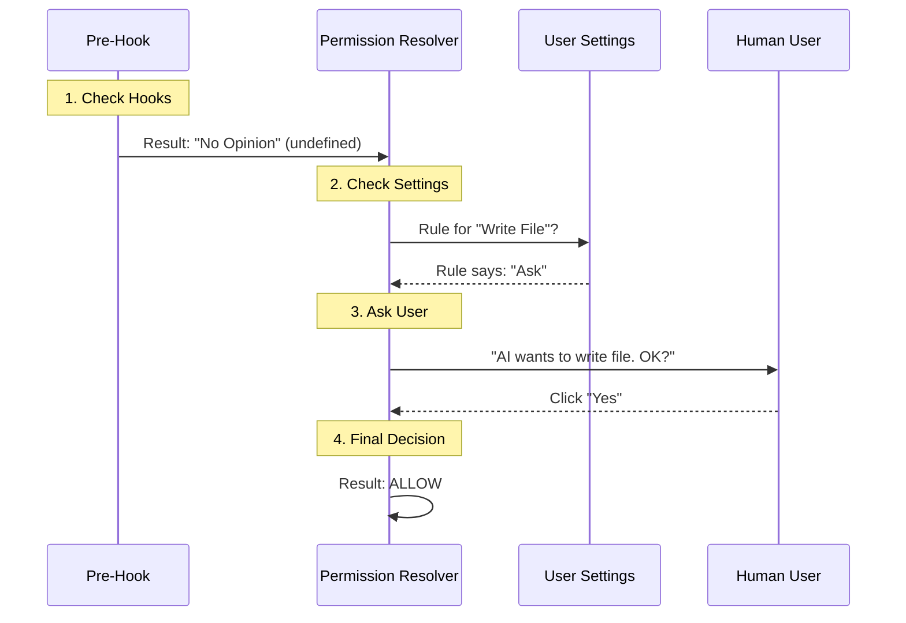

# Chapter 3: Permission Resolution

Welcome back! In [Lifecycle Hooks](02_lifecycle_hooks.md), we learned how to set up "security checkpoints" to block dangerous commands like `rm -rf /`.

However, the world isn't always Black and White (Allow or Block). Sometimes, it's Gray.

*   **Reading a file?** Probably fine to do automatically.
*   **Editing a file?** Maybe we should ask the user first.
*   **Sending an email?** Definitely ask the user!

This complex decision-making process is called **Permission Resolution**.

## Motivation: The "Club Bouncer" Analogy

Imagine a popular nightclub (your computer). The **Permission Resolver** is the Head Bouncer at the door.

When the AI (a guest) wants to enter (run a tool), the Bouncer checks three things in a specific order:

1.  **The VIP List (Hooks):** Did a promoter (a Hook) already vouch for this guest?
2.  **The House Rules (Settings):** Does the club have a rule against this type of guest (e.g., "No file edits allowed")?
3.  **The Owner (The User):** If the Bouncer isn't sure, they radio the club owner (You) and ask: *"Do we let them in?"*

Without this resolution logic, the AI would either be paralyzed (asking permission for everything) or dangerous (doing everything without asking).

### Central Use Case: "Write vs. Read"
In this chapter, we will solve this scenario:
**We want the AI to read files automatically (for speed), but we want it to ASK explicitly before writing or deleting files (for safety).**

## Key Concepts

The Permission Resolver combines inputs from different sources to create a final `PermissionDecision`.

### 1. The Inputs
*   **Hook Result:** A decision made by code (Chapter 2). Example: A testing hook might auto-allow everything during a test run.
*   **User Settings:** A configuration file (e.g., `settings.json`) that says "Always Allow Reading" or "Always Deny Network".
*   **User Interaction:** A manual "Yes/No" button click by the human user.

### 2. The Behavior
The decision always results in one of three behaviors:
*   `allow`: Run the tool immediately.
*   `deny`: Stop. Throw an error.
*   `ask`: Pause execution and show a dialog to the user.

## Internal Implementation: The Flow

The logic lives inside `toolHooks.ts` in a function called `resolveHookPermissionDecision`. It acts as the mediator between the hooks and the user.

Here is the decision flow:



## How It Works in Code

Let's look at `resolveHookPermissionDecision` in `toolHooks.ts`. We will simplify it to understand the core logic.

### 1. Handling "Hook Says Allow"

If a hook (like a trusted script) says "Allow", we usually let it pass. *However*, we have a safety catch.

```typescript
// Inside resolveHookPermissionDecision
if (hookPermissionResult?.behavior === 'allow') {
  
  // Even if a hook says "Allow", check if the user 
  // explicitly configured "Always Deny" in settings.
  const ruleCheck = await checkRuleBasedPermissions(tool, input, context);
  
  if (ruleCheck && ruleCheck.behavior === 'deny') {
    // Safety Net: User settings override hooks for DENY actions.
    return { decision: ruleCheck, input };
  }
  
  // Otherwise, trust the hook!
  return { decision: hookPermissionResult, input };
}
```

**Explanation:** This prevents a rogue plugin from approving an action that you, the user, explicitly banned in your settings. "Deny" rules are the ultimate trump card.

### 2. Handling "Hook Says Deny"

This is simple. If a hook says "No", it's "No".

```typescript
if (hookPermissionResult?.behavior === 'deny') {
  // If a hook blocked it (e.g., security scan), stop here.
  return { decision: hookPermissionResult, input };
}
```

**Explanation:** This is what allowed us to block `rm -rf /` in the previous chapter.

### 3. The Default: Ask the User

If no hooks have a strong opinion (which is most of the time), we defer to the standard permission system (`canUseTool`).

```typescript
// If no hooks intervened, use the standard logic
return {
  decision: await canUseTool(
    tool,
    input,
    context,
    assistantMessage,
    toolUseID
  ),
  input // Pass the input along
};
```

**Explanation:** `canUseTool` is the function that actually checks your `settings.json` or draws the "Approve/Reject" popup on your screen.

## Solving the Use Case

Let's trace how our **"Read vs. Write"** scenario flows through this code.

### Scenario A: AI tries to `read_file("data.txt")`

1.  **Hooks:** No hooks are registered for reading. Result: `undefined`.
2.  **Resolver:** Falls through to `canUseTool`.
3.  **canUseTool:** Checks `settings.json`. Finds a rule: `read_file: allow`.
4.  **Result:** `behavior: 'allow'`. The tool runs instantly.

### Scenario B: AI tries to `write_file("data.txt")`

1.  **Hooks:** No hooks are registered for writing. Result: `undefined`.
2.  **Resolver:** Falls through to `canUseTool`.
3.  **canUseTool:** Checks `settings.json`.
    *   *Option 1:* Rule says `write_file: deny`. -> **Result:** `deny` (Error).
    *   *Option 2:* Rule says `write_file: ask` (or no rule exists). -> **Result:** `ask`.
4.  **Interaction:** The application UI pops up. The user clicks "Approve".
5.  **Final Result:** `behavior: 'allow'`.

## Advanced Concept: Modifying Input

Sometimes, the Bouncer doesn't just say "Yes" or "No"—they might fix your tie before letting you in.

In the Permission Resolver, a decision can also include `updatedInput`.

```typescript
// In resolveHookPermissionDecision
if (hookPermissionResult?.behavior === 'allow') {
  // If the hook fixed the input (e.g., corrected a file path)
  // we use that new input going forward.
  const finalInput = hookPermissionResult.updatedInput ?? input;

  return { decision: hookPermissionResult, input: finalInput };
}
```

**Why is this useful?**
Imagine the AI tries to read `User/docs/file.txt`. A hook knows the real path is `/Users/docs/file.txt`. The hook can `allow` the action *AND* fix the path simultaneously, so the tool succeeds without the AI having to retry.

## Integration with Tool Execution

This resolution logic is called right inside the pipeline we built in Chapter 1.

From `toolExecution.ts`:

```typescript
// 1. Run Hooks
// ... (code from Chapter 2)

// 2. Resolve Permissions
const resolved = await resolveHookPermissionDecision(
  hookPermissionResult, // What did hooks say?
  tool, 
  processedInput, 
  // ... context ...
);

// 3. Act on Decision
if (resolved.decision.behavior !== 'allow') {
  // If it's 'deny' or the user clicked 'Cancel' on the 'ask' dialog
  return createRejectionMessage("Permission denied");
}

// 4. Run Tool
// ... tool.call() ...
```

## Conclusion

**Permission Resolution** is the sophisticated logic that keeps the system safe while remaining usable. It ensures that:
1.  **Security** is enforced (Rules/Deny).
2.  **Automation** is possible (Hooks/Allow).
3.  **Control** is maintained (User/Ask).

Now that we have permission to run the tool, and we know how to run it... what happens if the tool produces a **massive** amount of data, or takes a long time to finish? We don't want the UI to freeze!

[Next Chapter: Streaming Tool Executor](04_streaming_tool_executor.md)

---

Generated by [Code IQ](https://github.com/adityasoni99/Code-IQ)