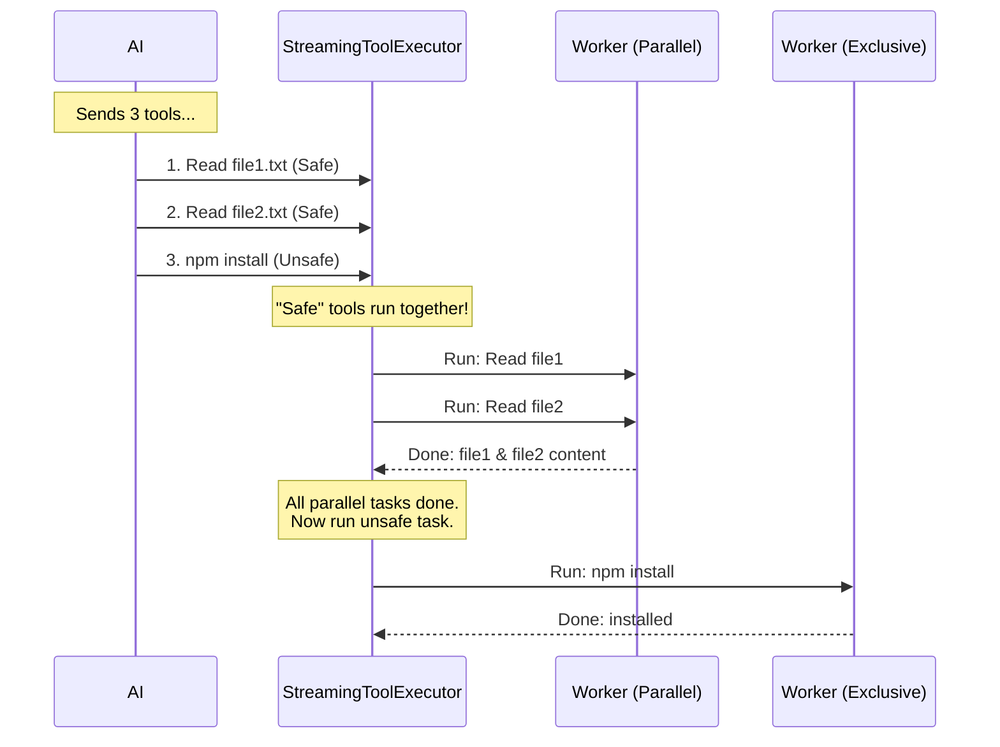

# Chapter 4: Streaming Tool Executor

Welcome to **Chapter 4**! In the previous chapter, [Permission Resolution](03_permission_resolution.md), we learned how to ask the user for permission to run a tool.

Now that we have permission, we need to actually run the tools. But what happens if the AI is "thinking" fast and sends us **three different commands** at the exact same time?

*   Do we run them all at once? (Fast, but maybe dangerous).
*   Do we run them one by one? (Safe, but slow).

This is where the **Streaming Tool Executor** comes in.

## Motivation: The "Busy Kitchen" Analogy

Imagine a restaurant kitchen. The AI is the waiter, and the **Streaming Tool Executor** is the Head Chef.

The waiter runs in and slaps three tickets on the counter:
1.  **Ticket A:** "Make a Salad" (Safe, easy).
2.  **Ticket B:** "Pour Soup" (Safe, easy).
3.  **Ticket C:** "Deep Clean the Oven" (Disruptive, requires the whole kitchen).

If the Chef tries to "Deep Clean the Oven" while "Making Salad," the salad might get full of cleaning spray. That's a disaster.

The **Streaming Tool Executor** manages this chaos:
*   It sees "Salad" and "Soup" are safe. It shouts: *"Chefs, do these together now!"* (**Parallel Execution**)
*   It sees "Clean Oven." It shouts: *"Wait! Finish the food first. Then stop everything. We clean the oven alone."* (**Blocking/Sequential Execution**)

### Central Use Case: Reading Multiple Files vs. Installing Software
Throughout this chapter, we will solve this specific scenario:
**The AI wants to read `file1.txt`, read `file2.txt`, and run `npm install` (install software).**

We want the two file reads to happen **simultaneously** (speed), but `npm install` must wait until they are done so it doesn't break anything.

## Key Concepts

### 1. The Queue
Just like a playlist, tools arrive and wait in line. The Executor decides when they leave the line to start working.

### 2. Concurrency Safety
Every tool has a flag: `isConcurrencySafe`.
*   **Safe (True):** Read-only tools (e.g., `read_file`, `ls`). These can run alongside other safe tools.
*   **Unsafe (False):** tools that change things (e.g., `write_file`, `bash`). These must run alone.

### 3. The Emergency Stop (Abort Controller)
If one tool crashes badly (like a script erroring out), we might need to stop all other running tools immediately to prevent a chain reaction of errors.

## The Process: Step-by-Step

Before looking at the code, let's visualize how the Executor handles our Use Case.



## Internal Implementation

The magic happens in `StreamingToolExecutor.ts`. It acts as a state machine managing the lifecycle of every tool.

### 1. The Setup

The class keeps a list of all tools (`this.tools`) and tracks their status: `queued`, `executing`, or `completed`.

```typescript
// Inside StreamingToolExecutor class
export class StreamingToolExecutor {
  // The list of all tools we are managing
  private tools: TrackedTool[] = []
  
  // We keep the tool definitions so we can look up 
  // if a tool is "Safe" or not.
  constructor(
    private readonly toolDefinitions: Tools,
    private readonly canUseTool: CanUseToolFn, 
    // ...
  ) {}
}
```
**Explanation:** This is our kitchen counter. We have a list of orders (`tools`) and the menu (`toolDefinitions`) that tells us how to cook them.

### 2. Adding a Tool to the Queue

When the AI streams a tool call, we add it to our list. We immediately check if it is "Concurrency Safe".

```typescript
// Inside addTool()
addTool(block: ToolUseBlock, assistantMessage: AssistantMessage): void {
  // 1. Find the tool definition (e.g., "read_file")
  const toolDefinition = findToolByName(this.toolDefinitions, block.name)

  // 2. Check if it is safe to run in parallel
  // (e.g., read_file returns true, run_command returns false)
  const isConcurrencySafe = toolDefinition.isConcurrencySafe(parsedInput)

  // 3. Add to the list as "queued"
  this.tools.push({
    id: block.id,
    status: 'queued',
    isConcurrencySafe,
    // ... other data
  })

  // 4. Try to run it immediately!
  void this.processQueue()
}
```
**Explanation:** We analyze the tool. If it's `read_file`, we mark it `Safe`. If it's `npm install`, we mark it `Unsafe`. Then we call `processQueue` to see if we can start cooking.

### 3. The Traffic Cop: `processQueue`

This is the brain of the operation. It looks at the queue and decides who gets to run.

```typescript
// Inside processQueue()
private async processQueue(): Promise<void> {
  for (const tool of this.tools) {
    // Only look at tools waiting in line
    if (tool.status !== 'queued') continue

    // Ask: Can we run this right now?
    if (this.canExecuteTool(tool.isConcurrencySafe)) {
      await this.executeTool(tool)
    } else {
      // If we are blocked (e.g., an unsafe tool is next but others are running),
      // we stop processing the queue to preserve order.
      if (!tool.isConcurrencySafe) break
    }
  }
}
```
**Explanation:** It loops through the waiting tools. It asks `canExecuteTool`: "Is the kitchen clear?" If yes, it runs the tool. If no, it waits.

### 4. The Decision Logic: `canExecuteTool`

Here is the logic for "Is the kitchen clear?":

```typescript
// Inside canExecuteTool()
private canExecuteTool(isConcurrencySafe: boolean): boolean {
  // Check who is currently cooking
  const executingTools = this.tools.filter(t => t.status === 'executing')

  // Rule 1: If kitchen is empty, ANYONE can start.
  if (executingTools.length === 0) return true;

  // Rule 2: If I am Safe, I can join ONLY IF everyone else is also Safe.
  return (
    isConcurrencySafe && 
    executingTools.every(t => t.isConcurrencySafe)
  )
}
```
**Explanation:**
*   If `read_file` is running, another `read_file` **CAN** join (both are Safe).
*   If `read_file` is running, `npm install` **CANNOT** join (it is Unsafe).
*   If `npm install` is running, **NOTHING** can join.

### 5. Executing the Tool

Finally, we run the tool. This calls the logic we learned in [Chapter 1: Tool Execution Pipeline](01_tool_execution_pipeline.md).

```typescript
// Inside executeTool()
private async executeTool(tool: TrackedTool): Promise<void> {
  tool.status = 'executing'

  // Run the pipeline (Permissions -> Pre-hooks -> Execution -> Post-hooks)
  const generator = runToolUse(
    tool.block,
    // ... arguments
  )

  // Wait for it to finish and collect messages
  for await (const update of generator) {
    messages.push(update.message)
  }

  tool.status = 'completed'
  
  // Try to process the queue again (maybe the 'npm install' can run now!)
  void this.processQueue()
}
```
**Explanation:** We mark the tool as "executing". We run the actual code. When it finishes, we mark it "completed" and call `processQueue` again to unblock any tools that were waiting for us to finish.

### 6. Handling Results

The AI expects results to come back in order. The executor buffers the results and yields them when ready.

```typescript
// Inside getRemainingResults()
async *getRemainingResults() {
  // Keep checking while we have work to do
  while (this.hasUnfinishedTools()) {
    
    // Check if tasks are done
    for (const tool of this.tools) {
      if (tool.status === 'completed') {
        // Give the result to the AI
        yield { message: tool.results } 
      }
    }
    
    // Wait for running tools to finish
    await waitForToolsToFinish()
  }
}
```
**Explanation:** This ensures that even if `file2.txt` (small) finishes reading before `file1.txt` (huge), the AI receives the results in the correct order if required, or handles them as they complete.

## Handling Errors (The "Stove on Fire" Scenario)

One specific detail in `StreamingToolExecutor` is how it handles `bash` errors.

If we are running 5 bash commands in parallel and the first one fails, the others are likely to fail too (or do damage).

```typescript
// Inside executeTool loop
if (isErrorResult && tool.block.name === 'bash') {
  // If bash fails, we assume something is wrong with the environment.
  this.hasErrored = true;
  
  // Kill all sibling tools immediately!
  this.siblingAbortController.abort('sibling_error');
}
```
**Explanation:** This is a safety mechanism. If a script crashes, we pull the emergency brake on all other parallel scripts.

## Conclusion

The **Streaming Tool Executor** turns a simple "Run this function" command into a sophisticated task manager.

1.  It queues tasks.
2.  It identifies which tasks can run in parallel (Safe) vs sequential (Unsafe).
3.  It manages the "Traffic Lights" to ensure safety.
4.  It handles emergency stops if a tool crashes.

Now we have a system that can run tools safely and efficiently. But how do we define the *strategy* for this concurrency? How do we decide specifically which tools are safe and which aren't?

[Next Chapter: Tool Orchestration & Concurrency strategy](05_tool_orchestration___concurrency_strategy.md)

---

Generated by [Code IQ](https://github.com/adityasoni99/Code-IQ)