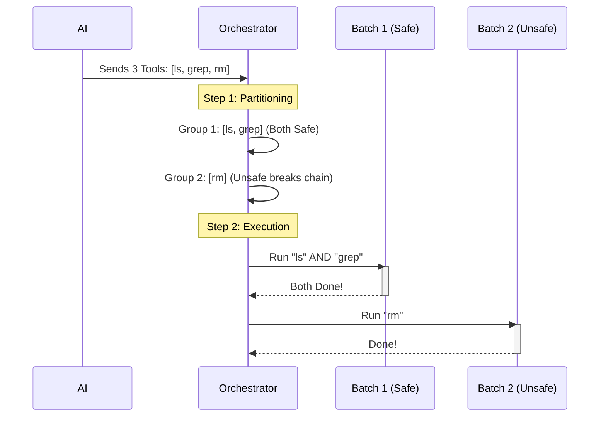

# Chapter 5: Tool Orchestration & Concurrency strategy

Welcome to **Chapter 5**, the final chapter of our journey!

In the previous chapter, [Streaming Tool Executor](04_streaming_tool_executor.md), we built a system that can queue up tools and run them. But simply having a queue isn't enough. We need a **Strategy**.

If the AI gives us a list of 10 tasks, in what order should we run them? Can we run them all at once? Or must we run them one by one?

This chapter covers **Tool Orchestration**, the "Traffic Controller" that organizes a chaotic list of tool requests into an orderly, efficient workflow.

## Motivation: The "Highway" Analogy

Imagine a multi-lane highway.

1.  **Small Cars (Safe Tools):** These are tools like "Read File" or "List Directory." They don't change anything. Multiple cars can drive side-by-side (Parallel) without crashing.
2.  **Oversize Loads (Unsafe Tools):** These are tools like "Delete File" or "Edit Code." They change the state of the world. When an oversize load is on the road, it needs *all the lanes* to itself (Serial) to prevent accidents.

**The Problem:**
If the AI sends us: `[Read File A, Read File B, Delete File A, Read File C]`.

*   **Naive Approach 1 (Run All):** We try to delete File A while reading it. **Crash!**
*   **Naive Approach 2 (Run One-by-One):** We wait for File A to be read, then File B... this is too slow.

**The Solution:**
We need to group them into **Batches**:
1.  **Batch 1 (Safe):** Read File A + Read File B (Run together).
2.  **Batch 2 (Unsafe):** Delete File A (Run alone).
3.  **Batch 3 (Safe):** Read File C (Run alone/together).

### Central Use Case: The "Cleanup" Script
Throughout this chapter, we will solve this specific scenario:
**The AI wants to: 1. List files, 2. Search for text (Grep), 3. Delete a file.**

We want the first two (safe) to run fast and simultaneously, but the third (dangerous) to wait until the others are finished.

## Key Concepts

### 1. Concurrency Safe (`isConcurrencySafe`)
Every tool definition includes a rule:
*   **True:** "I only look. I don't touch." (e.g., `ls`, `grep`, `read_file`).
*   **False:** "I change things." (e.g., `write_file`, `bash`, `npm install`).

### 2. Partitioning
This is the algorithm that slices the long list of tools into "Safe Batches" and "Unsafe Batches."

### 3. Orchestration
The process of looping through these batches and executing them using the correct method (Parallel vs. Serial).

## The Process: Step-by-Step

Let's visualize how the Orchestrator sorts the traffic.



## Internal Implementation

The logic for this lives in `toolOrchestration.ts`. It acts as a high-level manager that uses the core execution logic we learned in [Chapter 1: Tool Execution Pipeline](01_tool_execution_pipeline.md).

### 1. Partitioning the Tools

This is the most important part of the strategy. We iterate through the tools and bundle "safe" ones together. As soon as we hit an "unsafe" tool, we close the current bundle and start a new one.

```typescript
// Inside partitionToolCalls function
function partitionToolCalls(toolMessages, context) {
  return toolMessages.reduce((batches, toolUse) => {
    // 1. Check if the current tool is safe (e.g., "read_file" = true)
    const isSafe = checkConcurrencySafety(toolUse, context);
    
    // 2. Look at the last batch we were building
    const lastBatch = batches[batches.length - 1];

    // 3. If current is safe AND last batch was safe -> Add to pile!
    if (isSafe && lastBatch?.isConcurrencySafe) {
      lastBatch.blocks.push(toolUse);
    } else {
      // 4. Otherwise, start a brand new batch
      batches.push({ isConcurrencySafe: isSafe, blocks: [toolUse] });
    }
    
    return batches;
  }, []);
}
```
**Explanation:**
*   We start with an empty list of batches.
*   We look at `ls` (Safe). Start **Batch 1 (Safe)**.
*   We look at `grep` (Safe). Add to **Batch 1**.
*   We look at `rm` (Unsafe). **Stop Batch 1**. Start **Batch 2 (Unsafe)**.
*   Result: `[{ safe: true, blocks: [ls, grep] }, { safe: false, blocks: [rm] }]`.

### 2. The Orchestration Loop

Now that we have our batches, we loop through them.

```typescript
// Inside runTools function
export async function* runTools(toolUseMessages, ...) {
  // 1. Get the partitions (batches)
  const batches = partitionToolCalls(toolUseMessages, context);

  // 2. Loop through each batch
  for (const batch of batches) {
    
    if (batch.isConcurrencySafe) {
      // 3. If safe, run all tools in this batch at the same time
      yield* runToolsConcurrently(batch.blocks, ...);
    } else {
      // 4. If unsafe, run them one-by-one (serially)
      yield* runToolsSerially(batch.blocks, ...);
    }
    
    // 5. Update state before moving to the next batch
    // (Ensure the "rm" finished before starting next batch)
  }
}
```
**Explanation:** This ensures that Batch 1 finishes completely before Batch 2 starts. This effectively creates a "Barrier" between safe and unsafe operations.

### 3. Running Concurrently

To run tools side-by-side, we use `Promise.all` (or a generator equivalent).

```typescript
// Inside runToolsConcurrently
async function* runToolsConcurrently(tools, ...) {
  // Map every tool to a running task
  const tasks = tools.map(async function* (tool) {
    // Run the pipeline from Chapter 1
    yield* runToolUse(tool, ...);
  });

  // Run them all! (simplified helper)
  yield* all(tasks);
}
```
**Explanation:** We fire off all the requests in the batch instantly. The system processes them in parallel, significantly speeding up "read-heavy" workloads.

### 4. Running Serially

For unsafe tools, we keep it simple.

```typescript
// Inside runToolsSerially
async function* runToolsSerially(tools, ...) {
  for (const tool of tools) {
    // Run one
    yield* runToolUse(tool, ...);
    
    // Wait for it to finish loop before starting the next one
  }
}
```
**Explanation:** This is a standard loop. It waits for the first tool to return a result before even looking at the second tool.

## Handling Context Modifiers

There is one advanced detail. Some tools (like `cd` to change directory) change the **Context** for future tools.

*   If `cd /tmp` is running in Batch 1, Batch 2 needs to know we are now in `/tmp`.
*   The Orchestrator captures these context changes (`newContext`) and passes them forward to the next batch.

```typescript
// Inside the runTools loop
if (update.newContext) {
  // Update the master context variable
  currentContext = update.newContext;
}
// Pass currentContext to the next batch...
```

## Conclusion

Congratulations! You have completed the **Tools Project Tutorial**.

We have traveled from the basic concept of a tool call all the way to a high-performance orchestration engine.

**Recap of our journey:**
1.  **[Tool Execution Pipeline](01_tool_execution_pipeline.md):** How to run a single function safely.
2.  **[Lifecycle Hooks](02_lifecycle_hooks.md):** How to inject logic (logging, security) before and after execution.
3.  **[Permission Resolution](03_permission_resolution.md):** How to decide if a tool *should* be allowed to run.
4.  **[Streaming Tool Executor](04_streaming_tool_executor.md):** How to handle tools arriving in a stream.
5.  **Tool Orchestration (This Chapter):** How to group tools into efficient, safe batches.

You now understand the nervous system of the AI application. It is designed to be **Safe** (Permissions), **Observable** (Hooks), and **Fast** (Orchestration).

Happy Coding!

---

Generated by [Code IQ](https://github.com/adityasoni99/Code-IQ)