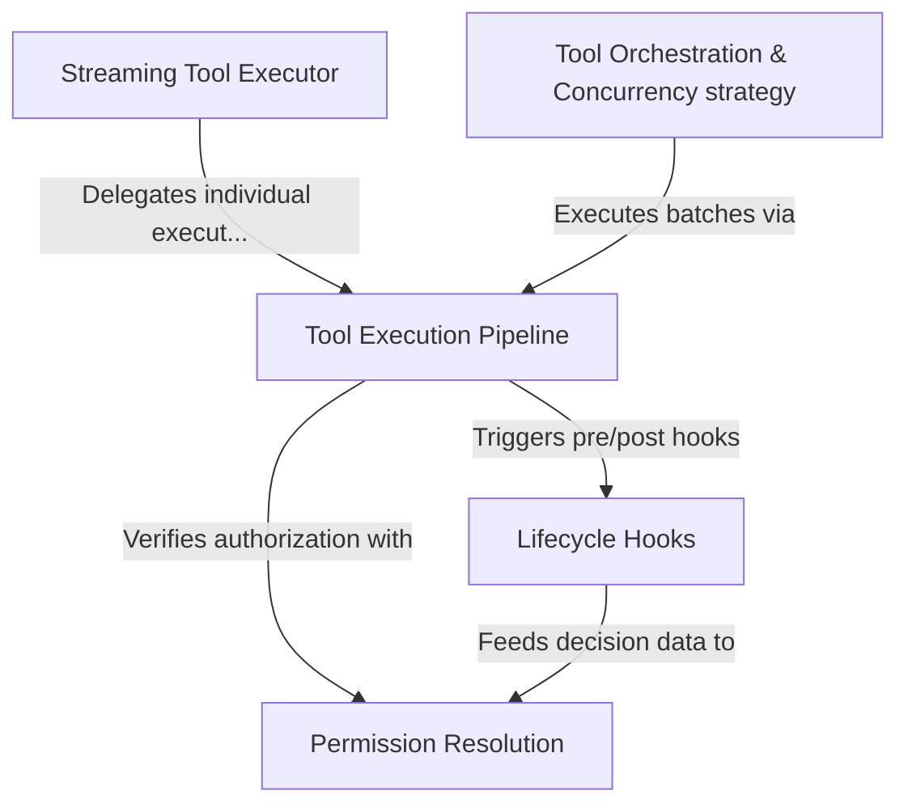

# Tutorial: tools

This system manages the **secure and efficient execution** of tools (functions/scripts) requested by an AI model. It handles the complete lifecycle of a tool call, from **real-time streaming** and queuing to validating inputs and enforcing **concurrency rules** (running safe tools in parallel while blocking for risky ones). The architecture integrates a central execution pipeline with *lifecycle hooks* and a robust **permission system** to ensure all actions are authorized and monitored.

## Chapters

1. [Tool Execution Pipeline](01_tool_execution_pipeline.md)
2. [Lifecycle Hooks](02_lifecycle_hooks.md)
3. [Permission Resolution](03_permission_resolution.md)
4. [Streaming Tool Executor](04_streaming_tool_executor.md)
5. [Tool Orchestration & Concurrency strategy](05_tool_orchestration___concurrency_strategy.md)

---

Generated by [Code IQ](https://github.com/adityasoni99/Code-IQ)