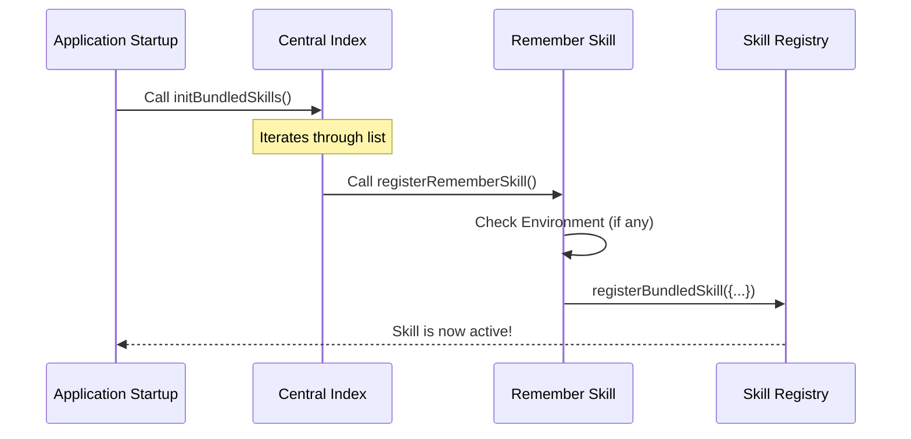

# Chapter 1: Skill Registration Pattern

Welcome to the **Skills** project! If you are looking to understand how to give our AI assistant new capabilities, you are in the right place.

We start our journey with the **Skill Registration Pattern**. Before we can teach the AI *how* to do something (like checking your memory or fixing code), we need a way to tell the system that this new ability simply *exists*.

## Motivation: The Toolbox Analogy

Imagine you have a massive toolbox. You don't want to dump every single tool onto the floor the moment you start working. Instead, you want a system where:

1.  Each tool is kept in its own separate box (Module).
2.  You have a master checklist (Index) of what tools are available.
3.  You can decide to leave some tools in the truck if you don't need them today (Feature Flags).

The **Skill Registration Pattern** is that master checklist. It allows us to keep our code clean by separating every skill into its own file, while having one central place to turn them on.

### The Use Case
Let's say we want to add a capability called **"Remember"** (which helps the AI manage its memory). We need a way to ensure that when the application starts, the "Remember" skill is loaded and ready to accept commands.

## Key Concepts

To make this happen, we use three simple components:

1.  **The Skill Module**: The file containing the specific skill logic.
2.  **The Registration Function**: A function exported by the module that says "I'm here, load me!"
3.  **The Central Index**: The main file that calls the registration functions for every skill.

## Step-by-Step Implementation

Let's look at how we wire this up, from the specific skill to the central loader.

### 1. The Skill Module's Entry Point

In this pattern, every skill file (like `bundled/remember.ts`) exports a specific function responsible for registering itself. It doesn't run the logic yet; it just prepares the skill.

```typescript
// File: src/skills/bundled/remember.ts
import { registerBundledSkill } from '../bundledSkills.js'

// This is the "Entry Point" for this specific skill
export function registerRememberSkill(): void {
  // We can add checks here (e.g., is the user allowed to use this?)
  if (process.env.USER_TYPE !== 'ant') {
    return
  }

  // If checks pass, we register the definition
  registerBundledSkill({
    name: 'remember',
    // ... description and logic ...
  })
}
```

*Explanation:* We define a function `registerRememberSkill`. It acts as a gatekeeper. It checks if the environment is correct (e.g., checking `USER_TYPE`), and if so, it calls the core system to register the skill.

### 2. The Central Index

Now that our skill has a registration function, we need the application to actually call it. This happens in `bundled/index.ts`. Think of this file as the roll call sheet.

```typescript
// File: src/skills/bundled/index.ts
import { registerRememberSkill } from './remember.js'
import { registerSimplifySkill } from './simplify.js'
// ... other imports

export function initBundledSkills(): void {
  // Roll call! Initialize the skills we want.
  registerRememberSkill()
  registerSimplifySkill()
  // ... others
}
```

*Explanation:* This file imports the registration functions we created in Step 1 and runs them one by one inside `initBundledSkills()`. When the app launches, it calls this single function, which triggers a chain reaction loading all tools.

## Internal Implementation: How it Works

Let's visualize the flow of data when the application starts up.



### Advanced Registration: Feature Flags

Sometimes, we want to hide a skill behind a "Feature Flag"—meaning it only loads for users who have a specific configuration turned on.

The Central Index handles this gracefully using conditional logic.

```typescript
// File: src/skills/bundled/index.ts
import { feature } from 'bun:bundle'

export function initBundledSkills(): void {
  // Standard skills load every time
  registerVerifySkill()

  // Experimental skills only load if the feature is on
  if (feature('BUILDING_CLAUDE_APPS')) {
    // We use 'require' here to avoid loading the file if not needed
    const { registerClaudeApiSkill } = require('./claudeApi.js')
    registerClaudeApiSkill()
  }
}
```

*Explanation:*
1.  We check `if (feature('...'))`.
2.  If true, we use `require` instead of `import`. This is a performance trick: if the feature is off, the computer never even reads the file for that skill!

### Advanced Registration: Browser Checks

We can also check the environment, such as whether Chrome is installed and configured.

```typescript
// File: src/skills/bundled/index.ts
import { shouldAutoEnableClaudeInChrome } from 'src/utils/claudeInChrome/setup.js'
import { registerClaudeInChromeSkill } from './claudeInChrome.js'

export function initBundledSkills(): void {
  // ... other skills

  // Only register this if the helper says we are ready
  if (shouldAutoEnableClaudeInChrome()) {
    registerClaudeInChromeSkill()
  }
}
```

*Explanation:* The `index.ts` file acts as the brain that decides *which* skills are appropriate for the current computer context.

## Summary

The **Skill Registration Pattern** is the initialization phase of our project.
1.  **Modular:** Each skill lives in its own file (like `remember.ts`).
2.  **Explicit:** Each skill exports a `registerFunction`.
3.  **Centralized:** One file (`index.ts`) coordinates the startup sequence.

By using this pattern, we ensure that adding a new skill is as simple as creating a file and adding one line to the index!

Now that we know *how* to register a skill, we need to understand what goes *inside* that registration call. What defines a skill's name, description, and behavior?

[Next Chapter: Bundled Skill Definition](02_bundled_skill_definition.md)

---

Generated by [Code IQ](https://github.com/adityasoni99/Code-IQ)